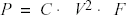
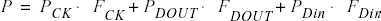
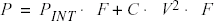

# Calculating Power

## Calculating Power

Use the following steps to calculate the power consumption of your design. The list of screens and steps appear in the order in which you should view them to analyze your power accurately.

1.  **Summary** tab: view global power at the design level and view its impact on junction temperature.

2.  **Domains** tab: define clock domains and specify a clock frequency and a data frequency for each clock domain.

3.  **Analysis** tab \(optional\): view detailed hierarchical analysis of your power consumption. If your power consumption exceeds your budget, this step helps you understand where there is room for improvement.

4.  **Frequencies** tab \(optional\): specify individual pin frequencies. This step provides pin-by-pin control of the frequency.

5.  **Probabilities** tab \(optional\): specify probabilities. You can use the default probabilities or set your own.

## Extracting Power Consumption of a Specific Clock Domain

To calculate the power consumption of a single clock domain \(clock tree and data path\) in a design:

1.  Set SmartPower in toggle-rate mode. This is the default setting. To confirm that SmartPower is in toggle-rate mode, choose **Preferences**from the **File**menu. Select the **Use Toggle Rates**check box.

2.  In the **Domains** tab, set all the **Clock Frequencies**to zero except for the clock domain for which you are calculating the power consumption.

## Advanced Analysis of I/Os

SmartPower allows you to estimate the power consumption related to I/Os. You can then analyze power consumption in detail.

To display I/O power consumption:

1.  In the **Summary**tab, select **By Type**from the **Breakdown**drop-down list. The grid displays the total power consumption of all I/Os in the design, as well as all other components. If you use different I/O standards, and different Vcci power rails, you can also display the power consumption for each rail by selecting **By Rail**from the **Breakdown**drop-down list. **Breakdown By Rail**shows the power consumption and current for each Vcci rail in the design.

2.  In the **Analysis**tab, select the highest hierarchy level in the Hierarchy tree in the left pane. Select **By Instance**from the Breakdown drop-down list.

3.  In the **Analysis**tab, unselect all categories under **Instances Contributions**except I/Os, and then click **Apply**. The table then displays a list of all I/Os in the design, along with the power contribution of each individual I/O. The columns display important I/O attributes: external port name, load, standard, drive- strength, slew, and macro.

4.  In the **Probabilities**tab, you can control the output probability of each tri-state and bidirectional I/O. The probability is the percentage of time that the I/O is used as an output. The default value can be changed and a specific value can also be set for each bidirectional or tri-state I/O.

## Adding a New Clock Domain

When you run SmartPower, it researches your existing clock domains and partitions your design automatically.

You may want to review the list of clock domains in the **Domains** tab to ensure that all the clocks of your design are included in the list. Add or remove clocks as necessary.

To add a new clock  domain:

1.  Click the **Domains**tab, and then click the **Add Domain**button.

2.  Select **Clock Domain**from the drop-down list.

    The Create Clock Domain dialog box appears.

    

3.  To create a new clock, select a **Potential Clock Pin**, specify a clock and data frequency and click **Create**.

    The new clock domain appears in the Domains window. If you select an existing clock pin from the drop- down list, the lists of clock pins and data pins of this new clock domain are computed automatically based on the netlist topology.

    **Note:** Select **Use Toggle Rates** in the SmartPower Preferences to define your data frequency as a percentage of your clock frequency. If your data frequency is 20% of your clock frequency, type **20** in the **Data Frequency** text box.

    

    If you want to create an empty clock domain and fill the lists of clock-pins and data pins manually, do not select a clock pin. Instead, type a new name for your clock domain.

## Verifying Lists of Clock and Data Pins of a Clock Domain

Beyond the verification of the list of clock domains, you may also wish to verify that the lists of clock pins and data pins computed for each clock domain are correct.

To verify the lists of clock pins and data pins of a clock domain:

1.  Click the **Domains**tab and select a specific **Domain**in the list.

2.  **Display the list of clock pins or data pins of this Domain.**A drop-down list in the **Domains**tab allows you to select clock pins or data pins. SmartPower displays the list of pins corresponding to your selection below the drop-down list. You can add or remove clock pins and data pins as necessary.

3.  **Remove a pin from a clock domain.**Highlight the selected pin and click the **Remove**button. The pin is removed from the clock domain and is made available in the list of pins that you can add in another clock domain.

4.  Highlight the selected pin in the list of pins that are not yet in a domain and click the **Add**button to add a pin in a clock domain.

    This pin is added to the clock domain. The pin is a clock or data pin, depending on the specification of the drop-down list when you clicked the **Add**button.

    **Note:** You cannot add a pin that exists in another domain until you free it from its existing domain. The pin is unavailable until you remove it from that domain.

After you verify that all the clocks of your designs are correctly identified and constructed, specify the correct clock and data frequency for each clock domain.

## Adding a New Set of Pins

To add a new set of pins:

1.  Open the Create Clock Domain dialog box.

2.  Click the **Domains**tab and click the **Add Domain**button.

3.  Select **Set of Pins**from the drop-down list.

4.  **Create a Set of Pins.**Name your new set of pins, specify a data frequency, and click **Create**

    

    The new set of pins appears in the Domains window.

## Specifying Clock and Data Frequencies in SmartPower

To specify a clock and data frequency:

1.  Click the **Domains**tab.

2.  Select the **Clock/Data**frequency cell and enter a new value.

    SmartPower defaults to 0 MHz for the clock frequency. Import your clock  frequency from SmartTime by using the Initialize Frequencies dialog box in  SmartPower or input your target for each clock frequency in the **Domains**tab. You must also specify a data frequency \(5% of your clock frequency  is a typical guideline for your data frequency—this corresponds to a toggle  rate of 10%\).

    Not all the pins/gates/nets of your design are associated with a specific  clock. For example, the frequency of a design input port is not always  correlated to a clock frequency. By extension, all pins that are upstream of  the first level of sequential elements are not associated with any clock.  SmartPower creates an InputSet by default that it uses to group all the pins  that are controlled by design inputs \(instead of sequential elements\). You  may want to view and verify the InputSet to further evaluate your  design.

## Verifying the InputSet

To verify the InputSet:

1.  Click the **Domains**tab and select the domain named **InputSet**in the list.

2.  Verify the list of pins of this domain. All the input ports of your design \(except the clocks\) belong in the **InputSet**. All pins between these input ports and the first level of sequential elements belong in the **InputSet**. You can add or remove pins as necessary.

3.  Specify an average input frequency. SmartPower uses the same frequency for all pins of the InputSet. The default InputSet frequency is 1 MHz. Enter a new value to change it.

## Splitting the InputSet

You might want to split the InputSet into several sets in order to specify different frequencies. For example, you might want to create a ResetSet—a reset tree with a very low frequency.

To split the InputSet:

1.  Create a new set of pins: In the **Domains**tab, click the **New**button, and select **Set of Pins**from the drop- down menu.

2.  In the Create Set of Pins dialog box, type a name and a frequency for the new set and click **Create**. The new set of pins appears in the Domains window. You can only create an empty set of pins, but it is possible to add pins to this domain later.

3.  Remove a group of pins from the **InputSet**. Click the **Domains**tab and select the domain named **InputSet** in the list.

4.  Select the pins that you want to remove and click the **Remove**button.

## Specifying Individual Pin Frequencies

The **Frequencies** tab allows you to specify an average clock and data frequency for each clock domain, and also an average frequency for each set of pins. This gives you an initial estimate of the power consumption of your design. However, if this estimate is not sufficiently accurate, you can refine it with a pin-by-pin annotation of the frequency.

The following procedure describes how to set the frequency of an individual pin. Performing this procedure does not remove the pin from its clock domain. A frequency annotation merely overrides the domain level frequency.

1.  Locate the pin in the **Frequencies**tab. You may need to select different clock domains from the drop-down list on the **Frequencies**tab. You can use filters to facilitate this search.

2.  Select the pin\(s\) in the grid and click the **Set frequencies for selected pins**button.

3.  Enter a new frequency value and click **OK**. This specifies a new frequency for the selected pin\(s\).

## Changing the Frequency Annotation of a Pin

The following procedure describes how to change the frequency annotation of an individual pin. This may be useful when you import a VCD \(value change-dump\) file \(see \).

1.  Locate the pin in the **Frequencies**tab**.**You may need to select different clock domains from the drop-down list on the **Frequencies**tab. You can use filters to facilitate the search.

2.  Select the pin\(s\) in the grid and click the **Set frequency for selected pins**button.

3.  Enter a new frequency value and click **OK**. This specifies a new frequency for the selected pin\(s\).

## Removing the Frequency Annotation of a Pin

This procedure describes how to remove the frequency annotation of an individual pin. This may be useful when you import a VCD \(value change-dump\) file.

1.  Locate the pin in the **Frequencies**tab. You may need to select different clock domains from the drop-down menu on the **Frequencies**tab. You can use filters to facilitate the search.

2.  Select the pin\(s\) in the grid and click the **Reset frequencies for selected pins**button. This removes the specified frequency from the selected pins.

## Specifying Individual Pin Probabilities

The **Probabilities**tab allows you to specify the default output probability value for memory blocks, and tristate and bidirectional I/Os. In addition, you can increase the accuracy of the power estimation by annotating the probability of specific pins.

To specify or change the probability for one or multiple pins:

1.  Locate the pin\(s\) in the **Probabilities**tab. You can use filters to facilitate this search.

2.  Select the pin\(s\) and click the **Set probabilities for selected pins** button.

3.  Enter a new probability value and click **OK**.

### Specifying or Changing Probability for One or More Pins

To specify or change the probability for one or multiple pins:

1.  Locate the pin\(s\) in the **Probabilities**tab. You can use filters to facilitate this search.

2.  Select the pin\(s\) and click the **Set probabilities for selected pins** button.

3.  Enter a new probability value and click **OK**.

### Resetting the Probability for One or More Pins

To reset the probability for one or multiple pins:

1.  Locate the pin\(s\) in the **Probabilities**tab. You can use filters to facilitate this search.

2.  Select the pin\(s\) and click the **Reset Probabilities for selected pins**button.

## Vectorless Estimation

The Vectorless estimation method is an accurate method of annotating individual pins with  frequencies and probabilities. It uses primary inputs, clock frequencies, and nets  annotated with other methods as a starting point, and uses a Monte Carlo simulation to  annotate all nets in the design with frequencies and probabilities.

Vectorless estimation is available for SmartFusion 2, IGLOO 2, RTG 4, PolarFire and  PolarFire SoC families of devices.

Vectorless estimation can be enabled from the Initialize Frequencies and Probabilities  dialog box or from the VCD Import dialog box.

Changes to probabilities or frequencies in the Probabilities, Frequencies, or Domains  tabs result in an out-of-date vectorless estimation. To update vectorless estimation,  press the refresh vectorless  button.

## Viewing Results \(Design Level\)

Click the **Summary** tab to view global power consumption at the design level. The **Summary**tab shows your design's estimated power consumption and temperature information.

The power estimation reported in the **Summary**tab is the total static and dynamic power consumption of your design. For a more detailed view of this power consumption, click the **Analysis** tab.

To  estimate the junction temperature:

1.  Verify your package. You cannot change your package directly in SmartPower, because it may render your place-and-route information \(and thus it may severely impact the total power consumption\). To choose another package, use **Designer &gt; Tools &gt; Device Selection**.

2.  Click the **Summary**tab and select a **Cooling**style in the list. Thermal resistance changes automatically when you update the cooling style.

3.  Specify an ambient temperature. Enter an **ambient temperature**\(default value is 25ºC\) and click the **Set** button.

    **Note:** The junction temperature value changes according to the package, cooling style, and ambient temperature values you choose.

## Analyzing Results

The **Analysis** tab shows the estimated power consumption of individual blocks, gates, nets, I/Os, and memory, and allows you to make a hierarchical analysis of your power consumption.

The **Analysis**tab may also help you to improve your power consumption by identifying the components that consume a significant amount of power.

To identify the components consuming the most  power:

1.  Use the **Analysis**tab to expand the design hierarchy. The **Analysis**tab allows you to expand your design hierarchy and view a complete list of the blocks in your design. In the hierarchy window, click the **+**next to your design to view the items in the hierarchy. Click the **+**next to a sub-block to view its sub-elements.

    

2.  Click to select a block. By default, SmartPower selects the design-level block, but you can always select another block in the hierarchical tree. The Report window displays the list of sub-elements of the selected block. Initially, this list includes all sub-elements. The grid in the Analysis window displays a breakdown of the power of the selected block by type. This breakdown provides you a good overview of which areas of your design you should optimize for power.

3.  To find the components that use a significant amount of power, choose **By Instance**from the **Breakdown** drop-down list.

4.  Sort and filter the sub-elements to find the component that is using the most power. The Analysis window displays the list of sub-elements of the selected block. By default, this list includes all sub-elements. The grid contains columns for name, type, power, driver, fanout, macro, I/O standard, output load, output drive, slew, port, domain and frequency. You can limit the list of sub-elements to a list of sub-blocks, nets, gates, I/Os, memories, or any combination of these five classes of sub-elements. You can sort the list according to any column by double-clicking the column header.

## SmartPower Calculation Equations

SmartPower calculates the static power and the dynamic power of your design, for given operating conditions and operating modes:

**Static Power**: summation of the static power consumed by each element of the design.  SmartPower provides a static power consumption of the array. This value is  die-dependent. This value is also a function of the operating mode. For some families,  SmartPower also considers a static power contribution per I/O bank. For specific I/O  technologies like voltage referenced I/Os or differential I/Os, SmartPower also  considers a static power contribution per I/O.

**Dynamic Power**: summation of the dynamic power consumed by each element of the design  \(nets, modules, I/Os, RAMs, FIFOs, PLLs, etc.\).

**Operating Conditions**: SmartPower calculates power consumption in Worst, Typical, or Best operating conditions. SmartPower uses the following as general guidelines:

-   It applies a voltage derating to dynamic power contributions. Higher voltage typically leads to higher power consumption.
-   It applies a temperature derating to static power contributions. Higher temperature typically leads to higher power consumption.
-   It applies no radiation derating.

**Operating Modes**: SmartPower calculates power consumption in Active, Static, Flash\*Freeze,  Sleep, and Shutdown operating modes when applicable for your design.

## Sample Equations:

The following examples are for general evaluation purposes only. They are not a precise  representation of the actual calculations, since each calculation takes into account  family-specific information.

-   For a **net**,

    

    where C is the total capacitive loading of the net  \(extracted from the routing topology\), V is the net's voltage swing, and F is  the average switching frequency.

    **Note:** For the ProASICPLUS family, SmartPower extracts the capacitive loading of a net from a Wire Load model.

-   For a **module**, the power is computed using a characterized library \(by family and die-size\) describing a specific power model for each type of module. For example, the power model of a flip-flop is given by 

    where FCK is the average clock-input  frequency for this flip-flop, FDOUT is its average data-output frequency, and  PCK, PDOUT, PDin are three constants estimated by electrical simulation and  silicon characterization for this flip-flop module, and FDin is its average  data-input frequency.

-   For an **I/O**, the formula used for computing the power consumption depends on the I/O technology and the family. For example, for a TTL output, the dynamic power is given by

    

    where C is the output load \(derived from what you have set in the I/O Attribute Editor GUI, typically 35 pF for TTL\), V is the output's voltage swing \(3.3 V for TTL\), and PINT represents an internal power contribution dissipated in the pad, and F is the average switching frequency of the I/O.

-   For a **complex block**, like a RAM, a FIFO, or a PLL, SmartPower uses a high-level power model that integrates design parameters.

SmartPower computes all the constant parameters of these equations automatically. However, the  frequencies depend on the target frequencies of your design. Since it is impractical to  enter each frequency manually, SmartPower has several flows that help you estimate the  frequencies and calculate the power consumption.

## Data Change History - SmartPower

The data change history report lists power data updates up to the current release that may impact the power consumption of the design.

To generate a data change history report, choose **Data Change History** from the **Help**menu to open a data change history report in text format.

