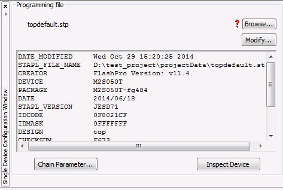

# Overview

This section provides an overview of FlashPro Express.

## FlashPro Hardware Programmers

The FlashPro series of hardware programmers consists of:

-   FlashPro3/X
-   FlashPro4
-   FlashPro5
-   FlashPro6

All FlashPro series hardware programmers save board space because a  single JTAG chain can be used for all JTAG devices. In-system programming  using the JTAG port adds the flexibility of field upgrades or post-assembly  production-line characterization. Production costs are reduced significantly  as a result of elimination of expensive sockets on the board.

**Important:** FlashPro5 and FlashPro6 support programming though a device SPI Target port.

For more information, visit the [Microchip Website](https://www.microchip.com/en-us/products/fpgas-and-plds/fpga-and-soc-design-tools/programming-and-debug/flashpro-and-flashpro-express#overview).

## Secure Job Programming

Job programming is the concept of using a single file to program a Microchip device or chain of  Microchip devices using encrypted bitstreams.

The single job file contains all of the information necessary to setup FlashPro Express as well  as the encrypted bitstream images for the devices in the job. After a job file is  created, it can be passed securely to production programming houses or contract  engineering facilities to load the Microchip images during manufacturing. Job projects  can be exported from Libero and imported into stand-alone FlashPro Express, providing a  clean delineation between design flow and production programming.

## Migrating FlashPro Projects to FlashPro Express

Existing FlashPro projects \(`*.pro`\) files are called Job Project files in  FlashPro Express. These Job Projects can be opened with FlashPro Express to take  advantage of Linux programming support and the simplified tool targeted for operators in  a production floor environment.

 

**Note:** FlashPro projects that were created in single mode are not supported by this tool. Microchip recommends that you convert these projects to chain mode projects.

 

To convert the project to a chain project:

1.  Open the FlashPro project \(`*.pro`\) in FlashPro.
2.  Locate the loaded STAPL file by one of two methods:

    The log prints **STAPL file ‘&lt;stapl\_path&gt;’ has been loaded successfully**. **&lt;stapl\_path&gt;**  is the location of the STAPL file loaded.

    

In the Single Device Configuration window, the field  **STAPL\_FILE\_NAME** shows the location of the STAPL file  loaded.

1.  Switch the project to chain mode using one of the two methods:
    -   Press the chain button from the toolbar: 
    -   From the **Tools** menu, select **Mode &gt; Chain Programming**.
2.  Load the STAPL file in chain mode by adding a Microchip device in the chain.
    1.  From the **File** menu, select **Configuration &gt; Add Microchip Devices from Files**.
    2.  Browse to the location of the STAPL file and click **Open**.
3.  To save the project, from the **File** menu, select **Save Project**.

You can now open the project using FlashPro Express.

When moving FlashPro project \(`*.pro`\) files to another machine, Microchip  recommends that you archive the entire project folder, copy it to the new machine,  extract it locally, and then load the job project within FlashPro Express. FlashPro  Express opens a job project only when a programmer is connected to the machine, at least  one Microchip device has programmed enabled, and all enabled Microchip devices have a  bitstream file loaded.

