# Creating and Verifying Designs

Create your design with the following design capture tools:

-   [Create SmartDesign](GUID-BA52F539-E830-4341-B5FA-D07408FE99BC.md#)
-   [System Builder](GUID-BA52F539-E830-4341-B5FA-D07408FE99BC.md#) \(SmartFusion 2 and IGLOO 2 only\)
-   [Create HDL](GUID-BA52F539-E830-4341-B5FA-D07408FE99BC.md#)
-   [Create SmartDesign Testbench](GUID-BA52F539-E830-4341-B5FA-D07408FE99BC.md#) \(optional, for simulation only\)
-   [Create HDL Testbench](GUID-BA52F539-E830-4341-B5FA-D07408FE99BC.md#) \(optional, for simulation only\)
-   [Verify Pre-synthesized Design](GUID-BA52F539-E830-4341-B5FA-D07408FE99BC.md#)

## SmartFusion 2 and IGLOO 2 Tools

The following topics describe System Builder and how to use the MSS in your SmartFusion 2<br /> designs.

### System Builder

System Builder is a graphical design wizard that allows you to enter high-level design<br /> specifications for SmartFusion 2 or IGLOO 2.

System Builder takes you through the following steps:

-   Asks basic questions about your system architecture and peripherals
-   Builds a correct-by-design complete system

To start System Builder:

1.  In the Design Flow window, click **System Builder &gt; Run**.
2.  In the Enter a name for your system dialog box, enter a name for the system you want to build.
3.  Click **OK**. The System Builder Device Features page appears.

System Builder automatically configures the silicon features you select. To complete the<br /> design, add your custom logic or IP and connect them to your System Builder-generated<br /> design.

For a complete family-specific explanation of the tool, see the [SmartFusion 2 System Builder documentation](https://coredocs.s3.amazonaws.com/Libero/Tool/SysBuilder/sf2_system_builder_ug_2.pdf) or the [IGLOO 2 System Builder documentation](https://coredocs.s3.amazonaws.com/Libero/Tool/SysBuilder/igl2_system_builder_ug_2.pdf).

### Using the MSS in Your SmartFusion 2 Designs

The following topics describe how to use the MSS in your SmartFusion 2 designs.

**Note:** MSS is valid for SmartFusion 2 devices only.

#### Instantiating a SmartFusion 2 MSS in Your Design

You can configure peripherals within the SmartFusion 2 MSS to suit your requirements. Examples of<br /> peripherals you can configure include:

-   Arm® Cortex®-M3
-   Embedded nonvolatile memory \(eNVM\)
-   Ethernet MAC
-   Timer
-   UART
-   SPI

The MSS operates stand-alone, without any dependencies on other logic within the<br /> device; however, designs that require functionality beyond a standalone MSS are handled<br /> by using SmartDesign to add user logic in the SmartFusion 2 SoC FPGA fabric.

You can instantiate an MSS into your design from the New Project Creation Wizard when you start a<br /> new SmartFusion 2 project, or from the Design Flow window after you have created a new<br /> project.

##### Instantiating a SmartFusion 2 MSS from the New Project Creation Wizard

1.  Enable **Use Design Tool** \(under **Design Templates and Creators**\) and click to select **SmartFusion 2 Microcontroller Subsystem \(MSS\)** from the list.

##### Not Using a Design Tool when You Create a Project

If you decide not to use a Design Tool when you created your project:

1.  Expand **Create Design** in the Design Flow window and double-click **Configure MSS**.
2.  When the Add Microcontroller Subsystem dialog box appears, enter your design name and click **OK**. A SmartDesign Canvas appears, with the MSS added to your project. Double-click the MSS to view and configure MSS components.

#### Configure the SmartFusion 2 MSS

Documents for specific SmartFusion 2 MSS peripherals are available on the [Peripheral Documents web page](https://www.microchip.com/doclisting/TechDoc.aspx).

The SmartFusion 2 MSS Configurator in the following figure contains the following elements.<br /> Double-click an element in the MSS to configure it. If a check box is available, check<br /> it to enable the element in your design or uncheck it to disable the element in your<br /> design.

MSS ARM Cortex-M3 Peripherals

-   MSS CAN
-   MSS Peripheral DMA \(PDMA\)
-   MSS GPIO
-   MSS I2C
-   MSS Ethernet MAC
-   MSS DDR Controller \(MDDR\)
-   MSS MMUART
-   MSS Real Time Counter \(RTC\)
-   MSS Embedded Nonvolatile Memory \(eNVM\)
-   MSS SPI
-   MSS USB
-   MSS Watchdog Timer

Fabric Interfaces

-   MSS Fabric Interface Controllers \(FICs\)

Additional Information

-   MSS Cache Controller
-   MSS DDR Bridge Controller
-   MSS AHB Bus Matrix
-   MSS Clocks Configurator \(MSS CCC\)
-   MSS Interrupts Controller
-   MSS Reset Controller

-   MSS SECDED Configurator
-   MSS Security Configurator

The MSS generates a component that is instantiated into your top-level design.

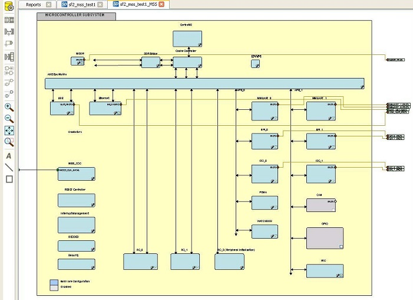

#### Generate SmartFusion 2 MSS Files

See the MSS Configurator help for more information on generating SmartFusion 2 MSS files.

Click the **Generate Component**button  to create your<br /> SmartFusion 2 MSS files. The MSS Configurator generates the<br /> following files:

-   HDL files for the MSS components, including timing shells for synthesis - HDL files are automatically managed by the Libero SoC and passed to the Synthesis and Simulation tools.
-   EFC File: Contains your eNVM client data - The EFC content is included in your final programming file.
-   Firmware drivers and memory maps are exported into the `<project>\firmware\` directory - Libero SoC automatically generates a Software IDE project that includes your Firmware drivers. If you are not using a software project automatically created by Libero, you can import this directory into your Software IDE project.
-   Testbench HDL and BFM script for the MSS design: These files are managed by Libero SoC and automatically passed to the Simulation tool.
-   PDC files for the MSS and the top-level design: These files are managed by Libero SoC and automatically integrated during Compile and Layout.

## Create SmartDesign

SmartDesign is a visual block-based design creation and entry tool for instantiating,<br /> configuring, and connecting Microchip IPs, user-generated IPs, and custom/glue-logic HDL<br /> modules. This tool provides a canvas for instantiating and stitching together design<br /> objects. The result from SmartDesign is a design-rule-checked and automatically<br /> abstracted synthesis-ready HDL file. A generated SmartDesign can be the entire FPGA<br /> design or a component subsystem to be re-used in a larger design.

The following design objects can be instantiated in the SmartDesign canvas:

-   Microchip IP Cores
-   User-generated or third-party IP Cores
-   HDL design files
-   HDL + design files
-   Basic macros
-   Other SmartDesign components \(`*.cxf` files\). These files can be generated from SmartDesign in the current Libero SoC project, or they can be imported from other Libero SoC projects.
-   Re-usable design blocks \(`*.cxz` files\) published from Libero SoC. For more information, see the [SmartDesign User Guide](http://coredocs.s3.amazonaws.com/Libero/2025_1/Tool/smartdesign_ug.pdf).

**Note:** The following table lists the direct cores that cannot be generated in Libero using Batch mode on Linux machines only via TCL if the DISPLAY variable is not set.

|Direct Cores That Cannot be Used in Batch Mode|Direct Cores That Cannot be Used in Batch Mode|
|----------------------------------------------|----------------------------------------------|
|CoreAXI4SRAM|CoreFIFO|
|CoreCIC|CoreFFT|
|CoreCordic|CoreFIR\_PF|
|CoreABC|CoreRSDEC|
|CoreEDAC|CoreRSENC|
|CoreDDS| |

### Create New SmartDesign

This SmartDesign component might be the top level of the design, or it can be used as a<br /> lower level SmartDesign component after successful generation in another design.

1.  From the **File** menu, choose **New &gt; SmartDesign** in the Design Flow window or double-click **Create SmartDesign**. The Create New SmartDesign dialog box appears.

    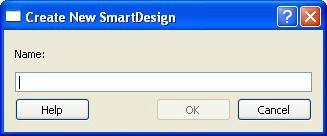

2.  Enter a name and click **OK**. The component appears in the **Design Hierarchy** tab of the Design Explorer.

**Note:** The component name you choose must be unique in your project. For more information, see the [SmartDesign User Guide](http://coredocs.s3.amazonaws.com/Libero/2025_1/Tool/smartdesign_ug.pdf).

### Export Component Description \(Tcl\)

Using the Export Component Description option, you can export components such as SmartDesign<br /> components, configured cores, and HDL+ cores separately as Tcl.

To export a SmartDesign component:

1.  Right-click the component and choose **Export Component Description \(Tcl\)**.

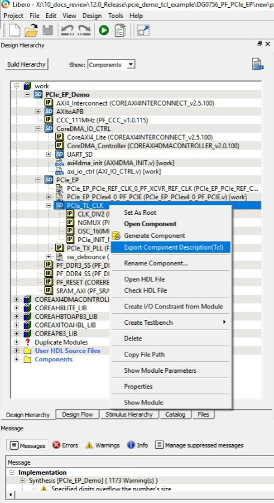


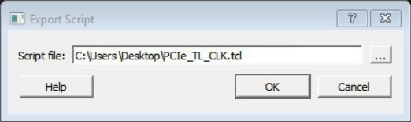

2. Click the **Browse** button to specify the location where you want<br /> to export the Tcl file, and then click **OK**.

### Examples

The following is an example of an exported Tcl script for a SmartDesign Component<br /> \(PCIe\_TL\_CLK\).

```
# Creating SmartDesign PCIe_TL_CLK set sd_name {PCIe_TL_CLK}
create_smartdesign -sd_name ${sd_name}
# Disable auto promotion of pins of type 'pad' auto_promote_pad_pins -promote_all 0
# Create top level Ports
sd_create_scalar_port -sd_name ${sd_name} -port_name {CLK_125MHz} -port_direction {IN}
sd_create_scalar_port -sd_name ${sd_name} -port_name {TL_CLK} -port_direction {OUT} sd_create_scalar_port -sd_name ${sd_name} -port_name {DEVICE_INIT_DONE} -port_direction
{OUT}
# Add CLK_DIV2_0 instance
sd_instantiate_component -sd_name ${sd_name} -component_name {CLK_DIV2} -instance_name
{CLK_DIV2_0}
# Add NGMUX_0 instance
sd_instantiate_component -sd_name ${sd_name} -component_name {NGMUX} -instance_name
{NGMUX_0}
# Add OSC_160MHz_0 instance
sd_instantiate_component -sd_name ${sd_name} -component_name {OSC_160MHz} -instance_name
{OSC_160MHz_0}
# Add PCIe_INIT_MONITOR_0 instance
sd_instantiate_component -sd_name ${sd_name} -component_name {PCIe_INIT_MONITOR} - instance_name {PCIe_INIT_MONITOR_0}
sd_mark_pins_unused -sd_name ${sd_name} -pin_names {PCIe_INIT_MONITOR_0:FABRIC_POR_N} sd_mark_pins_unused -sd_name ${sd_name} -pin_names {PCIe_INIT_MONITOR_0:USRAM_INIT_DONE} sd_mark_pins_unused -sd_name ${sd_name} -pin_names {PCIe_INIT_MONITOR_0:SRAM_INIT_DONE} sd_mark_pins_unused -sd_name ${sd_name} -pin_names {PCIe_INIT_MONITOR_0:XCVR_INIT_DONE}
sd_mark_pins_unused -sd_name ${sd_name} -pin_names
{PCIe_INIT_MONITOR_0:USRAM_INIT_FROM_SNVM_DONE}
sd_mark_pins_unused -sd_name ${sd_name} -pin_names
{PCIe_INIT_MONITOR_0:USRAM_INIT_FROM_UPROM_DONE}
sd_mark_pins_unused -sd_name ${sd_name} -pin_names
{PCIe_INIT_MONITOR_0:USRAM_INIT_FROM_SPI_DONE}
sd_mark_pins_unused -sd_name ${sd_name} -pin_names
{PCIe_INIT_MONITOR_0:SRAM_INIT_FROM_SNVM_DONE}
sd_mark_pins_unused -sd_name ${sd_name} -pin_names
{PCIe_INIT_MONITOR_0:SRAM_INIT_FROM_UPROM_DONE}
sd_mark_pins_unused -sd_name ${sd_name} -pin_names
{PCIe_INIT_MONITOR_0:SRAM_INIT_FROM_SPI_DONE}
sd_mark_pins_unused -sd_name ${sd_name} -pin_names {PCIe_INIT_MONITOR_0:AUTOCALIB_DONE} 
# Add scalar net connections
sd_connect_pins -sd_name ${sd_name} -pin_names {"NGMUX_0:CLK1" "CLK_125MHz" } sd_connect_pins -sd_name ${sd_name} -pin_names {"CLK_DIV2_0:CLK_OUT" "NGMUX_0:CLK0" }
sd_connect_pins -sd_name ${sd_name} -pin_names {"PCIe_INIT_MONITOR_0:DEVICE_INIT_DONE" "DEVICE_INIT_DONE" }
sd_connect_pins -sd_name ${sd_name} -pin_names {"CLK_DIV2_0:CLK_IN" "OSC_160MHz_0:RCOSC_160MHZ_CLK_DIV" }
sd_connect_pins -sd_name ${sd_name} -pin_names {"NGMUX_0:SEL" "PCIe_INIT_MONITOR_0:PCIE_INIT_DONE" }
sd_connect_pins -sd_name ${sd_name} -pin_names {"NGMUX_0:CLK_OUT" "TL_CLK" } 
# Re-enable auto promotion of pins of type 'pad'
auto_promote_pad_pins -promote_all 1 
# Save the smartDesign save_smartdesign -sd_name ${sd_name} 
# Generate SmartDesign PCIe_TL_CLK
generate_component -component_name ${sd_name}
```

The following is an example of an exported Tcl script for a System Builder Core<br /> \(PF\_DDR3\_SS\).

```
# Exporting core PF_DDR3_SS to TCL
# Create design TCL command for core PF_DDR3_SS
create_and_configure_core -core_vlnv {Actel:SystemBuilder:PF_DDR3:2.3.120} - component_name {PF_DDR3_SS} -params {\
"ADDRESS_MIRROR:false" \ 
"ADDRESS_ORDERING:CHIP_ROW_BANK_COL" \ 
"AUTO_SELF_REFRESH:1" \ 
"AXI_ID_WIDTH:6" \
"AXI_WIDTH:64" \ 
"BANKSTATMODULES:4" \ 
"BANK_ADDR_WIDTH:3" \ 
"BURST_LENGTH:0" \ 
"CAS_ADDITIVE_LATENCY:0" \ 
"CAS_LATENCY:9" \ 
"CAS_WRITE_LATENCY:7" \ 
"CCC_PLL_CLOCK_MULTIPLIER:6" \ 
"CLOCK_DDR:666.666" \ 
"CLOCK_PLL_REFERENCE:111.111" \ 
"CLOCK_RATE:4" \ 
"CLOCK_USER:166.6665" \ 
"COL_ADDR_WIDTH:11" \ 
"DLL_ENABLE:1" \
"DM_MODE:DM" \ 
"DQ_DQS_GROUP_SIZE:8" \ 
"ENABLE_ECC:0" \ 
"ENABLE_INIT_INTERFACE:false" \
"ENABLE_LOOKAHEAD_PRECHARGE_ACTIVATE:false" \
"ENABLE_PAR_ALERT:false" \ 
"ENABLE_REINIT:false" \ 
"ENABLE_TAG_IF:false" \ 
"ENABLE_USER_ZQCALIB:false" \ 
"EXPOSE_TRAINING_DEBUG_IF:false" \ 
"FABRIC_INTERFACE:AXI4" \ 
"FAMILY:26" \
"MEMCTRLR_INST_NO:1" \ 
"MEMORY_FORMAT:COMPONENT" \
"MINIMUM_READ_IDLE:1" \
"ODT_ENABLE_RD_RNK0_ODT0:false" \ 
"ODT_ENABLE_RD_RNK0_ODT1:false" \ 
"ODT_ENABLE_RD_RNK1_ODT0:false" \ 
"ODT_ENABLE_RD_RNK1_ODT1:false" \ 
"ODT_ENABLE_WR_RNK0_ODT0:true" \
"ODT_ENABLE_WR_RNK0_ODT1:false" \ 
"ODT_ENABLE_WR_RNK1_ODT0:false" \ 
"ODT_ENABLE_WR_RNK1_ODT1:true" \ 
"ODT_RD_OFF_SHIFT:0" \ 
"ODT_RD_ON_SHIFT:0" \ 
"ODT_WR_OFF_SHIFT:0" \ 
"ODT_WR_ON_SHIFT:0" \ 
"OUTPUT_DRIVE_STRENGTH:RZQ6" \
"PARAM_IS_FALSE:false" \ 
"PARTIAL_ARRAY_SELF_REFRESH:FULL" \
"PHYONLY:false" \ 
"PIPELINE:false" \ 
"QOFF:0" \ 
"QUEUE_DEPTH:3" \ 
"RDIMM_LAT:0" \
"READ_BURST_TYPE:SEQUENTIAL" \ 
"ROW_ADDR_WIDTH:16" \ 
"RTT_NOM:DISABLED" \ 
"RTT_WR:OFF" \ 
"SDRAM_NB_RANKS:1" \ 
"SDRAM_NUM_CLK_OUTS:1" \ 
"SDRAM_TYPE:DDR3" \
"SELF_REFRESH_TEMPERATURE:NORMAL" \ 
"SHIELD_ENABLED:true" \ 
"SIMULATION_MODE:FAST" \ 
"TDQS_ENABLE:DISABLE" \ 
"TGIGEN_ADD_PRESET_WIDGET:true" \ 
"TIMING_DH:150" \ 
"TIMING_DQSCK:400" \ 
"TIMING_DQSQ:200" \ 
"TIMING_DQSS:0.25" \
"TIMING_DS:75" \ 
"TIMING_DSH:0.2" \ 
"TIMING_DSS:0.2" \ 
"TIMING_FAW:30" \ 
"TIMING_IH:275" \ 
"TIMING_INIT:200" \ 
"TIMING_IS:200" \ 
"TIMING_MODE:0" \ 
"TIMING_MRD:4" \ 
"TIMING_QH:0.38" \ 
"TIMING_QSH:0.38" \ 
"TIMING_RAS:36" \ 
"TIMING_RC:49.5" \ 
"TIMING_RCD:13.5" \ 
"TIMING_REFI:7.8" \
"TIMING_RFC:350" \ 
"TIMING_RP:13.5" \ 
"TIMING_RRD:7.5" \ 
"TIMING_RTP:7.5" \ 
"TIMING_WR:15" \ 
"TIMING_WTR:5" \ 
"TURNAROUND_RTR_DIFFRANK:1" \ 
"TURNAROUND_RTW_DIFFRANK:1" \ 
"TURNAROUND_WTR_DIFFRANK:1" \ 
"TURNAROUND_WTW_DIFFRANK:0" \
"USER_POWER_DOWN:false" \ 
"USER_SELF_REFRESH:false" \ 
"WIDTH:16" \ 
"WRITE_LEVELING:ENABLE" \ 
"WRITE_RECOVERY:5" \ 
"ZQ_CALIB_PERIOD:200" \ 
"ZQ_CALIB_TYPE:0" \ 
"ZQ_CALIB_TYPE_TEMP:0" \ 
"ZQ_CAL_INIT_TIME:512" \ 
"ZQ_CAL_L_TIME:256" \
"ZQ_CAL_S_TIME:64" } -inhibit_configurator 0 
# Exporting core PF_DDR3_SS to TCL done
```

The following is an example of an exported Tcl script for an HDL+<br /> core.

```
# Exporting core pattern_gen_checker to TCL
# Exporting Create HDL core command for module pattern_gen_checker create_hdl_core -file
{X:/10_docs_review/12.0_Release/pcie_demo_tcl_example/DG0756_PF_PCIe_EP/new/project/hdl/ PATTERN_GEN_CHECKER.v} -module {pattern_gen_checker} -library {work} -package {}
# Exporting BIF information of HDL core command for module pattern_gen_checker
```

The following is an example of an exported Tcl script for a SgCore<br /> \(PF\_TX\_PLL\).

```
# Exporting core PCIe_TX_PLL to TCL
# Exporting Create design command for core PCIe_TX_PLL
create_and_configure_core -core_vlnv {Actel:SgCore:PF_TX_PLL:1.0.115} -component_name
{PCIe_TX_PLL} -params {\ 
"CORE:PF_TX_PLL" \ 
"FAMILY:26" \
"INIT:0x0" \
"PARAM_IS_FALSE:false" \ 
"SD_EXPORT_HIDDEN_PORTS:false" \
"TxPLL_AUX_LOW_SEL:true" \ 
"TxPLL_AUX_OUT:125" \
"TxPLL_CLK_125_EN:true" \ 
"TxPLL_DYNAMIC_RECONFIG_INTERFACE_EN:false" \ 
"TxPLL_EXT_WAVE_SEL:0" \
"TxPLL_FAB_LOCK_EN:false" \ 
"TxPLL_FAB_REF:200" \ 
"TxPLL_JITTER_MODE_SEL:10G SyncE 32Bit" \ 
"TxPLL_MODE:NORMAL" \ 
"TxPLL_OUT:2500.000" \
"TxPLL_REF:100" \ 
"TxPLL_SOURCE:DEDICATED" \ 
"TxPLL_SSM_DEPTH:0" \
"TxPLL_SSM_DIVVAL:1" \
"TxPLL_SSM_DOWN_SPREAD:false" \ 
"TxPLL_SSM_FREQ:64" \ 
"TxPLL_SSM_RAND_PATTERN:0" \
"VCOFREQUENCY:1600" } -inhibit_configurator 1 
# Exporting core PCIe_TX_PLL to TCL done
```

### Hierarchical Export Component Description \(Tcl\)

This option exports the complete design and its subcomponents to Tcl. When this option is<br /> executed on a SmartDesign, it iterates through all the instances and collects<br /> information about the pins, groups, and nets in the SmartDesign. All the TCL scripts<br /> generated are exported to a folder you select when the Hierarchical Export Component<br /> Description \(Tcl\) option executes.

")

This exported folder consists of the following files and subfolders:

|Subfolders|Description|
|----------|-----------|
|HDL|Contains all the imported HDL source files.|
|Stimulus|Contains all the imported HDL stimulus files.|
|Components|Contains all the Tcl files of the components used in the<br /> SmartDesign.|

|Files|Description|
|-----|-----------|
|hdl\_source.tcl|Contains the tcl for imported and linked files.|
|&lt;component&gt;\_recursive.tcl|Top-level tcl used to recreate the design.|
|Un\_Supported\_Cores\_List.txt|Contains all the cores for which the export function cannot be<br /> performed.|

To run this option, right-click the desired component for which the information must be<br /> exported in Tcl in the Design/ Stimulus Hierarchy, and then choose<br /> **Hierarchical Export Component Description \(Tcl\)**.

 Option")

<br />

 Option After Right-clicking a Component")

<br />

#### Limitations

Hierarchical Export Component Description \(Tcl\) support is not available for blocks.

#### Messages

The following table lists the messages that the tool generates in the log window.

|Message|Description|
|-------|-----------|
|Error: Please check the permission of the specified folder.|The folder you specified is not writable.|
|Error: Unable to Export Component ‘top’ to path|The export operation was not successful.|
|Info: Component ‘top’ exported successfully to path|The export operation was successful.|

### Generating a SmartDesign Component

Before your SmartDesign component can be used by downstream processes, such as synthesis<br /> and simulation, you must generate it.

Click the **Generate**<br />  button to generate a SmartDesign component. An HDL file is<br /> generated in the directory<br /> `<libero_project>/components/<library>/<yourdesign>`.

<br />

**Note:** The generated HDL file will be deleted when your SmartDesign design is modified and saved to ensure synchronization between your SmartDesign component and its generated HDL file.

<br />

Generating a SmartDesign component might fail if there are any [design rule checking \(DRC\) errors](GUID-DD5BFD75-BB76-49D8-99EA-EC328F43A5FD.md#). DRC errors must be corrected before you<br /> generate your SmartDesign design.

If the ports of a sub-design change, the parent SmartDesign component is annotated with<br /> the icon  in the **Design Hierarchy** tab of the Design<br /> Explorer.

#### Generate Recursively vs. Non-Recursively

You can generate a SmartDesign component recursively or nonrecursively. These options are<br /> set in the [Project Preference Dialog Box - Design Flow Preferences section](GUID-DD5BFD75-BB76-49D8-99EA-EC328F43A5FD.md#).

|Option|Description|
|------|-----------|
|Recursive generation|Clicking the **Generate** button generates all<br /> sub-design SmartDesigns, depth first. The parent SmartDesign is<br /> generated only if all the sub-designs generate successfully.|
|Non-Recursive generation|Clicking the **Generate** button generates the<br /> specified SmartDesign only. The generation can be marked as<br /> successful even if a sub-design is “ungenerated” \(either never<br /> attempted or unsuccessful\). An ungenerated component is annotated<br /> with the icon  in the<br /> **Design Hierarchy** tab of the Design<br /> Explorer.|

## Create Core from HDL

You can instantiate any HDL module and connect it to other blocks inside SmartDesign. However,<br /> there are situations where you might want to extend your HDL module with more<br /> information before using it inside SmartDesign.

-   If you have an HDL module that contains configurable parameters or generics.
-   If your HDL module is intended to connect to a processor subsystem and has implemented the appropriate bus protocol, then you can add a bus interface to your HDL module so that it can easily connect to the bus inside of SmartDesign.

### Creating a Core from Your HDL

To create a core from your HDL, perform the following steps:

1.  Import or create a new HDL source file; build the Design Hierarchy by clicking **Build Hierarchy**. The HDL file appears in the Design Hierarchy.
2.  In the Design Hierarchy, select the HDL file and click the **HDL+** icon.

    or

    Right-click the HDL file and<br /> select the **Create Core from HDL** option.

    The<br /> **Edit Core Definition – Ports and Parameters** dialog<br /> box shows the ports and parameters that were extracted from your HDL<br /> module.

3.  Remove parameters that are not intended to configure. To remove such parameters, select them from the list and click the **X** icon. Remove parameters that are used for internal variables, such as state machine enumerations. If you remove a parameter unintentionally, click **Re-extract ports and parameters from HDL file** to reset the list so it matches your HDL module.

    

4.  \(Optional\) To [add bus interfaces](GUID-DD5BFD75-BB76-49D8-99EA-EC328F43A5FD.md#) to your core, click **Add/Edit Bus Interfaces**.
5.  After you specify the information, your HDL turns into an HDL+ icon in the Design Hierarchy. Click and drag your HDL+ module from the Design Hierarchy to the **Canvas**.
6.  If you added bus interfaces to your HDL+ core, it appears in your SmartDesign, with a bus interface pin you can use to connect to the appropriate bus IP core.
7.  If your HDL+ has configurable parameters, double-click the object on the Canvas \(or right-click and choose **Configure**\) to set the values. On generation, the specific configuration values per instance are written to the SmartDesign netlist.

    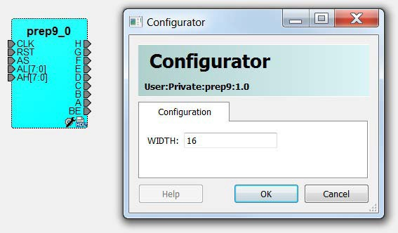

8.  To open the HDL file inside the text editor, right-click the instance and select **Modify HDL**.

### Editing Core Definitions

After you create a core definition, you can edit it by selecting your HDL+ module in the Design<br /> Hierarchy and clicking the HDL+ icon.

### Removing Core Definitions

If you do not want the extended information on your HDL module, you can revert it to a regular<br /> HDL module.

1.  Right-click the HDL+ in the Design Hierarchy and choose **Remove Core Definition**.
2.  After removing your definition, update the instances in your SmartDesign that referenced the core you removed by right-clicking the instance and choosing **Replace Component for Instance**.

## Designing with HDL

This section describes how to use HDL to implement designs using the HDL Editor.

### Create HDL

Create HDL opens the HDL editor with a new VHDL or Verilog file. Your new HDL file is saved to<br /> your `/hdl` directory and all modules created in the file appear in the<br /> Design Hierarchy.

You can use VHDL and Verilog to implement your design.

To create an HDL file:

1.  In the Design Flow window, double-click **Create HDL**. The Create new HDL file dialog box opens.
2.  Select your **HDL Type**. Choose whether to **Initialize file with standard template** to populate your file with default headers and footers. The HDL Editor workspace opens.
3.  Enter a name. Do not enter a file extension because Libero SoC adds one for you. The filename must follow Verilog or VHDL file naming conventions.
4.  Click **OK**.
5.  After creating your HDL file, click the **Save** button to save your file to the project.

### Using the HDL Editor

The HDL Editor is a text editor for editing HDL source files. In addition to regular editing<br /> features, the editor provides keyword highlighting, line numbering, and a syntax<br /> checker.

You can have multiple files open at one time in the HDL Editor workspace. Click the tabs to move between files.

To start the editor:

<br />

1.  Right-click inside the HDL Editor to show the **Edit** menu items. Available editing functions include the following. These functions are also available in the toolbar.

    <br />

    -   Cut, copy, and paste
    -   Go to line
    -   Comment and Uncomment Selection
    -   Check HDL File
    -   Word Wrap mode \(disabled by default\)
    -   Font size changes. To increase or decrease the font size of text in the editor, right-click in the editor and choose **Increase Font** or **Decrease Font**.
    <br />

2.  Save your file to add it to your Libero SoC project by selecting **Save** from the **File** menu.

    or

    Clicking the<br /> **Save** icon in the toolbar.

3.  To print your project, select **Print** from the **File** menu or the toolbar.

<br />

**Note:** To avoid conflicts between changes made in your HDL files, use one editor for all your HDL edits.

### HDL Syntax Checker

The HDL syntax checker parses through HDL files to identify typographical mistakes and<br /> syntactical errors.

To run the syntax checker:

1.  From the **Files** list, double-click the HDL file to open it.
2.  Right-click in the body of the HDL editor and choose **Check HDL File**. The syntax checker parses the selected HDL file and looks for typographical mistakes and syntactical errors. Warnings and error messages for the HDL file appear in the Libero SoC Log window.

### Commenting Text

You can comment text as you type in the HDL Editor, or you can comment out blocks of text by<br /> selecting a group of text and applying the **Comment** command.

To comment or uncomment out text:

1.  Type your text.
2.  Select the text.
3.  Right-click inside the editor and choose **Comment Selection** or **Uncomment Selection**.

### Find

You can search for a whole or partial word, with or without matching the case.

To find an entire or partial word:

1.  From the **File** menu, choose **Find**. The Find dialog box appears below the Log/Message window.
2.  Enter the text you want to find.
3.  Use the options to match case, whole word, and/or regular expression.

**Note:** The editor also supports a Find to Replace function.

### Editing Columns

To select a column of text to edit, select the column, and then press ALT+Click.

### Importing HDL Source Files

To import an HDL source file:

1.  In the Design Flow window, right-click **Create HDL** and choose **Import Files**. The Import Files window appears.
2.  Go to the location where the HDL file is located.
3.  Select the file to import and click **Open**.

    <br />

    **Note:** You can import SystemVerilog \(`*.sv`\), Verilog \(`*.v`\), and VHDL \(`*.vhd`/`*.vhdl`\) files.

    <br />


### Mixed HDL Support in Libero SoC

To use mixed HDL in the Libero SoC, you require:

-   ModelSim ME Pro
-   SynplifyPro to synthesize a mixed HDL design

When you [create a new project](GUID-F9EBA308-305F-4288-8D09-CB856AA26995.md#), you select a preferred language. The HDL files generated in the flow<br /> are created in the preferred language. If your preferred language is Verilog, the<br /> post-synthesis and post-layout netlists are in Verilog 2001.

The language used for simulation is the same language as the last compiled testbench. For<br /> example, if `tb_top` is in Verilog, `<fam>.v` is<br /> compiled.

## HDL Testbench

To create an HDL testbench, right-click a SmartDesign in the Design Hierarchy and choose<br /> **Create Testbench &gt; HDL**. The HDL testbench instantiates the<br /> selected SmartDesign into the component automatically.

To create a new testbench file, double-click **Create HDL Testbench** to<br /> display the Create New HDL Testbench dialog box. This dialog box allows you to create a<br /> new testbench file, with the option to include standard testbench content and your<br /> design data.

### HDL Type

Set **HDL Type** to **Verilog** or<br /> **VHDL** for the testbench.

### Name

Specify a testbench file name. A `*.v` or a `*.vhd` file is created<br /> and opened in the HDL Editor.

### Clock Period \(ns\)

Enter a clock period in nanoseconds \(ns\) for the clock to drive the simulation. The default value is 100 ns \(10 MHz\). Libero creates in the testbench a SYSCLK signal with the specified frequency to drive the simulation.

<table id="TABLE_RQP_M3Q_D4B"><thead><tr><th>

Option

</th><th>

Description

</th></tr></thead><tbody><tr><td>

Set as Active Stimulus

</td><td>

Sets the HDL Testbench as the stimulus file to use for simulations. The active stimulus file/testbench is included in the `run.do` file that Libero generates to drive the simulation. **Note:** Setting one testbench as the Active Stimulus is necessary when there are multiple test benches in the stimulus hierarchy. When you select the testbench ensure that the Active Stimulus matches the DUT \(from the **Design Hierarchy** view\) that you want to stimulate.

</td></tr><tr><td>

Initialize with Standard Template

</td><td>

Adds boilerplate for a minimal standard test module. This test module does not include an instantiation of the root module under test.

</td></tr><tr><td>

Instantiate Root Design

</td><td>

Creates a test module that includes an instance of the root module under test, and clocking logic in the test module that drives the base clock of the root module under test.

</td></tr></tbody>
</table>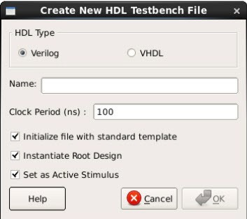

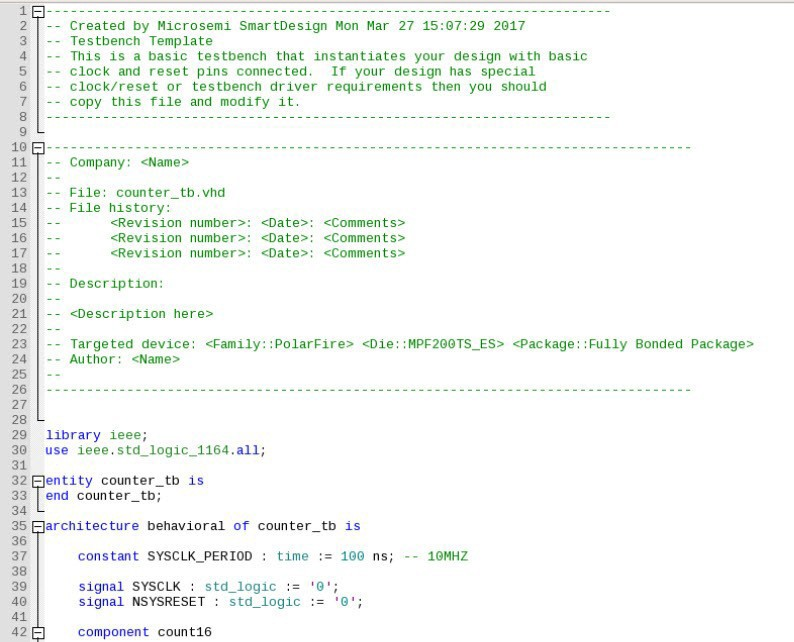

## Designing with Block Flow

For information about designing with Block Flow, see the [PolarFire Block Flow User Guide](https://coredocs.s3.amazonaws.com/Libero/2021_3/Tool/pf_block_flow_ug.pdf).

## Viewing Configured Components and SmartDesigns in a Project

Libero SoC supports the Components view that lists all the configured components and SmartDesigns in a project.

To open the view, click **View &gt; Windows &gt; Components**. Follow<br /> the same procedure to close the Components view.


When you open the Components view, it appears as a tab in the left-side area of the<br /> Libero SoC and lists all configured components and SmartDesigns in the project. If you<br /> open the Components view when a project is not open, the tab is empty.

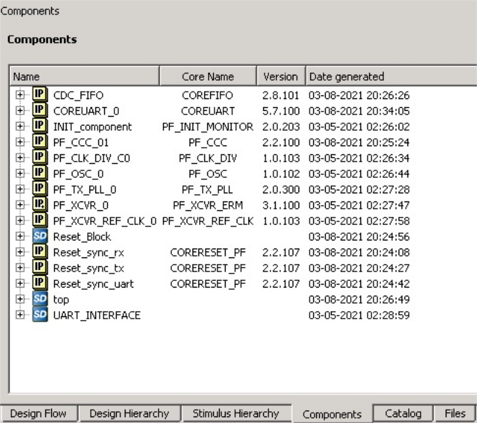

Right-clicking a component in the Components view tab displays a menu that is similar to<br /> the one that appears when you right-click entries in the Components section of the<br /> Design Hierarchy.

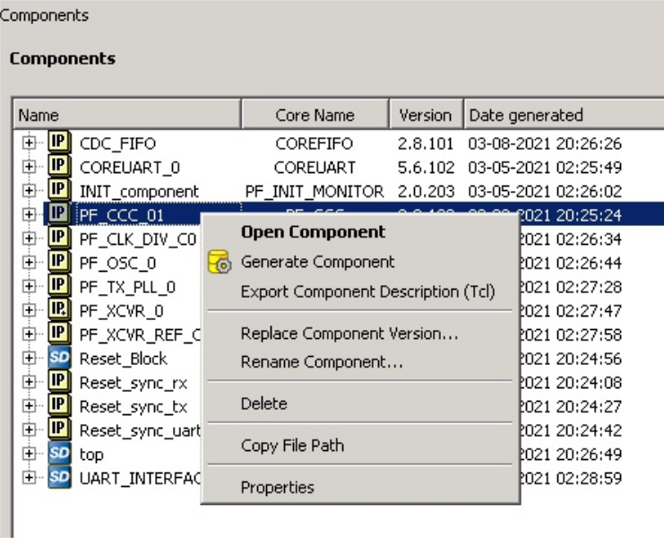

HDL source files present at various levels in<br /> `<project>/Component/work/<core_name>/` appear under<br /> **HDL Source Files**.

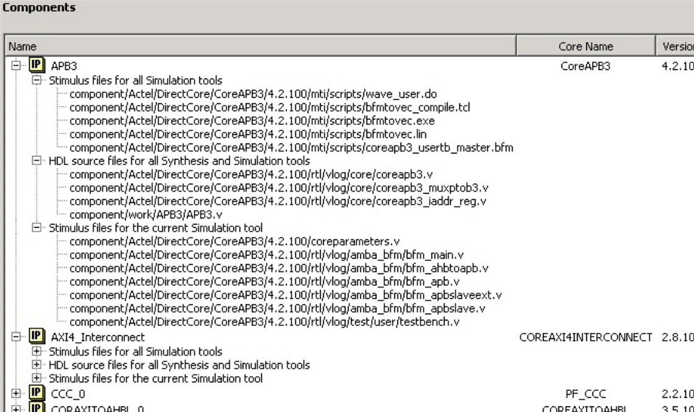

The **Vendor**, **Library**,<br /> **CoreName**, and **Version** columns show the<br /> appropriate information.

The timestamp shown for **Generation** appears in the **Date Generated** column and gets updated when the component gets<br /> regenerated.

## Create a New SmartDesign Testbench

The SmartDesign Testbench component can be the top level of the design. It can also be used as a lower level SmartDesign Testbench component in another design following a successful generation.

1.  From the **File** menu, choose **New &gt; SmartDesign Testbench**.

    or

    In the Design Flow window, double-click **Create SmartDesign Testbench**.

    The Create New SmartDesign Testbench dialog box appears.

    

2.  Enter a name.

    **Note:** The component name must be unique in your project.

3.  To make this SmartDesign Testbench your active stimulus, check the **Set as Active Stimulus** check box.

    **Note:** Setting one testbench as the Active Stimulus is necessary when there are multiple test benches in the stimulus hierarchy. When you select the test bench, make sure the Active Stimulus matches the DUT \(from the **Design Hierarchy** view\) that you want to stimulate.

4.  Click **OK**. The component appears in the **Stimulus Hierarchy** tab of the Design Explorer.

For more information, see the [SmartDesign User Guide](http://coredocs.s3.amazonaws.com/Libero/2025_1/Tool/smartdesign_ug.pdf).

## Import MSS

If you use a device from the PolarFire SoC family, a new tool called **Import MSS** is added under **Create Design** in the design<br /> flow process. When you run this tool, an Import MSS Component dialog box allows you to<br /> select the MSS Component \(`*.cxz`\) files. After importing the selected<br /> `*.cxz` module file, it appears in the Design Hierarchy window<br /> preceded by a new icon, as shown in the following figure.

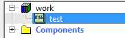

When importing an MSS block created using an ES device in a Libero project created using<br /> a non-ES device, the following error message appears:


When importing an MSS block created using an non-ES device, in a Libero project created<br /> using ES device, the following error message appears:

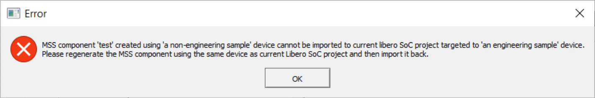

On right-clicking the MSS component and choosing **Open Component**,<br /> PolarFire SoC MSS Configurator opens up in read-only mode. If the MSS component is<br /> instantiated in your SmartDesign, you can also open the PolarFire SoC MSS component in<br /> the read-only mode on double-clicking the MSS Component instance in the SmartDesign<br /> Canvas. You will not be able to regenerate the design files from the PolarFire SoC MSS<br /> Configurator in the read-only mode.

You can also launch the PolarFire SoC MSS Configurator from the Libero tool as<br /> follows:

```
pfsoc_mss.exe \
-LIBERO_READ_ONLY_MODE \ 
-CONFIGURATION_FILE:<location_to_file>/<file_name>.cfg
```

Both the arguments are mandatory. This opens the PolarFire SoC MSS Configurator from the<br /> Libero tool in read-only mode. You must mention the path to the configuration file.

## Verify Pre-Synthesized Design - RTL Simulation

To perform pre-synthesis simulation, either:

-   Double-click **Simulate** under **Verify Pre-Synthesized Design** in the Design Flow window.

    or

-   In the Stimulus Hierarchy, right-click the testbench and choose **Simulate Pre-Synth Design &gt; Run**

The default tool for RTL simulation in Libero SoC PolarFire is ModelSim ME Pro.

ModelSim ME Pro is a custom edition of ModelSim PE that is integrated into Libero SoC's design environment. ModelSim for Microchip is an OEM edition of Siemens ModelSim tools. ModelSim ME Pro supports mixed VHDL, Verilog, and SystemVerilog simulation. It works only with Microchip simulation libraries and is supported by Microchip.

Libero SoC supports other editions of ModelSim. To use other ModelSim editions, do not install ModelSim ME Pro from the Libero SoC media.

**Note:** ModelSim ME Pro for Microchip includes online help and documentation. After starting ModelSim ME Pro, click the **Help**menu to display the help.

For more information about simulations in Libero SoC, see the following topics:

-   Simulation Options and Simulation Libraries in the [Project Settings Dialog Box](GUID-DD5BFD75-BB76-49D8-99EA-EC328F43A5FD.md#)
-   [Selecting a Stimulus File for Simulation](GUID-BA52F539-E830-4341-B5FA-D07408FE99BC.md#)
-   [Selecting additional modules for simulation](GUID-BA52F539-E830-4341-B5FA-D07408FE99BC.md#)
-   [Performing Functional Simulation](GUID-BA52F539-E830-4341-B5FA-D07408FE99BC.md#)

### Project Settings: Simulation - Options and Libraries

The Project Settings dialog box allows you to change how Libero SoC handles DO files in<br /> simulation and imports your DO files. You can also set simulation run time,<br /> change the DUT name used in your simulation, and change your library<br /> mapping.

To access the Project Settings dialog box:

1.  From the **Project** menu, choose **Project Settings**.
2.  In the left pane, click **Simulation options** or **Simulation libraries** to expand the options.
3.  For **Simulation options**, click the option you want to edit:
    -   **DO file**
    -   **Waveforms**
    -   **Vsim commands**
    -   **Timescale**
4.  For **Simulation libraries**, click the library whose path you want to change.

<br />

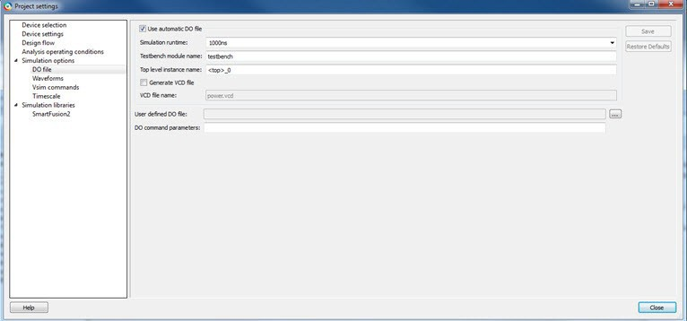

<br />

### DO file

|Option|Description|
|------|-----------|
|Use automatic DO file|Allows Project Manager to create a DO file automatically that will<br /> allow you to simulate your design.|
|Simulation Run Time|Available when **Use automatic DO file** is<br /> checked. Specifies how long the simulation must run. If the value is 0<br /> or if the field is empty, the run command is omitted from the<br /> `run.do` file.|
|Testbench module name|Available when **Use automatic DO file** is<br /> checked. Specifies the name of your testbench entity name. Default is<br /> `testbench`, which is the value that WaveFormer Pro<br /> uses.|
|Top Level instance name|Available when **Use automatic DO file** is<br /> checked. Default is `<top_0>`, the value that<br /> WaveFormer Pro uses. Project Manager replaces<br /> `<top>` with the top-level macro when you run<br /> simulation \(presynth/postsynth/postlayout\).|
|Generate VCD file|Available when **Use automatic DO file** is<br /> checked. Checking the check box generates a VCD file.|
|VCD file name|Available when **Use automatic DO file** is<br /> checked. Specifies the name of your generated VCD file. The default is<br /> `power.vcd`. To change the name, click<br /> **power.vcd** and enter the new name.|
|User defined DO file|Enter the DO file name or click the **Browse**<br /> button to go to the file.|
|DO command parameters|Text in this field is added to the DO command.|

### Waveforms

<table id="TABLE_GDG_DZV_D4B"><thead><tr><th>

Option

</th><th>

Description

</th></tr></thead><tbody><tr><td>

Include DO file

</td><td>

Allows you to customize the set of signal waveforms displayed in ModelSim ME Pro.

</td></tr><tr><td>

Display waveforms for

</td><td>

Displays signal waveforms for the top-level testbench or for the design under test. -   top-level testbench: Project Manager outputs the line `addwave/testbench/*` in the DO file `run.do`.
-   DUT: Project Manager outputs the line `add wave/testbench/DUT/*` in the `run.do` file.

</td></tr><tr><td>

Log all signals in the design

</td><td>

Saves and logs all signals during simulation.

</td></tr></tbody>
</table>### Vsim Commands

<table id="TABLE_YTW_5ZV_D4B"><thead><tr><th>

Option

</th><th>

Description

</th></tr></thead><tbody><tr><td>

Resolution

</td><td>

Default is 1 ps. Some custom simulation resolutions might not work<br /> with your simulation library. Consult your simulation help for<br /> information about how to work with your simulation library and detect<br /> infinite zero-delay loops caused by high resolution values.

</td></tr><tr><td>

Additional options

</td><td>

Text entered in this field is added to the `vsim`<br /> command.-   SRAM ECC Simulation: Two options can be added to specify the simulated error and correction probabilities of all ECC SRAMs in the design:
    -   `-gERROR_PROBABILITY=<value>`, where 0 &lt;= value &lt;= 1.
    -   `-gCORRECTION_PROBABILITY=<value>`, where 0 &lt;= value &lt;= 1.
-   During Simulation: Raises SB\_CORRECT and DB\_DETECT flags on each SRAM block based on generated random numbers that fall below the specified `<value>`s.

When you run the Post-Layout Simulation Tool, a<br /> run.do file is created that consists of<br /> information that must be sent to a simulator. To run a simulation on<br /> a corner, select an SDF corner and the type of delay needed from one<br /> of the options in SDF timing delays section.SDF<br /> Corners:Slow<br /> Process, Low Voltage and High TemperatureSlow<br /> Process, Low Voltage and Low TemperatureFast<br /> Process, High Voltage and Low TemperatureSDF Timing<br /> DelaysMinimumTypicalMaximumDisable pulse<br /> filtering during SDF-based simulations: This option disables<br /> pulse filtering during SDF simulations.After you<br /> select the corner, appropriate files for simulation are<br /> written in the run.do file, as shown in the<br /> following figure.

</td></tr></tbody>
</table>```
vlog -sv-work postlayout “$(PROJECT_DIR)/designer/sd1/sd1_fast_hv_lt_ba.v” 
vsim -L PolarFire -L postlayout -t 1ps -sdfmax
/sd1=$(PROJECT_DIR)/designer/sd1/sd1_fast_hv_lt_ba.sdf +pulse_int_e/1
+pulse_int_r/1 +transport _int_delays postlayout.sd1
```

### Timescale

|Option|Description|
|------|-----------|
|TimeUnit|Time base for each unit. Enter a value and select s, ms, us, ns, ps,<br /> or fs from the drop-down list.Default: ns|
|Precision|Enter a value and select s, ms, us, ns, ps, or fs from the drop-down<br /> list. Default: isps|

### Simulation Libraries

|Option|Description|
|------|-----------|
|Restore Defaults|Sets the library path to default from your Libero SoC<br /> installation.|
|Library path|Allows you to change the mapping for your Verilog and VHDL<br /> simulation libraries. Enter the pathname or click the<br /> **Browse** button to go to your library<br /> directory.|

### Selecting a Stimulus File for Simulation

Before running simulation, associate a testbench. If you try to run simulation without an<br /> associated testbench, the Libero SoC Project Manager prompts you to associate a testbench or<br /> open ModelSim ME Pro without a testbench.

To associate a stimulus:

1.  Run the simulation.

    or

    In the Design Flow window, under **Verify Pre-Synthesized Design**, right-click **Simulate** and choose **Organize Input Files &gt; Organize Stimulus Files**.

    The Organize Stimulus Files dialog box appears.

2.  Associate your testbenches. In the Organize Stimulus Files dialog box, all the stimulus files in the current project appear in **Source Files** in the **Project** list box. Files already associated with the block appear in the **Associated Source Files** list box.

    In most cases, you will have one testbench associated with your block. However, if you want simultaneous association of multiple testbench files for one simulation session, as in the case of PCI cores, add multiple files to the **Associated Source Files** list.

    -   To add a testbench: Select the testbench you want to associate with the block in **Source Files** in the **Project** list box and click **Add** to add it to the **Associated Source Files** list.
    -   To remove a testbench or change the files in the **Associated Source Files** list box: Select the files and click **Remove**.
    -   To order testbenches: Use the up and down arrows to arrange the order in which you want the testbenches compiled. The top level-entity must be at the bottom of the list.
3.  When you are satisfied with the **Associated Source Files** list, click **OK**.

### Selecting Additional Modules for Simulation

Libero SoC passes all the source files related to the top-level module to simulation.

If you need additional modules in simulation:

<br />

1.  Right-click **Simulate** in the Design Flow window and choose **Organize Input Files &gt; Organize Source Files**. The Organize Files for Simulation dialog box appears.
2.  From the **Simulation Files** in the **Project** list, select the HDL modules you want to add and click **Add** to add them to the **Associated Stimulus Files** list.

<br />

### Performing Functional Simulation

To perform functional simulation:

1.  Create your testbench.
2.  In the Design Flow window, select **Implement Design &gt; Verify Post-Synthesis Implementation**.
3.  Right-click **Simulate** and choose **Organize Input Files &gt; Organize Simulation Files** from the right-click menu. In the Organize Files for Source dialog box, all the stimulus files in the current project appear under **Source Files** in the **Project** list box. Files associated with the block appear in the **Associated Source Files** list box.
4.  In most cases, you will have one testbench associated with your block. However, if you want simultaneous association of multiple testbench files for one simulation session, as in the case of PCI cores, add multiple files to the **Associated Source Files** list.
    -   To add a testbench: In the **Source Files**of the **Project** list box, select the testbench you want to associate with the block. Click **Add** to add it to the **Associated Source Files** list.
    -   To remove a testbench or change the files in the **Associated Source Files** list box: Select the files and click **Remove**.
5.  When you are satisfied with the **Associated Simulation Files** list, click **OK**.
6.  To start ModelSim ME Pro, right-click **Simulate** in the Design Hierarchy window and choose **Open Interactively**. ModelSim ME Pro starts and compiles the appropriate source files. When the compilation completes, the simulator runs for 1̮ ms and the Wave window shows the simulation results.
7.  Scroll in the Wave window to verify that the logic of your design functions as intended. Use the zoom buttons to zoom in and out as necessary.
8.  When finished, select **Quit** from the **File** menu.

