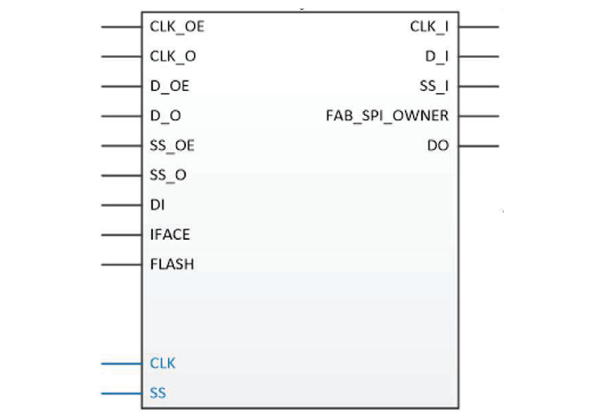

# Special

## FCEND\_BUFF

Buffer, driven by the FCO pin of the last macro in the Carry-Chain.

<br />


<br />

|Input|Output|
|-----|------|
|A|Y|

|A|Y|
|---|---|
|0|0|
|1|1|

## FCINIT\_BUFF

Buffer, used to initialize the FCI pin of the first macro in the<br /> Carry-Chain.

<br />


<br />

|Input|Output|
|-----|------|
|A|Y|

|A|Y|
|---|---|
|0|0|
|1|1|

## PF\_SPI

The PF\_SPI macro allows your design access to the dedicated System<br /> Controller SPI port, when SPI-​Initiator mode is enabled, by tying both SC\_SPI\_EN and<br /> IO\_CFG\_INTF to high.

<br />



<br />

|Port|Direction|Polarity|Description|
|----|---------|--------|-----------|
|D\_I|Output|—|This port is connected to the SPI DI pin.|
|FAB\_SPI\_OWNER|Output|High|Indicator to the Fabric SPI-​Initiator if the<br /> SPI Port is available.|
|CLK\_OE|Input|High|Enables the SPI CLK output.|
|CLK\_O|Input|—|This port drives the SPI Clock pin. CLK\_OE must be HIGH to drive.|
|D\_OE|Input|High|Enables the Data output.|
|D\_O|Input|—|This port drives the SPI DO pin. D\_OE must be HIGH to drive.|
|SS\_OE|Input|High|Enables the Target Select output.|
|SS\_O|Input|High|This port drives the SPI Target Select \(SS\)<br /> pin. SS\_OE must be HIGH to drive.|
|CLK|Output|—|SPI Clock output pin.|
|DI|Input|—|SPI Serial Data input pin.|
|DO|Output|—|SPI Serial Data output pin.|
|SS|Output|High|SPI Target Select output pin.|
|IFACE|Input|High|This port is mapped to the IO\_CFG\_INTF pin. This pin must be tied to high together with the SC\_SPI\_EN pin to enable SPI port for the fabric macro to work.|
|FLASH|Input|High|This port is mapped to the SC\_SPI\_EN pin. This pin must be tied to high together with the IO\_CFG\_INTF pin to enable the SPI port for fabric macro to work.|

## SC\_STATUS

In the SC\_STATUS macro, the SUSPEND\_EN signal indicates that the device is in avionics mode, meaning device initialization is complete and all hardware defaults are set.

**Important:** This macro does not support simulation. To simulate the System Controller suspend mode, add the following pseudo-code to the simulation testbench:

-   At simulation time t = 0, set `SUSPEND_EN` = 0, and `ACTIVE` = 1.
-   0.625 µs after the later of `DEVICE_INIT_DONE` = 1 or `AUTOCALIB_DONE` = 1 is asserted, set `SUSPEND_EN` = 1, and `ACTIVE` = 0 to indicate that the system controller has entered suspend mode.


|Value|Description|
|-----|-----------|
|0|The device is not in avionics mode.|
|1|The device is in avionics mode.|

For ACTIVE signal, if SC is in suspend mode, ACTIVE signal must not be asserted.

|Port|On ​Initiator|On Target|Description|
|Presence|Width|Direction|Presence|Width|Direction|
|----|-------------|---------|-----------|
|--------|-----|---------|--------|-----|---------|
|SUSPEND\_EN|Required|1|Output|Required|1|Input|Asserted when SC is in suspend mode.|
|ACTIVE|Required|1|Output|Required|1|Input|Asserted when SC is in active mode.|

## OSC\_RC160MHZ

The OSC\_RC160MHZ oscillator is an RC oscillator that provides a free-running clock of 160 MHz at CLKOUT when OSC\_160MHZ\_ON is tied HIGH.

## OSC\_RC2MHZ

The OSC\_RC2MHZ oscillator is an RC oscillator that provides a free-running clock of 2 MHz<br /> at CLKOUT when OSC\_2MHZ\_ON is tied HIGH.

## LIVE\_PROBE\_A

This is one of the specialized probes. SmartDebug uses the dedicated and specialized probe points built in the FPGA fabric, which significantly accelerates and simplifies the debug process.

## INIT

This macro does do not have any inputs. It has the following output ports, which are asserted after the specified time that is passed as parameters.

-   **FABRIC\_POR\_N**: De-asserted when the fabric is operational.
-   **PCIE\_INIT\_DONE**: Used by fabric logic to hold PCIe-related fabric logic in reset until the PCIe controller is initialized. PCIE\_INIT\_DONE is asserted after initializing the PCIe lane instances placed in the PCIe quad. If only XCVR lanes are placed in the PCIe quad, only XCVR\_INIT\_DONE is asserted.
-   **RFU\[0\]**: Asserted when the XCVR block is initialized.
-   **RFU\[1\]**: Asserted when μSRAM is initialized from sNVM.
-   **RFU\[2\]**: Asserted when μSRAM is initialized from µPROM.
-   **RFU\[3\]**: Asserted when μSRAM is initialized from SPI.
-   **RFU\[4\]**: Asserted when SRAM is initialized from sNVM.
-   **RFU\[5\]**: Asserted when SRAM is initialized from µPROM.
-   **RFU\[6\]**: Asserted when SRAM is initialized from SPI.
-   **RFU\[7\]**: Asserted when auto calibration is done.
-   **SRAM\_INIT\_DONE**: Asserted when the LSRAM blocks are initialized.
-   **USRAM\_INIT\_DONE**: Asserted when the µSRAM blocks are initialized.
-   **GPIO\_ACTIVE**: This signal can be used by user logic to determine if the calibration completes for each I/O banks. \# denotes the bank number \(0,1, 7, 8, and 9\).
-   **HSIO\_ACTIVE**: This signal can be used to monitor if there is VDDI power loss on specific I/O banks. This is an output signal from the INIT\_MONITOR IP if any of the corresponding bank is selected. \# denotes the bank number \(0,1, 7, 8, and 9\).

## LANECTRL

The lane controller handles the complex operations necessary for the high-speed interfaces, such as DDR memory and CDR interfaces. To bridge the lane clock to the high-speed I/O clock, the lane controller is used to control an I/O FIFO in each IOD. The I/O FIFO interfaces with DDR memory by using the Data Q Strobe \(DQS\) on the lane clock. The lane controller can also delay the lane clock using a Process, Voltage, and Temperature \(PVT\)-calculated delay code from the DLL to provide a 90° shift. Certain I/O interfaces require a lane controller to handle the clock-domain that results with higher gear ratios. The lane controller also provides the functionality for the IOD CDR. Using the four phases from the CCC PLL, the lane controller creates eight phases and selects the proper phase for the current input condition with the input data.

## LANECTRL\_BYPASS

This macro puts the LANECTRL in bypass mode. It has three ports A, RESET and CLK\_OUT\_R.

## PFSOC\_SCSM

The `PFSOC_SCSM` macro allows a PolarFire SoC device, configured with the<br /> System Controller Suspend Mode \(SCSM\) enabled, to support MSS reboots during normal<br /> device operation. Without this macro, the System Controller:

-   Will remain in suspend mode during normal operation after the initial power-up device initialization and MSS boot completion.
-   Will not service subsequent MSS boot requests, even if you reset the MSS.

You must connect the `REBOOT_REQUESTED_M2F` output of the MSS component to<br /> the `SC_WAKE` input pin of the `PFSOC_SCSM` macro. Other<br /> connections are not permitted.

**Important:** To enable the `REBOOT_REQUESTED_M2F` port in the MSS configurator, check the **Expose Feedback ports to Fabric** option under the **Misc** tab.

With this connection added to your FPGA fabric design, whenever the `MSS REBOOT_REQUESTED_M2F` output is asserted, the System Controller exits SCSM<br /> and processes the pending MSS reboot request. Once the MSS boots, the<br /> `REBOOT_REQUESTED_M2F` output will deassert and the System Controller<br /> returns to the suspend mode. The System Controller status can be monitored via the<br /> `SC_STATUS` macro.

**Important:** The `PFSOC_SCSM` macro only supports the PolarFire SoC \(production device\) family. PolarFire SoC Engineering Silicon \(ES\) devices are not supported.


### Design Rule Checks

Following are the Design Rule Checks \(DRCs\) for the `PFSOC_SCSM`<br /> macro.

-   Check that the driver is only `MSS REBOOT_REQUESTED_M2F`, otherwise the `PFSOC_SCSM` macro will error out and stop the flow with the following message:

    ``` {#CODEBLOCK_NCH_SHL_TSB}
    The PFSOC_SCSM primitive macro only supports being driven by the MSS component’s REBOOT_REQUESTED_M2F output. Other drivers are not supported. See the PolarFire SoC Macro Library Guide for more information.
    ```

-   If Suspend is not enabled, and the `PFSOC_SCSM` is instantiated, a warning is issued in the **Export Design Initialization Data and Memory Report** file.

    ``` {#CODEBLOCK_DBH_XHL_TSB}
    The PFSOC_SCSM macro is instantiated in the design, but System Controller Suspend Mode is not enabled. This macro is intended for use with System Controller Suspend Mode. See the PolarFire SoC Macro Library Guide for more information.
    ```

-   If Suspend is enabled, and the MSS is used, but the `PFSOC_SCSM` macro is not instantiated, a warning is issued in the **Export Design Initialization Data and Memory Report** file.

    ``` {#CODEBLOCK_KSG_13L_TSB}
    The PFSOC_SCSM macro is not instantiated even though System Controller Suspend Mode is enabled and the MSS component is instantiated. The system controller will not be available to process MSS reboot requests during operation. See the PolarFire SoC Macro Library Guide for more information.
    ```

-   The `PFSOC_SCSM` macro is visible only for the PolarFire SoC designs. This macro is required for the PolarFire SoC designs using the MSS component and for enabling System Controller Suspend Mode \(SCSM\). When not used in the PolarFire SoC designs, Libero ties the input to the System Controller to a static `1`.
-   If an ES device or a PolarFire family is selected, the `PFSOC_SCSM` macro will error out and stop the flow in compile with the following error message, as only production PolarFire SoC devices are supported.

    <br />

    ``` {#CODEBLOCK_E1L_MWM_WSB}
    CMPPF_026: This design has one or more instances of the PFSOC_SCSM macro which is not supported for the device in use. Before compiling, this macro(s) must be removed from the design.
    ```

    <br />

-   For RT PolarFire SoC devices:

    ``` {#CODEBLOCK_CYQ_JBW_FFC}
    Error: The `PFSOC_SCSM` pin cannot be static. Refer to the PolarFire SoC Macro Library Guide for more information."
    ```


