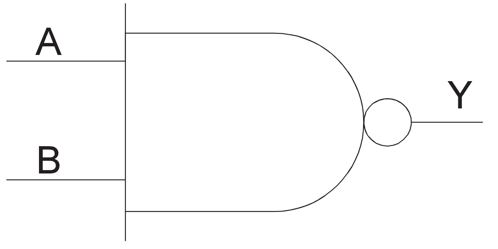
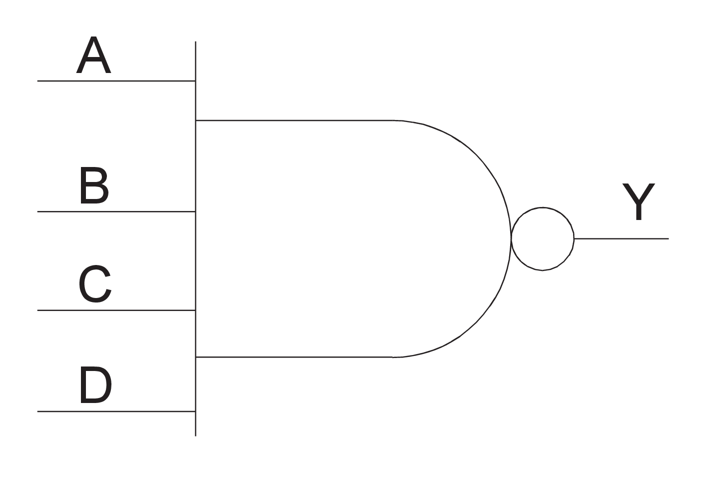
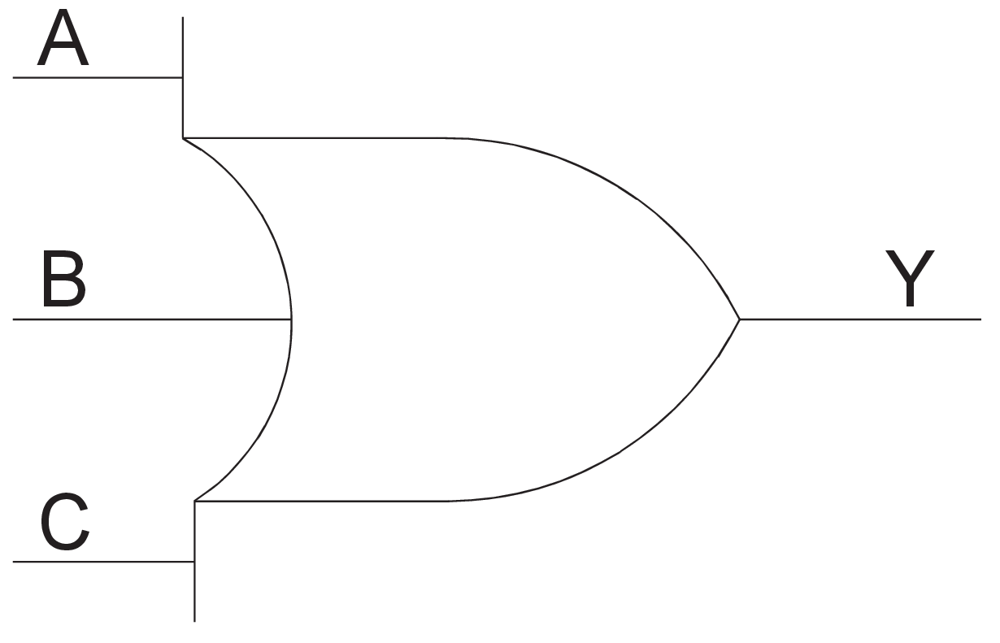
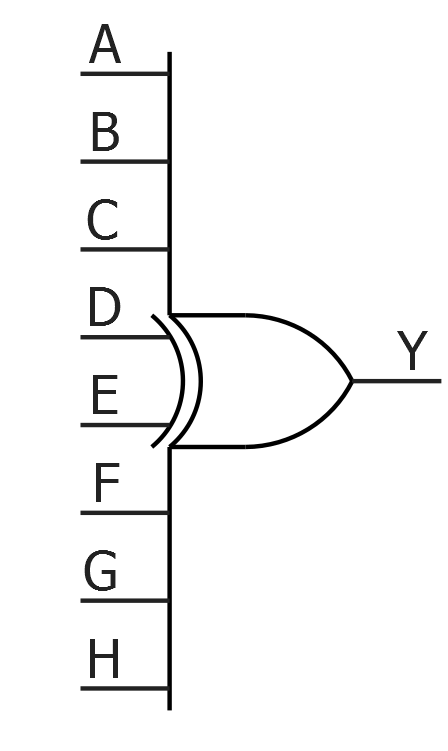

# hm4

## INV

Inverter.

 

 

|Input|Output|
|-----|------|
|A|Y|

|A|Y|
|---|---|
|0|1|
|1|0|

## INVD

Inverter.

**Note:** Compile optimization does not remove this macro.

|Input|Output|
|-----|------|
|A|Y|

|A|Y|
|---|---|
|0|1|
|1|0|

## MX2

2 to 1 Multiplexer.

 

 

|Input|Output|
|-----|------|
|A, B, S|Y|

|A|B|S|Y|
|---|---|---|---|
|A|X|0|A|
|X|B|1|B|

## MX4

4 to 1 Multiplexer.

This macro uses two logic modules.

 

 

|Input|Output|
|-----|------|
|D0, D1, D2, D3, S0, S1|Y|

|D3|D2|D1|D0|S1|S0|Y|
|---|---|---|---|---|---|---|
|X|X|X|D0|0|0|D0|
|X|X|D1|X|0|1|D1|
|X|D2|X|X|1|0|D2|
|D3|X|X|X|1|1|D3|

## NAND2

2-Input NAND.

 

 

|Input|Output|
|-----|------|
|A, B|Y|

|A|B|Y|
|---|---|---|
|X|0|1|
|0|X|1|
|1|1|0|

## NAND3

3-Input NAND.

 

 

|Input|Output|
|-----|------|
|A, B, C|Y|

|A|B|C|Y|
|---|---|---|---|
|X|X|0|1|
|X|0|X|1|
|0|X|X|1|
|1|1|1|0|

## NAND4

4-input NAND.

 

 

|Input|Output|
|-----|------|
|A, B, C, D|Y|

|A|B|C|D|Y|
|---|---|---|---|---|
|X|X|X|0|1|
|X|X|0|X|1|
|X|0|X|X|1|
|0|X|X|X|1|
|1|1|1|1|0|

## NOR2

2-input NOR.

 

 

|Input|Output|
|-----|------|
|A, B|Y|

|A|B|Y|
|---|---|---|
|0|0|1|
|X|1|0|
|1|X|0|

## NOR3

3-input NOR.

 

 

|Input|Output|
|-----|------|
|A, B, C|Y|

|A|B|C|Y|
|---|---|---|---|
|0|0|0|1|
|X|X|1|0|
|X|1|X|0|
|1|X|X|0|

## NOR4

4-input NOR.

 

 

|Input|Output|
|-----|------|
|A, B, C, D|Y|

|A|B|C|D|Y|
|---|---|---|---|---|
|0|0|0|0|1|
|1|X|X|X|0|
|X|1|X|X|0|
|X|X|1|X|0|
|X|X|X|1|0|

## OR2

2-input OR.

 

 

|Input|Output|
|-----|------|
|A, B|Y|

|A|B|Y|
|---|---|---|
|0|0|0|
|X|1|1|
|1|X|1|

## OR3

3-input OR.

 

 

|Input|Output|
|-----|------|
|A, B, C|Y|

|A|B|C|Y|
|---|---|---|---|
|0|0|0|0|
|X|X|1|1|
|X|1|X|1|
|1|X|X|1|

## OR4

4-input OR.

 

 

|Input|Output|
|-----|------|
|A, B, C, D|Y|

|A|B|C|D|Y|
|---|---|---|---|---|
|0|0|0|0|0|
|1|X|X|X|1|
|X|1|X|X|1|
|X|X|1|X|1|
|X|X|X|1|1|

## XOR2

2-input XOR.

 

 

|Input|Output|
|-----|------|
|A, B|Y|

|A|B|Y|
|---|---|---|
|0|0|0|
|0|1|1|
|1|0|1|
|1|1|0|

## XOR3

3-input XOR.

|Input|Output|
|-----|------|
|A, B, C|Y|

|A|B|C|Y|
|---|---|---|---|
|0|0|0|0|
|1|0|0|1|
|0|1|0|1|
|1|1|0|0|
|0|0|1|1|
|1|0|1|0|
|0|1|1|0|
|1|1|1|1|

## XOR4

4-input XOR.

|Input|Output|
|-----|------|
|A, B, C, D|Y|

|A|B|C|D|Y|
|---|---|---|---|---|
|0|0|0|0|0|
|0|0|0|1|1|
|0|0|1|0|1|
|0|0|1|1|0|
|0|1|0|0|1|
|0|1|0|1|0|
|0|1|1|0|0|
|0|1|1|1|1|
|1|0|0|0|1|
|1|0|0|1|0|
|1|0|1|0|0|
|1|0|1|1|1|
|1|1|0|0|0|
|1|1|0|1|1|
|1|1|1|0|1|
|1|1|1|1|0|

## XOR8

8-input XOR.

This macro uses two logic modules.

|Input|Output|
|-----|------|
|A, B, C, D, E, F, G, H|Y|

If you have an odd number of inputs that are High, the output is High \(1\).

If you have an even number of inputs that are High, the output is Low \(0\).

For example:

|A|B|C|D|E|F|G|H|Y|
|---|---|---|---|---|---|---|---|---|
|0|0|0|0|0|0|0|0|0|
|0|0|0|0|0|0|0|1|1|
|0|0|0|0|0|0|1|1|0|

## UJTAG

The UJTAG macro is a special purpose macro. It allows access to the user JTAG circuitry on board the chip. You must instantiate a UJTAG macro in your design if you plan to make use of the user JTAG feature. The TMS, TDI, TCK, TRSTB, and TDO pins of the macro must be connected to top level ports of the design.

|Port|Direction|Polarity|Description|
|----|---------|--------|-----------|
|UIREG\[7:0\]|Output|—|This 8-bit bus carries the contents of the JTAG instruction register of each device. Instruction values 16 to 127 are not reserved and can be employed as user-defined instructions.|
|URSTB|Output|Low|URSTB is an Active-Low signal and is asserted when the TAP  controller is in Test-Logic-Reset mode. URSTB is asserted at power-up,  and a Power-on Reset signal resets the TAP controller state.|
|UTDI|Output|—|This port is directly connected to the TAP's TDI signal.|
|UTDO|Input|—|This port is the user TDO output. Inputs to the UTDO port are sent to the TAP TDO output MUX when the IR addess is in user range.|
|UDRSH|Output|High|Active-High signal enabled in the Shift\_DR TAP state.|
|UDRCAP|Output|High|Active-High signal enabled in the Capture\_DR\_TAP state.|
|UDRCK|Output|—|This port is directly connected to the TAP's TCK signal.|
|UDRUPD|Output|High|Active-High signal enabled in the Update\_DR\_TAP state.|
|TCK|Input|—|Test ClockSerial input for JTAG boundary  scan, ISP, and UJTAG. The TCK pin does not have an internal  pull-up/pull-down resistor. Connect TCK to GND or 3.3V through a  resistor \(500–1 KΩ\) placed closed to the FPGA pin to prevent  totem-pole current on the input buffer and TMS from entering into an  undesired state.If JTAG is not used, connect  it to GND.|
|TDI|Input|—|Test Data in. Serial input for JTAG boundary scan. There is an internal weak pull-up resistor on the TDI pin.|
|TDO|Output|—|Test Data Out. Serial output for JTAG boundary scan. The TDO pin does not have an internal pull-up/pull-down resistor.|
|TMS|Input|—|Test mode select. The TMS pin controls the use of the  IEEE® 1532 boundary scan pins \(TCK, TDI, TDO, and TRST\).  There is an internal weak pull-up resistor on the TMS pin.|
|TRSTB|Input|Low|Test reset. The TRSTB pin is an active-low input. It  synchronously initializes \(or resets\) the boundary scan circuitry. There  is an internal weak pull-up resistor on the TRSTB pin.To hold the JTAG in reset mode and prevent it from  entering into undesired states in critical applications, connect  TRSTB to GND through a 1 KΩ resistor \(placed close to the FPGA  pin\).|

