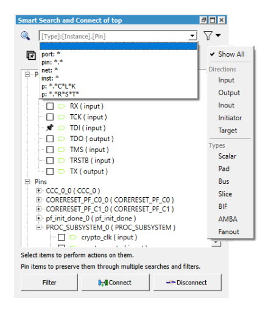
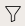
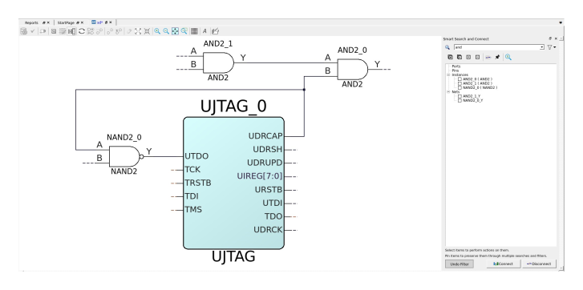

# Using the Smart Search and Connect Tool

The **Smart Search and Connect** tool manages large designs with many  pins, ports, and nets to connect. Design objects can be searched and connected easily without  looking at the SmartDesign canvas. You can see the connections on the SmartDesign canvas as  you make them. Any errors in the design are printed in the **Log**  window.

The **Smart Search and Connect** tool also help with complex searching and  efficiently connecting multiple objects \(clocks, resets, and so on\) at the same time. You can  search items using keywords and filters, select them, and then connect them using the  right-click menu options. Alternatively, you can click **Connect** or  **Disconnect** in the **Smart Search and Connect**  tool window. It is possible to keep the result of a search by pinning the desired items and  performing multiple searches. The pinned items are retained and available in search results,  even if they do not match search patterns.

To launch the **Smart Search and Connect** tool, use either of the  following methods:

1.  On the menu, click **Edit** and select **Find**.
2.  On the SmartDesign toolbar, click the **Smart Search and Connect** toggle icon.

**Result:** By default, the dockable **Smart Search and Connect** dialog box appears to the right side of the canvas. You can undock the  tool window and move it a different location in the SmartDesign tool window as needed.

## Searching for Design Objects in the Canvas

You can use the **Search** box in the **Smart Search and Connect** tool to search and connect design objects. The  **Search** box uses the following search pattern:  **\[Type\]:\[Instance\].\[Pin\]**.

**Important:** You can keep searched items by pinning them. Pinned items remain visible through multiple searches.

You can do a simple search when your search consists of only alphanumerical characters.  All pins, ports, instances, and nets that match the search pattern appears in the search  results tree view automatically. If the search pattern has the “`.`”  separator symbol, SmartDesign tool treats the part before the separator as an instance  name and the part after as a pin name.

You can also search by the following keywords: **port:**,  **pin:**, **instance:**,  **net:**, and **\*:**. Alternatively, you can  use their abbreviated versions. You must specify the keywords at the beginning of the  search pattern.

The SmartDesign canvas zooms in and highlights the design object. Zoom out far enough,  with the design object still selected, to see the rest of the design and make the net  connections.

## Narrowing the Search for Design Objects Using Filters

You can use the narrow search filter button \(\) to filter the design objects based on either pin or port  directions or pin or port types or with a combination of both in the Smart Search and  Connect tool. The selected filter is applied on the search results and are displayed in  the treeview.

The following table depicts the filter states.

|Icon State|Description|
|----------|-----------|
||Filter is selected|
||No filter is selected|

## Applying the Selected Filters on the Design Objects in the Canvas

You can apply the selected filters and display only a subset of the SmartDesign objects  using the **Filter** toggle button in the **Smart Search and Connect** tool. This view is suitable to use with large designs to focus  on a particular structure of the design, such as the clock, reset structure, or AMBA  sub-systems for instance.

To create a filtered view in the SmartDesign canvas, click **Filter**  in the **Smart Search and Connect** tool. The SmartDesign canvas  applies the filters and redraws the canvas with the filtered design objects visible in  the **Smart Search and Connect** tools treeview.

**Important:** The filtered SmartDesign canvas with the object\(s\) are **_read-only_**.

In the **Filtered** canvas view, except for the navigation commands  all other editorial commands and right-click options are disabled. The  **Filtered** canvas view is created with a cone structure. To add  new objects to the filtered canvas, double-click the dotted nets to see all the  connected nets to these nets in an expanded view. The net appears dotted if it is  connected to an instance that is not included in the filtered view. You can double-click  the dotted net to load all the instances connected to that net.

To add new objects to the filtered view from the Smart Search and Connect tool’s treeview  results, right-click the object of interest and select **Add to Filtered View**. When you add a pin or port to the filtered view, the tool adds the  net connected to the object\(s\).

To exit the read-only filtered view to a normal SmartDesign canvas, perform the following  steps:

-   Toggle the **Undo Filter** button.
-   Close the **Smart Search and Connect** window using **X** button.
-   Press **Ctrl+Z** or **Undo** button.

## Connecting and Disconnecting the Ports or Pins

You can choose to connect or disconnect pins and ports in your design.

### Connecting Pins or Ports

You can connect the unconnected pins or ports in either of the following ways:

-   In the Smart Search and Connect tool’s treeview, hold the **Ctrl** key pressed, select the unconnected pins or ports that you want to connect, and click the **Connect** button in the Smart Search and Connect tool window.
-   In the SmartDesign canvas, hold the **Ctrl** key pressed, select the unconnected pins or ports that you want to connect, right-click on any of the selected pin or port, and select the **Connect** option.

**Result:** Connections are made between the selected pins or  ports.

### Disconnecting Pins or Ports

You can disconnect the connected pins or ports in either of the following ways:

-   In the Smart Search and Connect tool’s treeview, hold the **Ctrl** key pressed, select the connected pins or ports that you want to disconnect, and click the **Disconnect** button in the Smart Search and Connect tool window.
-   In the SmartDesign canvas, hold the **Ctrl** key pressed, select the connected pins or ports that you want to disconnect, right-click on any of the selected pin or port, and click the **Disconnect** option.

**Result:** Connections between the selected pins or ports are  disconnected.

