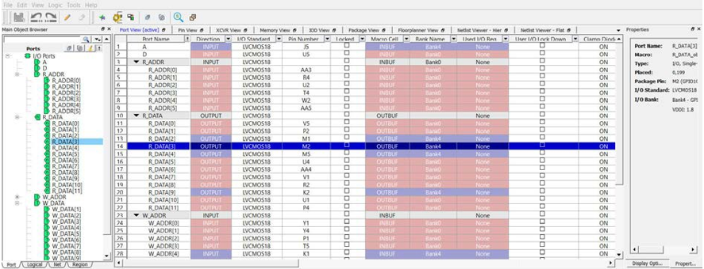

# Port View

The Port View displays the I/O attributes in a spreadsheet-like format.  Each row corresponds to an I/O port in the design, sorted by the port name. The column  headings specify the names of the I/O attributes in your design. The first few column  headings are standard and common for all families. The remaining columns display  family-specific attributes. Only attributes applicable to a specific device appear in the  I/O Editor attributes table. For some I/O attributes, you will choose from a drop-down  menu; for others, you might enter a value and for others, the field is read-only and not  editable.

Displayed columns can be sorted alphabetically, numerically, or  filtered.

In the I/O Editor, the ports can be viewed in a spreadsheet-like format or  in the Design Tree View window of the Port tab. A port selected in the Port tab is also  selected in the Port View spreadsheet and vice versa. The following figure shows the DM\[0\]  selected in the spreadsheet and the Design Tree port view.

The Port View also displays the memory width and data rate of the DDR  instance in the design \(if it exists in the design\) in the top left row under the Port Name  column, as shown in the following figure.

**Note:** ****See the following documents for more information about the I/O standards supported by each attribute:

-   [PDC Commands User Guide for SmartFusion2, IGLOO2, and RTG4](http://coredocs.s3.amazonaws.com/Libero/2025_1/Tool/pdc_ug.pdf)
-   [PDC Commands User Guide for PolarFire FPGA](http://coredocs.s3.amazonaws.com/Libero/2025_1/Tool/pf_pdc_ug.pdf)

-   **[Port Name](GUID-D2E50431-3A23-4D52-B540-0F1E7F9CA939.md)**  

-   **[Direction](GUID-58DD1DCC-6A7A-46D3-B7EE-626B083B3432.md)**  

-   **[I/O Standard](GUID-58E913BB-28E8-45C0-8069-0E024A65C687.md)**  

-   **[Pin Number](GUID-263EA4B6-B1C0-4A20-9684-B36EAD9FA5CE.md)**  

-   **[Locked](GUID-BC869B5C-E3C7-4F1B-B8B8-833A605863D7.md)**  

-   **[Macro Cell](GUID-AC7E9501-9FE9-4745-A3E4-0DCEADE66C66.md)**  

-   **[Bank Name](GUID-457F0C99-3599-41F1-A4F2-B9E1301C8CF9.md)**  

-   **[User I/O Lock Down](GUID-A2E7B305-578E-4B11-AD5E-6407F72C7BB8.md)**  

-   **[I/O State in Flash\*Freeze Mode](GUID-80A40382-38CF-4473-A5A3-7ECE17E3A975.md)**  

-   **[Clamp Diode](GUID-2C2B08DA-B2E1-4409-B07D-D253D201E260.md)**  

-   **[Resistor Pull](GUID-A4598C13-4708-471D-8D7A-9DD7ACC71B0F.md)**  

-   **[I/O Available in Flash\*Freeze Mode](GUID-AC8D1E5D-CA30-4519-BB19-0B966FE17536.md)**  

-   **[Use I/O Calibration from the Lane](GUID-58E30566-9D46-4FF0-B3E8-67B3E76B61AD.md)**  

-   **[Schmitt Trigger](GUID-F215C692-D2D1-4486-8A0C-912B223F39DD.md)**  

-   **[Vcm Input Range](GUID-E818C316-3EAA-4C88-87FC-286E4CE4521B.md)**  

-   **[On-Die Termination](GUID-CFB42E4A-CBE8-4970-926D-5D77B1317F2F.md)**  

-   **[ODT Static](GUID-4C06CFFA-0322-49C8-BDC0-80B7FA8947DD.md)**  

-   **[ODT Dynamic](GUID-F9850BF9-1110-46D7-8DD8-71456276D087.md)**  

-   **[ODT Value](GUID-13349EAD-4BA8-4CD5-97D2-0C9B9BBA46AC.md)**  

-   **[ODT Imp \(Ohm\)](GUID-12442457-E9A5-447E-89D7-1613DC9F5017.md)**  

-   **[Low Power Exit](GUID-E87586AB-E397-4E12-8D2B-D1B592BED3B0.md)**  

-   **[Input Delay](GUID-EF55599B-A16C-4220-A24C-53B4E9EDD3F6.md)**  

-   **[Slew](GUID-832368DE-A6EF-475B-B1B0-EC5B735FEE8D.md)**  

-   **[Pre-Emphasis](GUID-730F3AED-4B9F-41D7-9F91-512071B17579.md)**  

-   **[Output Drive](GUID-9907257D-1B09-44C8-B919-4BC79CE1F6DF.md)**  

-   **[Impedance](GUID-F43851B4-CE82-41B6-B3A7-D6106A626D1C.md)**  

-   **[Output Load](GUID-01893D19-78A8-4177-8988-93225D73FB3F.md)**  

-   **[Source Termination](GUID-FCDCF986-28CB-4AE8-AAB4-DA9E24E4C89F.md)**  

-   **[Output Delay](GUID-654E74E8-2939-444D-9FD1-16BFD8DE5690.md)**  

