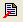
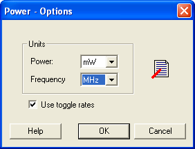

# Power Options

Allows you to set options that affect graphical and textual reports.

To open the SmartPower Power Options dialog box:

1.  From the **File**menu, choose **Options**.

2.  Select the **Options**panel in the Power Report dialog box.

3.  Click the  icon in the SmartPower toolbar.

    

    The dialog box has two sections: **Units**and **Use Toggle Rates**.

    -   **Units**: sets unit preferences for power \(W, mW, and uW\) and frequency \(Hz, KHz, and MHz\).
    -   **Use toggle rates**: when checked, the data frequency of all the clock domains is defined as a function of the clock frequency. This updates the data frequency automatically when you update the clock frequency. Toggle rates allow you to specify the data frequency as a percentage of clock frequency, but you can no longer specify the data frequency as a number, only as a percentage of the clock frequency. To specify data frequencies, clear the **Use toggle rates**option in the Preferences window.
    You can set the data frequency percentage when you create a new clock domain  with toggle rates active. In addition, when toggle rates are active you can  set the data frequency percentage in the **Domain and Frequencies**  tabs.

    

