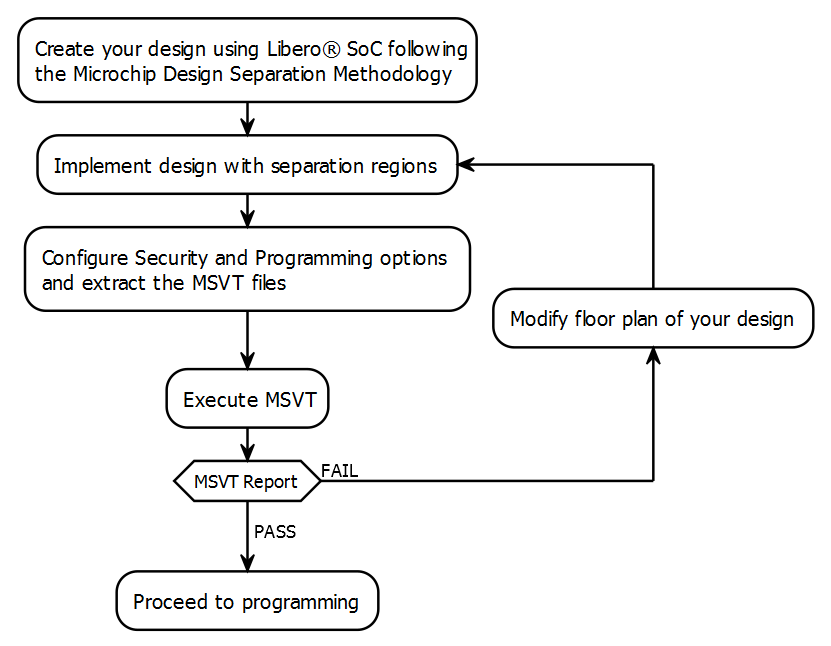

# Overview

MSVT can work on any placed and routed design that has a block requiring a separation from all elements external to the block. The tool works iteratively on every block to be verified. Internal signals and Inter-region signal \(IRS\) are verified separately. The tool checks whether the separation criteria is satisfied for each block and corresponding set of IRS signals.

Your design must adhere to the following criteria to implement a security- and safety-critical system:

-   Each block of your design must be assigned to a separation region.
-   There must be a minimum gap of unused logic clusters between separation regions, depending on your design requirement.
-   Each set of inter-block interface signals must be defined as an IRS region.

The following flowchart lists the design separation methodology steps.

