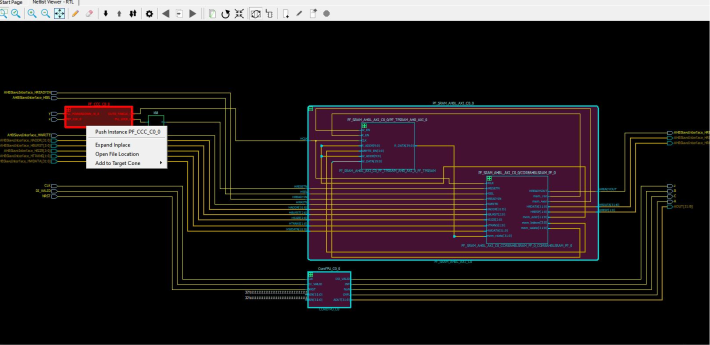

# Adding Selected Objects to a Cone

Design objects such as port, nets, and instances can be added to a logical cone.

-   When a net is selected and added to the cone, the instance connected to the net is added, and the net is a solid line in the cone.
-   Nets that are automatically added to the view \(because of added instances\) is always shown as dashed \(regardless of whether or not they have additional connections not yet added to the view\).
-   Nets are solid lines when they are added through the tree, or double clicking a dashed net, or when adding a port to the view, which adds its attached net.
-   Ports are not added to the view if an attached dashed net is already in the view.
-   When an instance is selected and added to the cone, all the partial nets of the instance are added to the instance pins. Nets which are represented by dash lines are partial nets, which are automatically added to the cone view when an instances is added. Double clicking a partial net in a cone view adds to the cone all the ports and instances the partial net is connected to. The dashed net changes to a solid line.

To add design objects to a logical cone:

1.  Make sure the cone to which you want to add design objects is the Target Cone. Only one cone can be active at a time.
2.  In Netlist Viewer or a Logical Cone view, select the instance, pin, or net to add to the logical cone.
3.  From the Netlist Viewer/Logical Cone view, choose **Add to Target Cone &gt; Selection**.

**Important:** When an instance is added to a logical cones, all the lower levels of hierarchy, if any, of the instance are included in the logical cone. The instance in the cone can be expanded in place \(by clicking the **+** sign\) or folded/collapsed \(by clicking the **-** sign\).

-   **[Adding Drivers and Loads into the Logical Cone](GUID-6A77C178-C56A-4738-9D76-84A4009F8C76.md)**  

-   **[Adding All Connected Logic](GUID-5C704E00-39C9-410A-B3FA-F059B0FB63BD.md)**  

**Parent topic:**[Logical Cones](GUID-E851B51B-C26E-4D51-9567-903C5143B64D.md)

