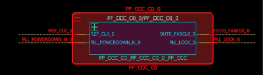
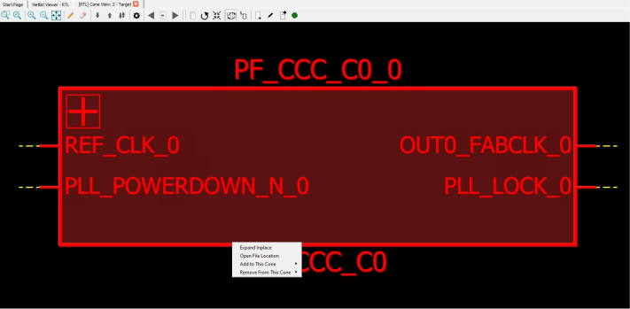

# Expand InPlace

Use one of the following two ways to execute the **Expand Inplace** operation  on an instance.

-   Click the **+** button at the top left of the instance, which indicates that it is pushable.

-   Left click to select the instance and then right click to select **Expand Inplace**.

**Parent topic:**[Dive In/Out of Design Hierarchy Without Creating New Views](GUID-AF5CEAAD-C50A-4627-BBEC-40CD98C66462.md)

