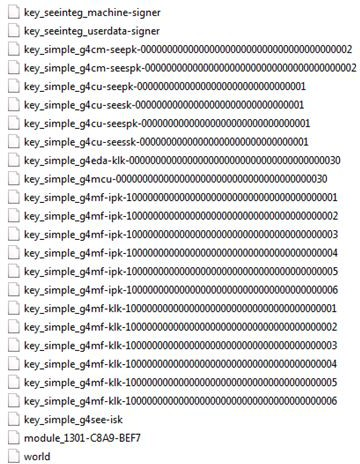

# HSM Security Environment

This section provides an overview of the security environment used by the U-HSM and the M-HSM. It  shows the key management scheme and interaction between the U-HSM, M-HSM, and Microchip  Manufacturing.

The main components of the HSM security environment are:

-   Security environment data \(Security World\)
-   HSM Module connected to Security World
-   Administrator Card Set \(ACS\)—used for administration of Security World

**Parent topic:**[HSM Servers](GUID-8655628F-64C1-4EED-AA0C-2F15C461DFAB.md)

## Security World

Security World is a key part of the HSM server. It is a security data domain physically residing on the disk of the host PC and used by the HSM module connected to it. Security World contains configuration data and security keys used by the HSM server.

Security World is introduced and supported by Thales. For complete documentation and descriptions  of utilities for managing Security World, see the *nShield Edge Solo User Guide*. This document provides an  overview about security keys utilized by the SPPS solution.

SPPS has installation and provisioning processes defined for the U-HSM \(see the [User HSM Installation and Setup User Guide](https://coredocs.s3.amazonaws.com/Libero/2025_1/Tool/user_hsm_ug.pdf)\) and the M-HSM \(see the [Manufacturer HSM Installation and Setup User Guide](https://coredocs.s3.amazonaws.com/Libero/2025_1/Tool/man_hsm_ug.pdf)\). The process includes instructions for creating a new  Security World and keys used by the HSM. It also shows how to  perform key exchange with other servers and how to handle DFK DB  \(explained in [Diversified Factory Key \(DFK\) and DFK Database](GUID-809EB1AF-697B-4466-8EE8-D38CDD3EBC10.md#)\).

### Security World Directory

All data related to Security World is stored in the Security World directory on the disk of the host PC. The actual path is determined during installation and defaults to:

`C:\ProgramData\nCipher\Key Management Data\local`

**Note:** "ProgramData" is a Windows system folder that is hidden by default.

### Security World Data

The Security World directory contains all Security World data and can be backed up, restored, copied, or moved to another HSM as a whole. It contains HSM identity information and should be backed up periodically.

Security World data includes the following:

-   Security World identity and configuration settings
-   Data of HSM module\(s\) connected to Security World \(the SPPS U-HSM and M-HSM support single module setup only\)
-   Data for the ACS cards associated with Security World
-   Keys used by HSM internally
-   Private component of the private/public key infrastructure for communication
-   Public keys of the other HSMs for secure data exchange
-   Microchip Manufacturing Keys \(used during bitstream generation by the U-HSM and used during protocol execution by the M-HSM\)

The following figure shows an example of U-HSM Security World directory content.

 

**Note:** The M-HSM has similar Security World data structure. The main difference between the two is the length of the UUID used by both HSM types \(32 for the U-HSM UUID, 40 for the M-HSM UUID\) and key name prefixes: "cu" for the U-HSM and "cm" for the M-HSM, respectively.

 

### Security World Creation

New Security World creation instructions are provided in the [User HSM Installation and Setup User Guide](https://coredocs.s3.amazonaws.com/Libero/2025_1/Tool/user_hsm_ug.pdf) for the U-HSM and the [Manufacturer HSM Installation and Setup User Guide](https://coredocs.s3.amazonaws.com/Libero/2025_1/Tool/man_hsm_ug.pdf) for the M-HSM. This process also includes initialization of the Administrator Card  Set \(ACS\). ACS cards are used for administrative actions performed on Security World,  such as connecting new HSM modules, and so on.

**Note:** ACS can be set up to require a user-defined quorum of ACS cards for performing administration actions on Security World \(see the *nShield Edge Solo User Guide* for details\).

Information about Security World is placed into the file named "world", as shown in [Figure   1](GUID-CB383160-3D0F-4B70-A9A9-19D5D7B82F3B.md#FIG_JP2_TNR_SNB).

Information about each card in ACS is stored in the file with prefix "card\_", for  example,`card_7fb2caf3494e585d4664febf7d624ab1b99e7d50_1`

### Connecting HSM Module to Security World

The process of Security World creation makes use of the HSM module connected to the host PC. The  HSM module is connected to Security World, and as a result, the Thales nCipher software  creates a file that contains information about the module in the Security World  directory. The file follows the pattern "module\_&lt;module serial number&gt;", as shown  in the example in [Figure   1](GUID-CB383160-3D0F-4B70-A9A9-19D5D7B82F3B.md#FIG_JP2_TNR_SNB).

This HSM module can be replaced with another module at any time after Security World creation.

## Key Management Scheme

This section explains the key management scheme used by both HSM server types in their  interactions with each other, as well as the Microchip Manufacturing HSM Server.

All security keys used by Security World are stored in the Security World directory as key token  files, as shown in [Figure   1](GUID-CB383160-3D0F-4B70-A9A9-19D5D7B82F3B.md#FIG_JP2_TNR_SNB). All private data in key token files  is encrypted, watermarked, and signed. These files are part of  the FIPS140-2 Level 2 and 3 certified nShield key management  system. For more information, see the *nShield Edge Solo User Guide*.

Security World Key access control lists \(ACL\) control which operations a key can be used for, if  the key can be stored persistently as a key token after generation, if a key is  recoverable by the Security World Security Officer, and other attributes of the key.

One of the features of SW Key ACLs is that is used in the SPPS is the SEE application key  scheme. This scheme allows all crypto operations available to a  key type to only be executed within a properly signed SEE  application \(HSM module firmware\).

### SEE Integrity Key

The HSM hardware module executes two types of the firmware:

-   Standard nShield firmware provided by Thales.
-   Custom firmware that implements Microchip security protocols and makes use of various keys created for the SPPS. This custom firmware is referred to as the SEE machine.

Standard firmware controls execution of the SEE machine. This control includes load, decryption, and security integration between SEE machine firmware, security keys used by SPPS, and data stored inside HSM module non-volatile memory \(NVRAM\).

-   The Microchip SEE machine is signed by the private component of the SEE Integrity Key.
-   The public component of the SEE Integrity Key is installed in the Security World directory upon HSM setup in the file`key_seeinteg_userdata_signer` \(shown in [Figure   1](GUID-CB383160-3D0F-4B70-A9A9-19D5D7B82F3B.md#FIG_JP2_TNR_SNB)\).
-   All keys created and used by SPPS are cryptographically signed by the public component of the SEE Integrity Key. This signature carries the hash of the private component of the key, thus allowing standard nShield firmware to enforce ACL policy by matching signatures on the SEE machine and keys used by it.

### Private/Public HSM Keys

For each HSM server, the user creates two private/public key pairs. One private/public key pair  is used for encryption and decryption. These keys appear with the prefix  "key\_simple\_g4cu\_seepk" and "key\_simple\_g4cu\_seesk" as shown in [Figure   1](GUID-CB383160-3D0F-4B70-A9A9-19D5D7B82F3B.md#FIG_JP2_TNR_SNB). The public key is sent to the other HSM servers for encryption of  the data sent back to this HSM. The HSM then uses the private key component to  decrypt.

received data. The private component is a persistent key created in the Security World directory stored in the encrypted form.

The other private/public key pair is used for signing and verifying signature. These keys appear  with prefix "key\_simple\_g4cu\_seessk" and  "key\_simple\_g4cu\_seespk" as shown in [Figure   1](GUID-CB383160-3D0F-4B70-A9A9-19D5D7B82F3B.md#FIG_JP2_TNR_SNB). The HSM uses the private key  component to sign the data that is sent to other HSM servers.  The public key is sent to other HSM servers for verifying the  signature of data sent by this HSM, which allows checking the  authenticity \(that is, assurance of signatory's identity\) and  integrity \(that is, tamper and corruption detection\) of the data  being imported. The private component is a persistent key  created in the Security World directory stored in the encrypted  form.

The public key of the HSM server carries cryptographic proof that it was created by an nShield  HSM module. This binding is done through the HSM Warrant file  and is checked by the other HSMs when importing this public key  component. This mechanism makes it nearly impossible for the  intruder to gain access to any HSM server used by SPPS by  sending them a falsely generated public key.

### nShield HSM Warrant

The HSM warrant is a file created by Thales. It is unique and included with every nShield Solo or  Edge HSM module provided by Microchip as part of the module acquisition process.

Data inside the warrant file ensures that an nShield module with a specific module serial number \(ESN\) and KLF value has been certified by Thales.

### Internal Security Key \(ISK\)

The ISK is a persistent Security World key generated by the customer. The ISK is stored in the  Security World directory in a file with the default name  `key_simple_g4see_isk`, as shown in  the example in [Figure   1](GUID-CB383160-3D0F-4B70-A9A9-19D5D7B82F3B.md#FIG_JP2_TNR_SNB). The actual name of the file is  user-configurable per instructions provided in the [User HSM Installation and Setup User Guide](https://coredocs.s3.amazonaws.com/Libero/2025_1/Tool/user_hsm_ug.pdf) and the [Manufacturer HSM Installation and Setup User Guide](https://coredocs.s3.amazonaws.com/Libero/2025_1/Tool/man_hsm_ug.pdf).

The ISK value is randomly generated by the HSM module and is unique within Security World. This key can only be used by the SEE application.

### Import of Public Keys from Other HSMs

Before an HSM can communicate with other HSMs, the public keys need to be manually exchanged in a  trusted manner. As a part of key exchange, every HSM server used  by SPPS should import two public keys from each of the other  HSMs. This mechanism mirrors the process explained in [Private/Public HSM Keys](GUID-CB383160-3D0F-4B70-A9A9-19D5D7B82F3B.md#). See  the [User HSM Installation and Setup User Guide](https://coredocs.s3.amazonaws.com/Libero/2025_1/Tool/user_hsm_ug.pdf) and the [Manufacturer HSM Installation and Setup User Guide](https://coredocs.s3.amazonaws.com/Libero/2025_1/Tool/man_hsm_ug.pdf), which explains how to import these public keys.

Public key import includes a strict check of the key generation certificate of the key being imported. This check validates that the key was generated by a valid HSM of the official SPPS application.

After the check has been done, the ISK is used to sign imported public key as proof of warrant check done upon the key import. This signature is required for the key to be used by the SEE application.

An example of the imported public keys is shown in [Figure   1](GUID-CB383160-3D0F-4B70-A9A9-19D5D7B82F3B.md#FIG_JP2_TNR_SNB). This sample Security World has the following imported public  keys:

-   key\_simple\_g4cm-seepk-0000000000000000000000000000000000000002
    -   This is the encryption public key of the M-HSM with UUID "0000000000000000000000000000000000000002"
    -   Note that the M-HSM has UUID length of 40
-   key\_simple\_g4cu-seepk-00000000000000000000000000000001
    -   This is the encryption public key of this U-HSM
    -   Note that the UUID length is only 32 hex symbols
    -   This is to enable the M-HSM function of this U-HSM server
-   key\_simple\_g4cm-seespk-0000000000000000000000000000000000000002
    -   This is the verify public key of the M-HSM with UUID "0000000000000000000000000000000000000002"
    -   Note that the M-HSM has UUID length of 40
-   key\_simple\_g4cu-seespk-00000000000000000000000000000001
    -   This is the verify public key of this U-HSM
    -   Note that the UUID length is only 32 hex symbols
    -   This is to enable the M-HSM function of this U-HSM server

### Microchip Manufacturing Keys

These special Microchip keys are imported per device type as a part of obtaining the DFK DB. For  more information, see the [User HSM Installation and Setup User Guide](https://coredocs.s3.amazonaws.com/Libero/2025_1/Tool/user_hsm_ug.pdf) for the U-HSM and the [Manufacturer HSM Installation and Setup User Guide](https://coredocs.s3.amazonaws.com/Libero/2025_1/Tool/man_hsm_ug.pdf) for the M-HSM.

Every imported key is created in a file starting with the prefix "key\_simple\_f4mf-" key. These  keys are used by both the U-HSM and the M-HSM. They are sent to either HSM from the  Microchip Manufacturing HSM. The key values are encrypted with the public key of the  receiving HSM.

### U-HSM ​Initiater Key

The U-HSM ​Initiater Key is created by the user. This is a symmetric key that allows the U-HSM to  protect KeySet files and Job Ticket initiater keys.

The U-HSM ​Initiater Key encrypts the Job Ticket ​Initiater Key, which in turn protects all  private Job Ticket data. To send ticket data to the M-HSM, the U-HSM only needs to  rewrap the Job Ticket ​Initiater Key with the M-HSM public key.

### DFK DB Handling

DFK DB is used by the M-HSM during initial key loading \(see [Diversified Factory Key \(DFK\) and DFK Database](GUID-809EB1AF-697B-4466-8EE8-D38CDD3EBC10.md#)\). It can also be used during a test  run by the U-HSM.

DFK DB is generated by Microchip for the specific U-HSM UUID. All DFK values in the generated  database are encrypted by per-device type DFK DB ticket keys. DFK DB ticket keys are  protected by the U-HSM public key imported into the Microchip Manufacturing HSM during  the previous steps. This scheme allows the U-HSM access to the DFK values in the  received database.

To use DFK DB on the M-HSM side, the user exports the DFK DB ticket keys and sends them to the  Microchip Manufacturing server for rewrap with the M-HSM public key. Rewrapped ticket  keys are imported by the user back to the DFK DB. When the DFK DB has ticket keys  encrypted with the M-HSM public key, it can be used by the M-HSM.

### Job Handling

All private data and key material is used by the Job Manager during bit stream generation and job  preparation is protected by the Ticket ​Initiater Key. This is a  symmetric encryption key encrypted by the U-HSM ​Initiater Key  \(see [U-HSM ​Initiater Key](GUID-CB383160-3D0F-4B70-A9A9-19D5D7B82F3B.md#)\).

During HSM job export \([Job Creation](GUID-BFB233D2-653B-4FD5-B65F-F6B4EBB72812.md#_BOOKMARK24)\), all Job Tickets are rewrapped  with the target the M-HSM public key. This grants the M-HSM  access to all job data protected by the Job Ticket ​Initiater  keys.

Other types of communication between the U-HSM and the M-HSM, such as Job Request/Reply protocol  execution \([Job Preparation](GUID-BFB233D2-653B-4FD5-B65F-F6B4EBB72812.md#)\) and returning job end sending job end certifiers from the  M-HSM for validation to U-HSM, also make use of the counterpart HSM public key to  protect private information.

