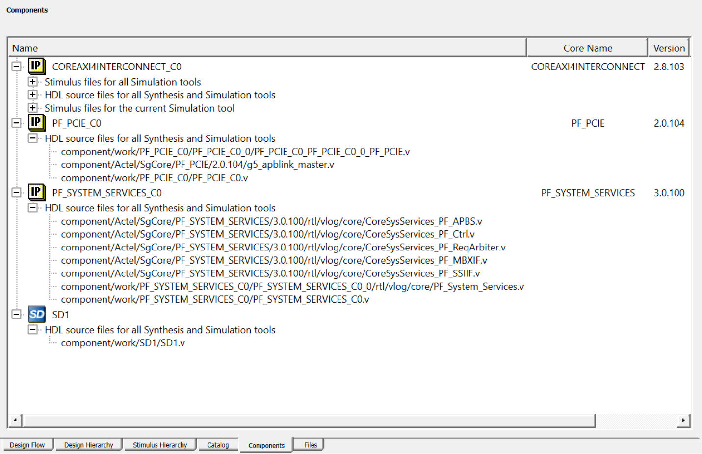

# Component Manifests

When you generate your components, a set of files is generated for each component. The Component Manifest Report details the set of files generated and used in each subsequent step \(Synthesis, Simulation, Firmware Generation, and so on\). This report gives you the locations of all the generated files needed to proceed with the Custom Flow. You can access the component manifest in the Reports area: Click `Design > Reports` to open the reports tab. In the reports tab, you see a set of `manifest.txt` files \([Figure   1](GUID-9BEC15C4-7AE9-403F-95DE-B94079733C2A.md#GUID-3BFD6C91-6BB4-4634-940A-CBDD0FCAA241)\), one for each component you generated.

**Tip:** You must set a component or module as 'root' to see the component manifest file contents in the Reports tab.

Alternatively, you can access the individual manifest report files for each core component generated or SmartDesign component from `<project>/component/work/<component name>/<instance name>/<component name>_manifest.txt` or `<project>/component/work/<SmartDesign name>/<SmartDesign name>_manifest.txt`. You can also access the manifest file contents of each component generated from the new **Components** tab in Libero, where the file locations are mentioned with respect to the project directory.

")

")

Focus on the following Component Manifest Reports:

-   If you use SmartFusion 2 or IGLOO 2 System Builder, read the file `<system builder name>_sb_manifest.txt`.
-   If you instantiated cores into a SmartDesign, read the file `<smartdesign_name>_manifest.txt`.
-   If you created components for cores, read the `<core_component_name>_manifest.txt`.

You must use all [Component Manifests](GUID-CBA28D38-9B16-4D6E-B465-EF0C370A2E37.md#) Reports that apply to your design. For example, if your project has a SmartDesign with one or more core components instantiated in it and you intend to use them all in your final design, then you must select files listed in the [Component Manifests](GUID-CBA28D38-9B16-4D6E-B465-EF0C370A2E37.md#) Reports of all those components for use in your design flow.

**Parent topic:**[Component Configuration](GUID-21EFBB2D-7F99-4C6B-B52B-40B50BBF57D9.md)

