# SmartTime Tutorials

The following sections describe SmartTime tutorials.

## Tutorial 1—32-Bit Shift Register with Clock Enable

This tutorial describes how to enter a clock constraint for the 32-bit shift register on SmartFusion 2 device.

You use the SmartTime Constraints Editor and perform post-layout timing analysis using the SmartTime Timing Analyzer.


To set up your project:

1.  Invoke Libero SoC. From the **Project** menu, choose **New Project**.

2.  Type `sf2_shift32` for your new project name and browse to a folder for your project location.

3.  Select **Verilog** as the Preferred HDL Type.

4.  Leave all other settings at their default values.

    

5.  Click **Next** to go to Device Selection page. Make the following selection from the pull-down menus:

    -   **Family**: SmartFusion 2
    -   **Die**: M2S090TS
    -   **Package**: 484 FBGA
    -   **Speed**: STD
    -   **Core Voltage**: 1.2V
    -   **Range**: COM
    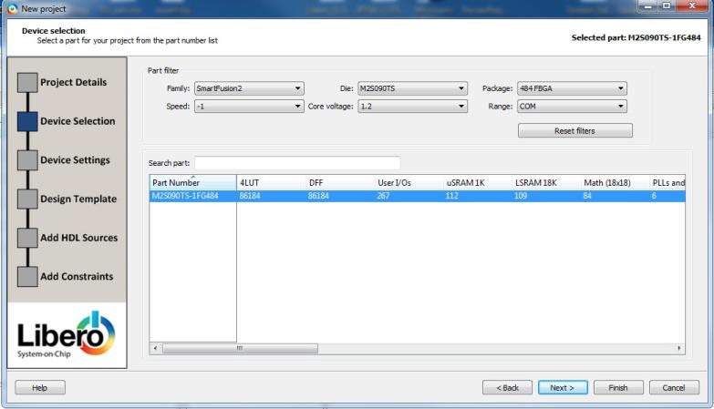

6.  Click the M2S090TS-1FG484 part number and click .

7.  Accept the default settings in the Device Settings page and click **Next**.

8.  Accept the default settings in the Design Template page and click **Next**.

9.  Click **Next** to go to the Add Constraints page.

10. Because you are not adding any constraints, click **Finish** to exit the New Project Creation wizard.

11. To add a new HDL file, select **File&gt; New&gt; HDL**.

    The Create a new HDL file dialog box appears.

12. Name the HDL file `shift_reg32` as shown in the following figure, and click **OK**.

    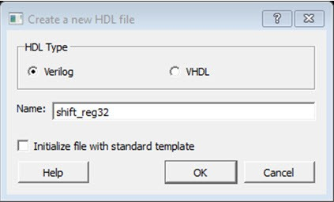

13. Copy the following code and paste it into the Verilog file:``module shift32 ( Q,CLK,D,EN,RESET); input D,EN,CLK,RESET;`

`output[31:0] Q; reg [31:0] Q_int;`

`assign Q=Q_int;`

`always@ (posedge CLK) begin`

`if(RESET)`

`Q_int<=0; else begin if(EN)`

`Q_int<={Q_int[30:0],D}; end`

`end endmodule`

`

14. Check the HDL file to confirm there are no syntax errors.

15. Confirm that the shift\_reg32 design appears in the Design Hierarchy window, as shown in the following figure.

    

16. In the Design Flow window, double-click **Synthesize** to run Synplify Pro with default settings.

    A green check mark appears next to **Synthesize** when Synthesis is successful, as shown in the following figure.

    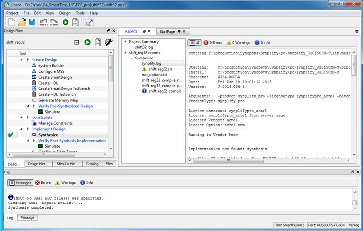


### Add a Clock Constraint—32-Bit Shift Register

To add a clock constraint to your design:

1.  In the Design Flow window, double-click **Manage Constraints**.

    The Constraint Manager appears.

    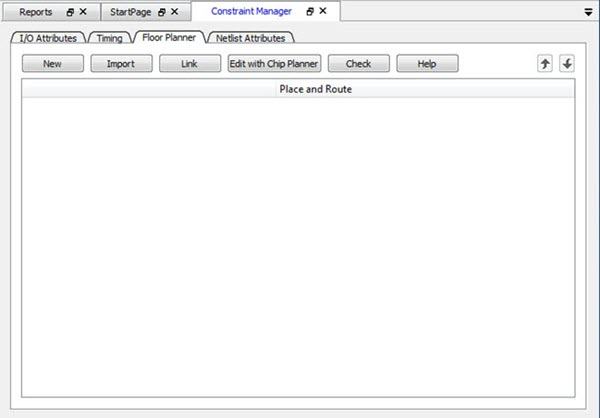

2.  Click the **Timing** tab.

3.  Click **Edit with Constraints Editor &gt; Edit Place and Route Constraints**.

    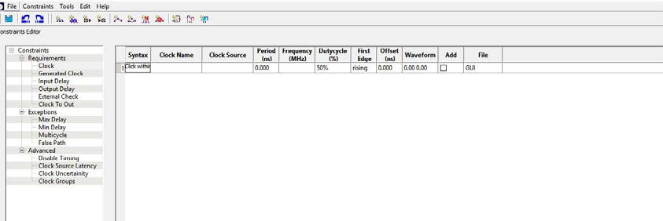

    The Constraints Editor appears.

4.  In the Constraints Editor, right-click **Clock** under **Requirement** and select **Add Clock Constraint**.

    The Create Clock Constraint dialog box appears.

    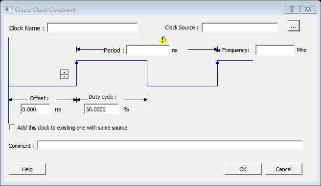

5.  From the **Clock Source** drop-down menu, choose the **CLK** pin.

6.  In the **Clock Name** field, type `my_clk`.

7.  Set the **Frequency** to 250 MHz \(as shown in the following figure\) and accept all other default values.

    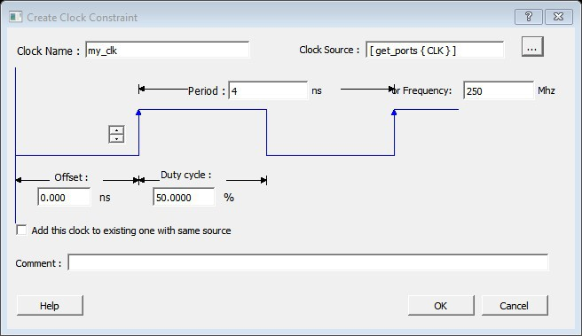

8.  Click **OK** to continue.

    The clock constraint appears in the SmartTime Constraints Editor.

    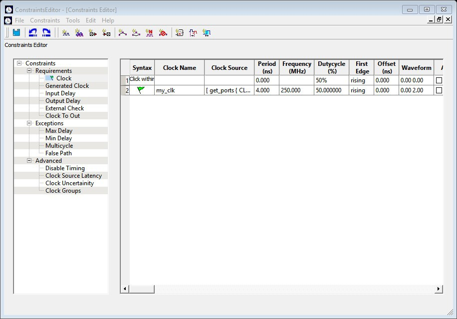

9.  From the **File** menu, choose **Save** to save the constraints.

10. From the SmartTime **File** menu, choose **Exit** to exit SmartTime.

    Libero creates a constraint file to store the clock constraint. This file appears in the Constraint Manager. It is named **user.sdc** and designated as **Target**.

    **Note:** A target file is used to store newly added constraints from the Constraint Editor. If you invoke the Constraint Editor with no SDC timing constraint file present, Libero SoC creates the user.sdc file and marks it as **Target** to store the timing constraints you create in the Constraint Editor.

11. In the Constraint Manager, check the check boxes under **Place and Route** and **Timing Verification** to associate the constraint file to the tools. The constraint file is used for both Place and Route and Timing verification.

    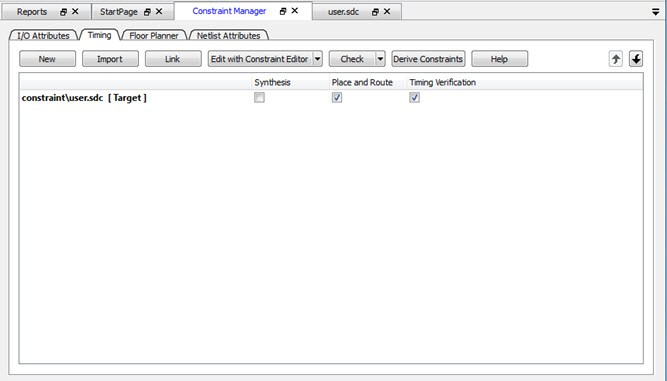


### Run Place and Route

To run Place and Route:

1.  Right-click **Place and Route** and choose **Configure Options**.

    The Layout Options dialog box appears.

2.  Click the check box to enable **Timing-driven** layout and accept the other default values shown in the following figure.

    <br />

    

    <br />

3.  Click **OK** to continue.

4.  In the Design Flow window, double-click **Place and Route** to start the Place and Route.


### Maximum Delay Analysis with Timing Analyzer—32-Bit Shift Register Example

The SmartTime Maximum Delay Analysis window shows the design maximum operating frequency along with any setup violations.

To perform maximum delay analysis:

1.  Right-click **Open SmartTime**in the Design Flow window and choose **Open Interactively**to open SmartTime. The Maximum Delay analysis window appears. A green check next to the clock name indicates there are no timing violations for that clock domain. The Summary page displays a summary of the clock domain timing performance.

    The Maximum Delay Analysis Summary appears with the following information shown:

    -   Maximum operating frequency for the design
    -   External setup and hold requirements
    -   Maximum and minimum clock-to-out times. In this example, the maximum clock frequency for CLK is 609.75 MHz.
    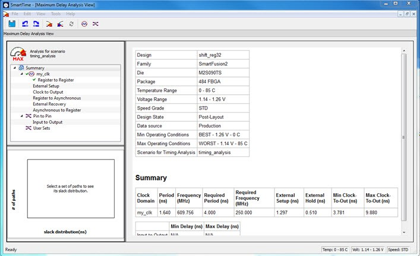

2.  Expand **my\_clk** to display the Register to Register, External Setup, and Clock to Output path sets.

    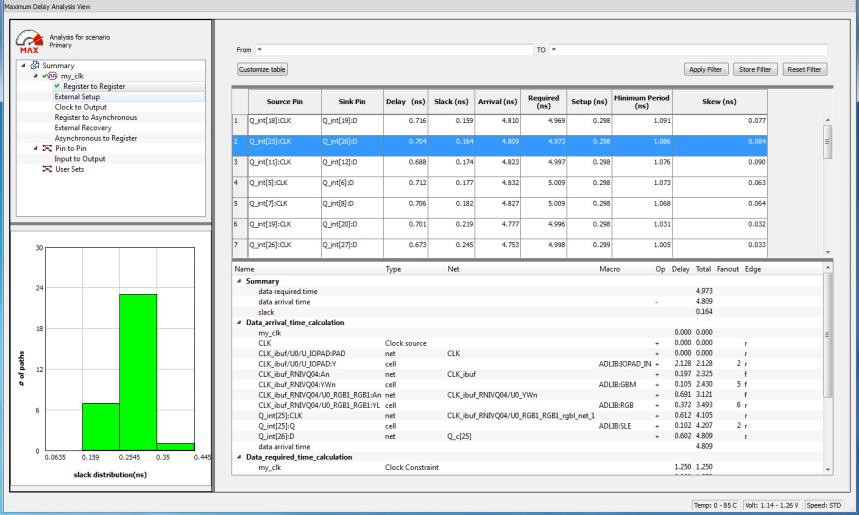

3.  Select **Register to Register** to display the register-to-register paths.

    The window displays a list of register- to-register paths and detailed timing analysis for the selected path. All the slack values are positive, indicating that there are no setup time violations

4.  Double-click a path row to open the Expanded Path window.

    The window shows a calculation of the data arrival and required times, along with a schematic of the path.

    **Note:** Timing numbers in the reports may vary slightly with different versions of the Libero software, and may not be what you see when you run the tutorial.

    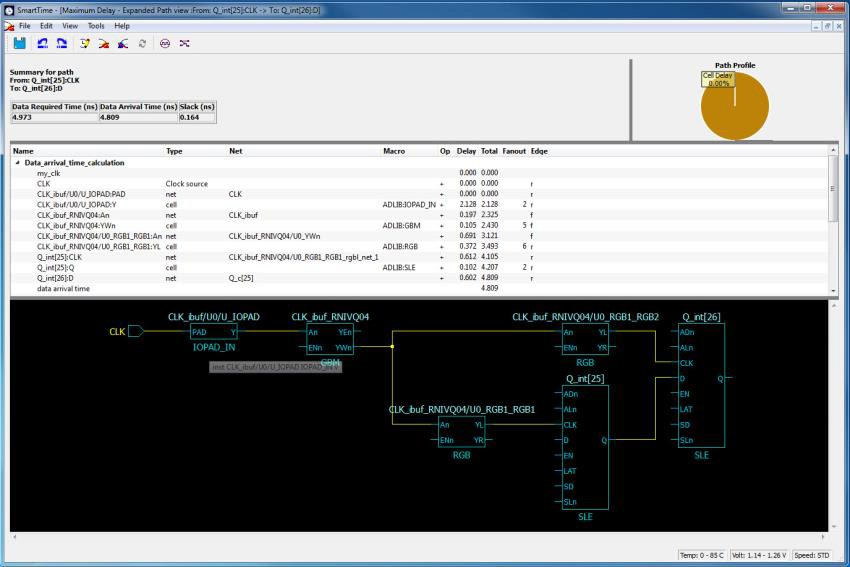

5.  Select **External Setup** to display the Input to Register timing.

6.  Select **Path 3**.

    The Input Arrival time from the EN pin to Q\_int\[27\]:EN is 4.547 ns.

    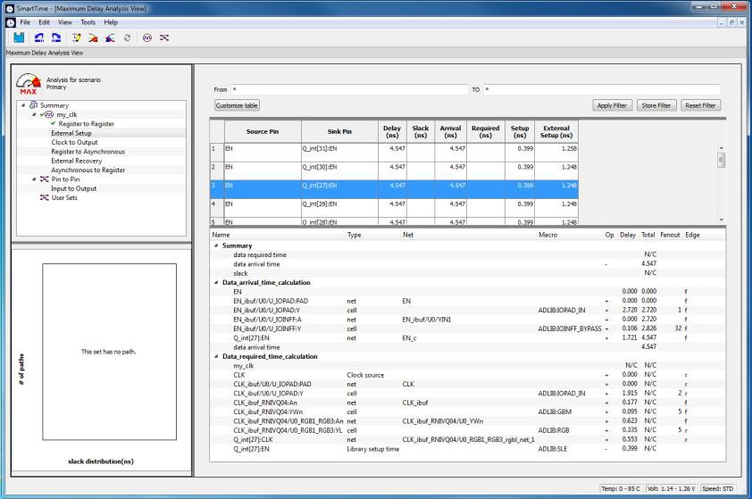

7.  Select **Clock to Output** to display the register to output timing.

8.  Select **Path 1**.

    The maximum clock to output time from Q\_int\[16\]:CLK to Q\[16 \] is 9.486 ns.

    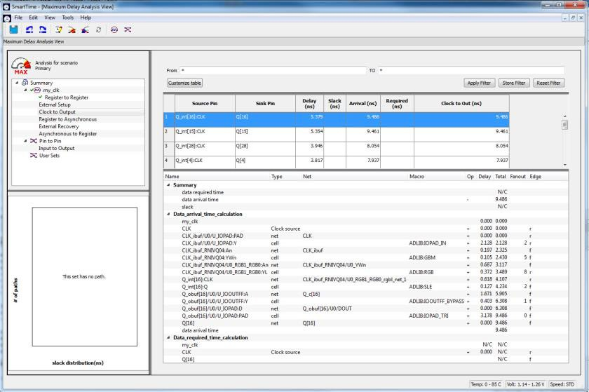


### Minimum Delay Analysis with Timing Analyzer—32-Bit Shift Register Example

The SmartTime Minimum Delay Analysis window identifies any hold violations that exist in the design.

To perform minimum delay analysis:

1.  From the SmartTime Analysis window, choose **Tools &gt; Minimum Delay Analysis**.

    The Minimum Delay Analysis View appears, as shown in the following figure.

    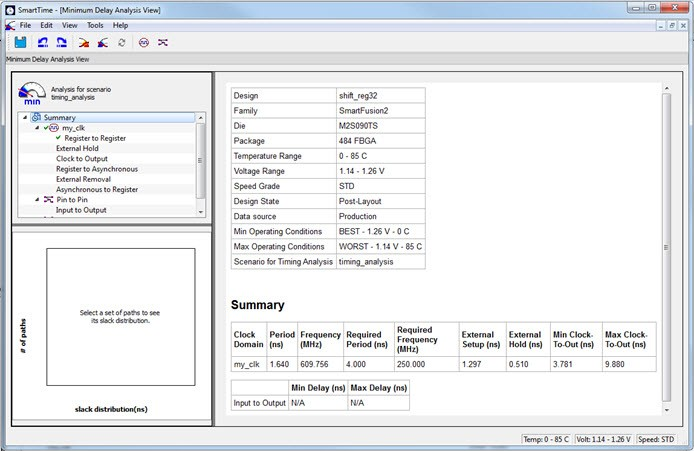

2.  Expand **my\_clk** to display Register to Register, External Hold, Clock to Output, Register to Asynchronous, External Removal, and Asynchronous to Register path sets.

3.  Click **Register to Register** to display the reg to reg paths.

    The window displays a list of register to register paths and detailed timing analysis for the selected path. All the slack value are positive, indicating that there are no hold time violations.

4.  Click to select the first path and observe the hold analysis calculation details, as shown in the following figure.

    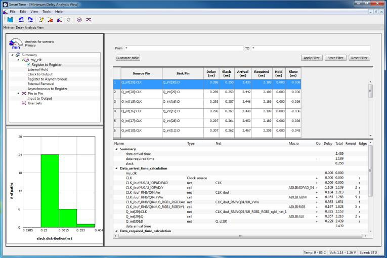


### Changing Constraints and Observing Results—32-Bit Shift Register Example

You can use the Constraints Editor to change your constraints and view the results in your design. The following procedure describes how.

1.  Open the Constraints Editor \(**Constraints Manager &gt; Timing Tab &gt; Edit Constraints with Constraint Editor &gt; Edit Timing Verifications Constraints**\).

    The Constraints Editor shows the clock constraint at 250 MHz you entered earlier.

    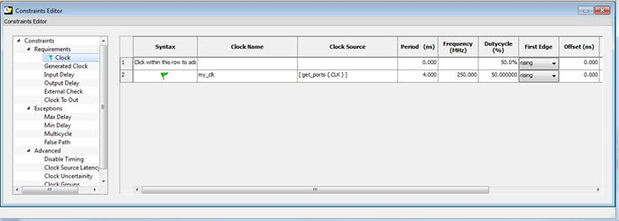

2.  Select the second row. Right-click and choose **Edit Clock Constraint**.

    The Edit Clock Constraint dialog box appears.

3.  Change the clock constraint from 250 MHz to 800 MHz, and then click the green check mark to continue.

4.  Click **Open SmartTime &gt; Open Interactively**.

5.  Choose **Maximum Delay Analysis View** to view the max delay analysis.

6.  In the Maximum Delay Analysis window, expand **my\_clk**.

7.  Click **Register to Register** to observe the timing information. The slacks decrease after you increase the frequency. You may see the slacks go negative, which indicates Timing Violations. Negative slacks are shown in red.

    **Note:** The actual timing numbers you see may be slightly different.

    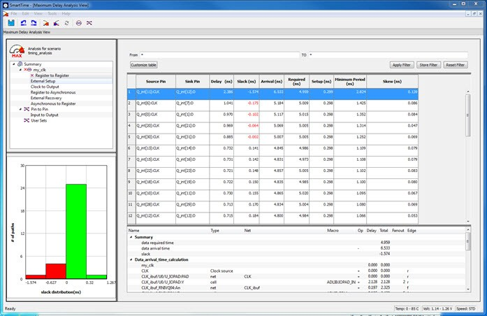

8.  Close SmartTime. When prompted to save changes, click **No**.


## Tutorial 2—False Path Constraints

This section describes how to enter false path constraints in SmartTime. Import an RTL source<br /> file from the following design. After routing the design, you analyze the timing, set<br /> false path constraints, and observe the maximum operating frequency in the SmartTime<br /> Timing Analysis window.

<br />

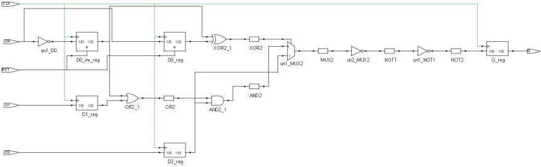

<br />

### Set Up Your False Path Example Design Project

To set up your false path example design project:

1.  Open Libero.

2.  From the **Project** menu, choose **New Project** to create a new project.

3.  Name the project `false_path` and set the project location according to your preferences.

4.  Click **Next**.

5.  Enter the following values for your **Device Selection** settings:

    -   **Family**: SmartFusion 2
    -   **Die**: M2S050
    -   **Package**: 484 FBGA
    -   **Speed**: STD
    -   **Die Voltage**: 1.2 V
    -   **Range**: COM
6.  Click **Finish** to create the new project.


### Import the false\_path Verilog File and Add Constraints

For this tutorial, you import the [false\_path.v](GUID-CCF26330-263C-4D48-8B48-D62A6DEA7116.md#) Verilog source file into your design, and then run Libero SoC.

To import the Verilog source file:

1.  From the **File** menu, choose **Import &gt; HDL Source Files**.

2.  Browse to the location of the false\_path.v you saved and select it. Click **Open** to import the file.

3.  Verify that the file appears in Design Hierarchy.

4.  In the Design Flow window, double-click **Synthesize** to run synthesis.

    A green check mark appears when the Synthesis step completes successfully.

5.  Expand **Edit Constraints**.

6.  Right-click **Timing Constraints** and choose **Open Interactively**.

7.  Double-click **Manage Constraints**.

8.  Select the **Timing** tab.

9.  Expand the **Edit with Constraint Editor** sub-menu, and select **Edit Place and Route Constraints**.

    The Constraints Editor appears.

10. Double-click **Requirements: Clock**.

    The Create Clock Constraint dialog box appears.

11. Double click the **Browse** button for **Clock Source**, select **CLK**, and assign it a name \(for example, `clk`\).

12. Set the frequency to 100 MHz.

    

13. Click **OK** to return to the Constraints Editor and observe that the clock information has been filled in, as shown in the following figure.

    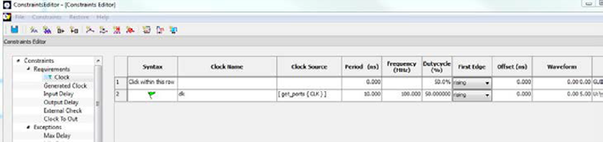

14. Save your changes \(**File &gt; Save**\) and close the Constraints Editor \(**File &gt; Close**\).

15. In the Constraint Manager, check the check boxes under **Place and Route** and **Timing Verification** to associate the constraint file to both tools. The constraint file is used for both Place and Route and Timing verification.


### Place and Route Your FALSE\_PATH Design

To run Place and Route on false\_path design:

1.  In Libero SoC, right-click **Place and Route**and choose **Configure Options**.

    The Layout Options dialog box appears.

    

2.  Click the check box to enable **Timing-Driven** layout and leave all other values unchecked.

3.  Click **OK** to close the Layout Options dialog box.

4.  Right-click **Place and Route** and choose **Run**.

    A green check mark appears next to **Place and Route** in the Design Flow window when Place and Route completes successfully.

    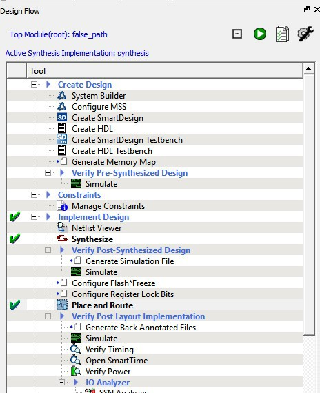


### Timing Analysis—Maximum Clock Frequency

The SmartTime Maximum Delay Analysis View displays the design maximum operating frequency and lists any setup violations.

To perform maximum delay analysis:

1.  Expand **Verify Post Layout Implementation**.

2.  Right-click **Open SmartTime** and choose **Open Interactively** to open SmartTime.

    The Maximum Delay Analysis View appears. The Maximum Delay Analysis View summarizes design performance and indicates that the design will operate at a maximum frequency of 442.48 MHz.

    **Note:** You may see a slightly different maximum frequency with a different version of Libero SoC.

    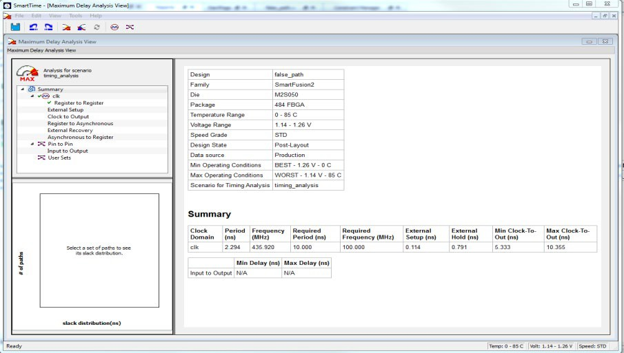

3.  Expand **clk** to expand the display and show the Register to Register path sets.

4.  Select **Register to Register** to display the register-to-register paths. Notice that the slack values are positive.

    

5.  Double-click to select and expand the row in the path list with the path is from the CLK pin of flip-flop D0\_reg to the D input of flip flop Q\_reg. Note that the path goes through the S input of multiplexer un1\_MUX2.

    Looking at the code in false\_path.v, you can see on lines 51 and 52, that D0\_reg and D\)\_inv\_reg are always the inverse of each other in "operational" mode \(except when RST is active\). Line 56 says that XOR2 is the XOR of these two signals, and hence always 1 \(except when RST is active\). Line 59 says that XOR2 is the select of MUX2.

    We might reasonably decide that we are not interested in the reset mode delay for this design; therefore, this path is a false path for our timing analysis purposes.

    

    Similar analysis shows that the path from D0\_inv\_reg:CLK to Q\_reg:D shares exactly the same false-path characteristic. Disable both paths.

6.  Restart the Libero Constraints Editor. The Constraints Editor must be running to use SmartTime’s back-annotation feature. Go to the **Constraint Manager** tab, then go to the **Timing** sub-tab, pull down **Edit with Constraint Editor**, and choose **Edit Timing Verification Constraints**.

7.  Leave this running and return to SmartTime.

8.  From the **Tools** menu, select **Max Delay Analysis**.

9.  To set the path from D0\_inv\_reg:CLK to Q\_reg :D as false, select the row containing this path in the Register to Register path set, right-click and choose **Add False Path Constraint**.

    The Set False Path Constraint dialog box appears. It might pop behind the current dialog box, so check other Constraint Manager windows.

    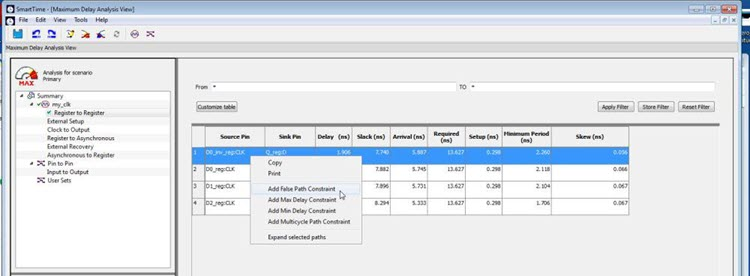

10. Click **OK** to close the Set False Path Constraint dialog box.

11. In the Constraints Editor window, check for an entry below **Exceptions &gt; False Path**.

12. Return to the SmartTime window and repeat for the D0\_reg:CLK -&gt; Q\_reg:D path.

13. Because we are interested only in timing analysis through the MUX when select = 1, we can ignore the MUX "0" path from D1\_reg:D through the AND2. We make this a false path. At this point the Constraints Editor should now look as follows. Save the file and exit the Constraints Editor and SmartTime.

14. 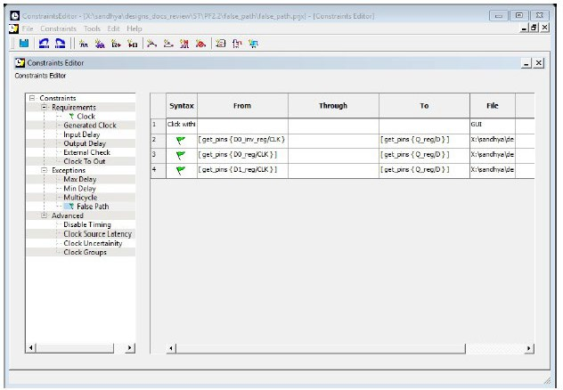

    Place and Route is now invalidated and must be re-run before we can perform timing analysis<br /> again. This is because we changed the constraint file we are using for both<br /> Place and Route and for Timing Analysis. We can use different constraint files,<br /> in which case we would not need to re-run Place and Route.

15. Right-click **Open SmartTime** and choose **Update and Open Interactively**.

    You will see that Place and Route is run automatically before SmartTime is restarted.

16. View the summary in the Maximum Delay Analysis View \(**Tools &gt; Max Delay Analysis**\). SmartTime now reports the maximum operating frequency as 586.17 MHz, as shown in the following figure.

    **Note:** The maximum operating frequency may vary slightly with a different version of the Libero software.

    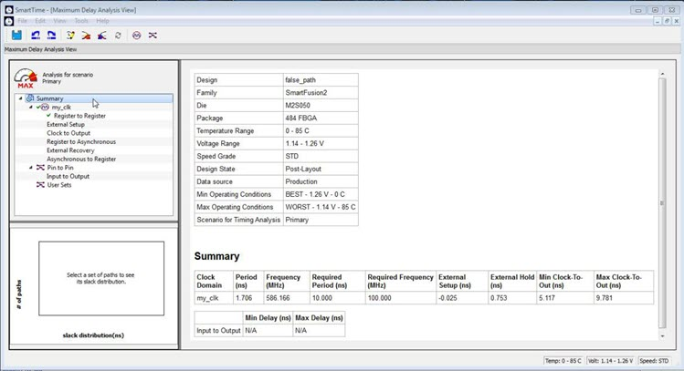

17. Select the Register to Register set for my\_clk. Observe that only one path is visible, from D2\_reg: CLK to Q\_reg:D. This is the only path that propagates a signal, as shown in the following figure.

18. 

19. Close SmartTime.

20. Close Libero SoC.


### false\_path.v

```
//////////////////////////////////////////////////////////// 
Company: Microchip Corp
//
// File history:
// 0.1 Initial Version
//
// Description:
// Simple example design to demonstrate use of timing // constraints.
//
// Targeted device: Family::SmartFusion2; Die::M2S050;
// Package::484 FBGA;
//
// Author: Joe X // //
//
////////////////////////////////////////////////////////////
module     false_path (D0, D1, D2, RST, CLK, Q); input D0;
input      D1;
input      D2;
input      RST;
input      CLK;
output     Q;

reg        D0_reg;
reg        D0_inv_reg;
reg        D1_reg;
reg        D2_reg;

reg        Q_reg;

wire       XOR2          /*synthesis syn_keep=1*/; 
wire       AND2          /*synthesis syn_keep=1*/; 
wire       OR2           /*synthesis syn_keep=1*/; 
wire       MUX2          /*synthesis syn_keep=1*/; 
wire       NOT1          /*synthesis syn_keep=1*/; 
wire       NOT2          /*synthesis syn_keep=1*/;

assign Q = Q_reg /*synthesis syn_keep=1*/; 

always @(posedge CLK or posedge RST)

begin
          if (RST)
          begin
              D0_reg         <= 1'b0;
              D0_inv_reg     <= 1'b0;
          end
          else
          begin
              D0_reg         <= D0;
              D0_inv_reg     <= ~D0;
          end
end
          assign XOR2 = D0_reg ^ D0_inv_reg; 
          assign OR2 = D0_inv_reg || D1_reg; 
          assign AND2 = OR2 && D2_reg;
          assign MUX2 = (XOR2) ? (D2_reg) : (AND2);

          always @(posedge CLK) 
          begin
              D1_reg     <= D1;
              D2_reg     <= D2;

              Q_reg <= NOT2;
          end

          not u1 (NOT1, MUX2); 
          not u2 (NOT2, NOT1);


          endmodule
```

