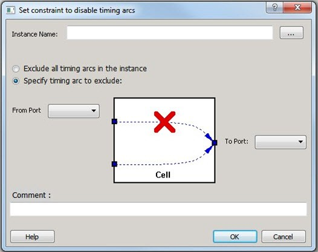
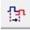
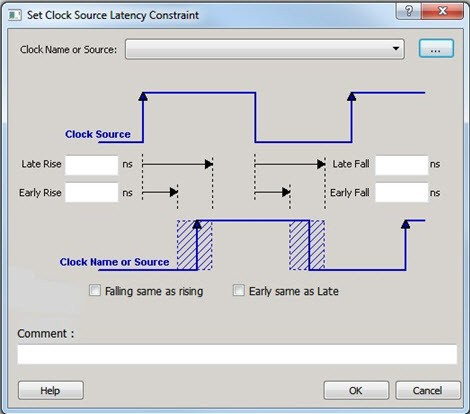
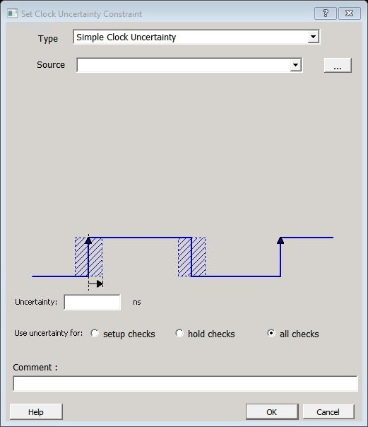
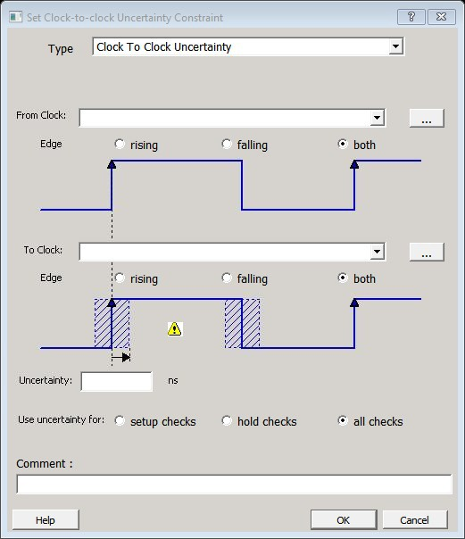
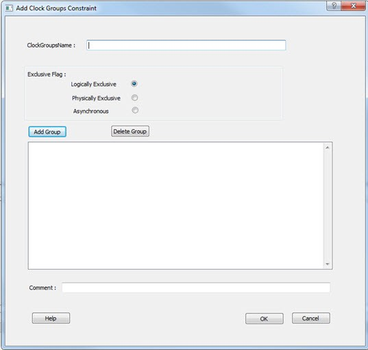
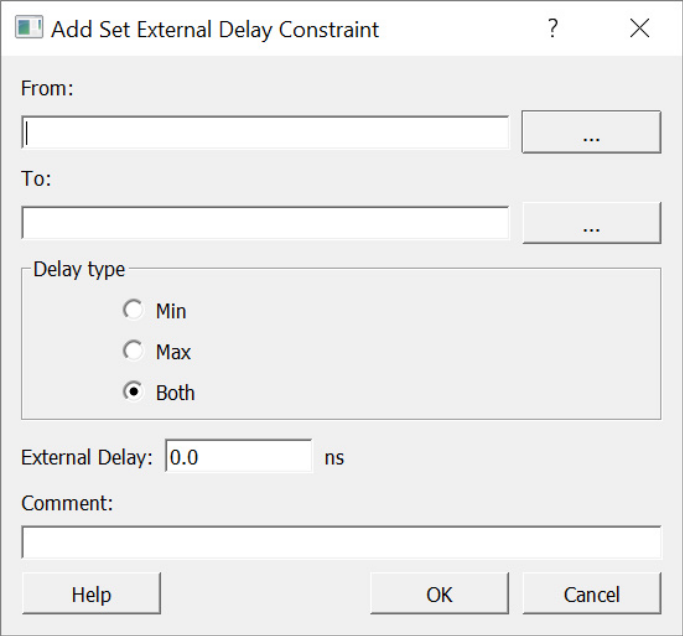

# Advanced Constraints

The following section details the advanced constraints.

## Set a Disable Timing Constraint

Use disable timing constraint to specify the timing arcs to be disabled for timing consideration.

To specify a Disable Timing constraint, open the **Set Constraint to Disable Timing Arcs** dialog box in one of the following four ways:

-   In the **Constraints Browser**, double-click **Disable Timing**.
-   Click the **Add Disable Timing Constraint**  icon.
-   From the **Constraints** menu, click **Disable Timing**.
-   Right-click any row of **Disable Timing Constraints Table** and click **Add Constraint to Disable Timing**. The **Set Constraint to Disable Timing Arcs** dialog box appears.

**Note:** This constraint is for the Place and Route tool and the Verify Timing tool. It is ignored by the Synthesis tool.

The following table describes the **Set Constraint to Disable Timing Arcs** dialog box options.

|Option|Description|
|------|-----------|
|Instance Name|  Specifies the instance name for which the disable timing arc  constraint will be created.  Click Browse next to the Instance  Name box to open the Select instance to  constrain dialog box.  The following options are available on the Select instance  to constrain dialog box:Type: Displays the type of the  available pins in the design. All instances is the only  valid type.Pattern: The default is \*,  which is a wild-card match for all. You can specify any  string value. Click Filter to  filter the available pins based on the specified pin  type and pattern.The list box displays the  available instances. If you change the pattern value,  the list box shows the available instances based on the  filter.Select instances from this list and click  OK to select the instance to  constrain. |
|Exclude All Timing Arcs in the Instance|Enables you to exclude all timing arcs in the specified  instance.|
|Specify Timing Arc to Exclude|Enables you to specify the timing arc to exclude. In this case, you  need to specify the from and to ports.|
|From Port|Specifies the starting point for the timing arc.|
|To Port|Specifies the ending point for the timing arc.|
|Comment|Enter a one-line comment for the constraint.|

### Specifying Disable Timing Constraint

Use disable timing constraint to specify the timing arcs being disabled.

To specify the disable timing constraint:

1.  Add the constraint in the **Editable Constraints Grid** or open the **Set Constraint to Disable Timing Arcs** dialog box using one of the following methods:
    -   From the **Constraints** menu, click **Disable Timing**.
    -   Click the  icon in the **Constraints Editor**.
    -   In the **Constraints Editor**, right-click **Disable Timing**and click **Add Disable Timing Constraints.**
2.  Select an instance from your design.
3.  Select whether you want to exclude all timing arcs in the instance or if you want to specify the timing arc to exclude. If you select **Specify timing arc to exclude**, select a from and to port for the timing arc.
4.  Enter any comments to be attached to the constraint.
5.  Click **OK**. The new constraint appears in the constraints list.

    **Note:** When you click **Save** from the **File** menu, the newly created constraint is saved in the database.

## Set Clock Source Latency Constraint

Use the clock source latency constraint to specify the delay from the clock generation point to  the clock definition point in the design.

Clock source latency defines the delay between an external clock source and the definition pin of  a clock.

You can specify both an "early" delay and a "late" delay for this latency, providing an  uncertainty that the timing analyzer can use for propagating through its calculations.  Rising and falling edges of the same clock can have different latencies. If only one  clock source latency value is provided, the value is taken as the exact latency value  for both rising and falling edges.

To specify a Clock Source Latency constraint, open the **Set Clock Source Latency Constraint** dialog box in one of the following four ways:

-   In the **Constraints Browser**, double-click **Clock Source Latency**.
-   Click the **Clock Source Latency Constraint**  icon.
-   From the **Constraints** menu, click **Clock Source Latency**.
-   Right-click any row of **Clock Latency Constraints Table** and click **Add Clock Source Latency**. The **Set Clock Source Latency Constraint** dialog box appears.

The following table describes the **Set Clock Source Latency Constraint** dialog box options.

|Option|Description|
|------|-----------|
|Clock Name or Source|To select the clock source, click the **Browse**  button to open the **Choose the Clock Source Pin**  dialog box.The only choice available for Pin Type is  Clock Pins.|
|Late Rise|Specifies the largest possible latency \(in nanoseconds\) of the rising  clock edge at the clock port or pin selected with respect to its source.  Negative values are acceptable, but may lead to overly optimistic  analysis.|
|Late Fall|Specifies the largest possible latency \(in nanoseconds\) of the  falling clock edge at the clock port or pin selected with respect to its  source. Negative values are acceptable, but may lead to overly  optimistic analysis.|
|Early Rise|Specifies the smallest possible latency \(in nanoseconds\) of the  rising clock edge at the clock port or pin selected with respect to its  source. Negative values are acceptable, but may lead to overly  optimistic analysis.|
|Early Fall|Specifies the smallest possible latency \(in nanoseconds\) of the  falling clock edge at the clock port or pin selected with respect to its  source. Negative values are acceptable, but may lead to overly  optimistic analysis.|
|Falling same as rising|Specifies that the rising and falling clock edges have the same  latency.|
|Early same as Late|  Specifies that the clock source latency must be considered a single  value, not a range from early to late. |
|Comment|Enter a one-line comment to describe the clock source  latency.|

## Set a Clock Uncertainty Constraint

Use the **Set Clock Uncertainty Constraint** dialog  box to    set  either the  [Simple Clock Uncertainty](GUID-D35DA016-318E-44F3-8D1B-F551EF3343D8.md#) constraint or  the  [Clock To Clock Uncertainty](GUID-D35DA016-318E-44F3-8D1B-F551EF3343D8.md#) constraint from the  **Type**  drop-down menu. The default is  [Simple Clock Uncertainty](GUID-D35DA016-318E-44F3-8D1B-F551EF3343D8.md#).

### Set Simple Clock Uncertainty Constraint

To open the **Set Clock Uncertainty Constraint**dialog box from the  **Constraints**menu, choose **Clock Uncertainty**and select **Simple Clock Uncertainty**from the  **Type**drop-down menu in **Set Clock Uncertainty Constraint** dialog box.

The following table describes the **Set Clock Uncertainty Constraint**  dialog box options.

|Option|Description|
|------|-----------|
|Type|  Select Simple Clock Uncertainty \(default\) to  set clock uncertainty constraint on a single clock. |
|Source|  Specifies the clock name as the uncertainty source. To set the source  clock, click the Browse button to open the  Select Source for Simple Uncertainty  Constraint dialog box.  The following options are available in the Select Source  for Simple Uncertainty Constraint dialog box:Type: Displays the type of  available pins in the design. The available Pin  Type options are:Clock  PinsAll  PinsAll  PortsPattern: Default is \*, which is  a wild-card match for all. You can specify any string value.  Click Search to filter the available  pins based on the specified Pin Type and Pattern.Available Pins: Displays the  available clock pins or ports \(ports are defined as clock  signal in the design\). If you change the pattern value, the  list box displays the available pins or ports based on the  filter.Use Add/Add  All to add the clock pins from the  Available Pins list to the Assigned Pins list or  Remove/Remove  All to delete the clock pins from the  Assigned Pins list.Assigned Pins: Displays pins  selected from the Available Pins list. Select Pins from this  list and click OK to add the source  to the constraint. |
|Uncertainity|Enter the time in `ns` that represents the amount of  deviation between two clock edges.|
|Use uncertainty for|Enables you to select whether the uncertainty constraint applies to  setup, hold, or all checks.|
|Comment|Enables you to save a single line of text that describes this  constraint.|

### Set Clock-to-Clock Uncertainty Constraint

To open the **Set Clock-to-clock Uncertainty Constraint** dialog box  from the **Constraints**menu, choose **Clock Uncertainty**, and select **Clock To Clock Uncertainty**from the **Type**drop-down menu.

The following table describes the **Set Clock-to-clock Uncertainty Constraint** dialog box options.

|Option|Description|
|------|-----------|
|Type|Select **Clock To Clock Uncertainty**.|
|From Clock|Specifies clock name as the uncertainty source.To set the From  Clock, click the Browse button to open the  Select Source Clock List for Clock-to-clock  Uncertainty dialog box.The following options  are available in the Select Source Clock List for  Clock-to-clock Uncertainty dialog box:Type: Displays the type of  available pins in the design. The only choice available for  Pin Type is Clock Pins.Pattern: Default is \*, which is  a wild-card match for all. You can specify any string value.  Click Search to filter the available  pins based on the specified Pin Type and Pattern.Available Pins: Displays the  available clock pins. If you change the pattern value, the  list box displays the available pins based on the  filter.Use Add/Add  All to add the clock pins from the  Available Pins list to the Assigned Pins list or  Remove/Remove  All to delete the clock pins from the  Assigned Pins list.Assigned Pins: Displays pins  selected from the Available Pins list. Select Pins from this  list and click OK to add the source  clock for the Clock-to-Clock Uncertainty constraint.|
|Edge|Enables you to select if the clock-to-clock uncertainty applies to  rising, falling, or both edges.|
|To Clock|Specifies clock name as the uncertainty destination.To set the To  Clock, click the Browse button to open the  Select Destination Clock List for Clock-to-clock  Uncertainty Constraint dialog box.The  following options are available in the Select Destination  Clock List for Clock-to-clock Uncertainty Constraint  dialog box:Type: Displays the type of  available pins in the design. The only valid selection is  Clock Pins.Pattern: Default is \*, which is  a wild-card match for all. You can specify any string value.  Click Search to filter the available  pins based on the specified Pin Type and Pattern.Available Pins: Displays the  available clock pins. If you change the pattern value, the  list box displays the available pins based on the  filter.Use Add/Add  All to add the clock pins from the  Available Pins list to the Assigned Pins list or  Remove/Remove  All to delete the clock pins from the  Assigned Pins list.Assigned Pins: Displays pins  selected from the Available Pins list. Select Pins from this  list and click OK to add the  destination clock for the Clock-to-Clock Uncertainty  constraint.|
|Uncertainty|Enter the time in `ns` that represents the amount of  deviation between two clock edges.|
|Use Uncertainty For|Enables you to select whether the uncertainty constraint applies to  setup, hold, or all checks.|
|Comment|Enables you to save a single line of text that describes this  constraint.|

## Set a Clock Group

To add or delete a  clock  group  constraint, open the **Add Clock Groups Constraint** dialog box in  one of the  following  ways:

-   From the **Constraints** menu, click **Clock Groups**.
-   In the **Constraints Browser**, double-click **Clock Groups**.
-   Right-click any row of **Clock Groups Constraints Table** and click **Add Clock Groups**.

The following table describes the **Add Clock Groups Constraints**  dialog box options.

<table id="TABLE_FYL_C1K_VNB"><thead><tr><th>

Option

</th><th>

Description

</th></tr></thead><tbody><tr><td>

ClockGroupsName

</td><td>

Enter a name for the  clock  groups  to be added.

</td></tr><tr><td>

Exclusive Flag

</td><td>

Choose one of the following three clock group attributes for the  clock group:-   **Logically Exclusive**: Use this setting for clocks that can exist physically on the device at the same time, but are logically exclusive \(for example, multiplexed clocks\).
-   **Physically Exclusive**: Use this setting for clocks that cannot exist physically on the device at the same time \(for example, multiple clocks defined on the same pin\).
-   **Asynchronous**: Use this setting when there are valid timing paths between the two clock groups, but the two clocks have no frequency or phase relationship and therefore these timing paths can be excluded from timing analysis.

</td></tr><tr><td>

Add Group

</td><td>

Click **Add**to open a dialog  box  to add clocks to a clock group. In the  **Available Pins** list, click the clocks, and  then click **Add**to move them  to  the   **Assigned Pins** list. Click  **OK**.

</td></tr><tr><td>

Delete Group

</td><td>

Delete the clocks from a  clock  group.  Select the group of clocks to be deleted and click **Delete Group**. This will delete the clock group.

</td></tr></tbody>
</table>## Set External Delay Constraint

Use set external timing constraint to specify the external delay between user-specified  From and To ports \(outside of chip\). The delay is considered during Timing Analysis for  PLL external feedback delay calculation when the PLL output goes outside of the chip  through the From pin, and re-enters the chip through the To pin, which then connects to  the PLL feedback clock input pin.

**Important:** The Synplify Pro Synthesis software does not support this constraint. In Libero flow, this constraint is skipped for Synplify Pro Synthesis software.

To set an external delay constraint, right click any row of Set External Delay  Constraints table, and then click **Add/Edit Set External Delay**.  When the Add Set External Delay Constraint dialog box appears, complete the options, and  then click **OK**.

 

<table id="TABLE_QPL_4XH_VWB"><thead><tr><th>

Option

</th><th>

Description

</th></tr></thead><tbody><tr><td>

From

</td><td>

Specify the output port or click **Browse** to  display the Select From Port for Set External Delay dialog box.  Available options are:-   **Pin Type**: Displays the pin type to search. The only valid selection is Output Ports and cannot be changed.
-   **Pattern**: The default value is \*, which is a wildcard match for all. You can specify any string value.

To filter the output port based on a specified pattern,  click Filter, select one output port from  the filtered results, and click  OK.

</td></tr><tr><td>

To

</td><td>

Specify the input port or click **Browse** to  display the Select To Port for Set External Delay dialog box.  Available options are:-   **Pin Type**: Displays the pin type to search. The only valid selection is Input Ports and cannot be changed.
-   **Pattern**: The default value is \*, which is a wildcard match for all. You can specify any string value.

To filter the input port based on a specified pattern, click  Filter, select one input port from  the filtered results, and click  OK.

</td></tr><tr><td>

Delay type

</td><td>

Choose one of the following delay type attributes for the  external delay:-   **Min**: The External Delay is considered during the minimum analysis.
-   **Max**: The External Delay is considered during the maximum analysis.
-   **Both**: The External Delay is considered for both minimum and maximum analysis.

</td></tr><tr><td>

External Delay

</td><td>

Specify the external delay in nanoseconds between the From and To  ports.

</td></tr><tr><td>

Comment

</td><td>

Enter a one-line comment for this constraint.

</td></tr></tbody>
</table> 

