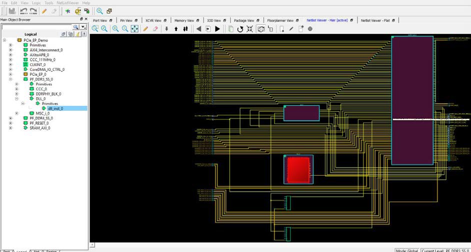

# Netlist Viewer—Hier

The Post-Synthesis Hierarchical View \(Netlist Viewer—Hier\) is a  hierarchical view of the netlist after synthesis and after technology mapping to the  Microchip FPGA technology. Click on the Canvas to load the "Hierarchical view" in Nelist  Viewer—Hier. The Chip Planner loads the netlist into the system memory and displays it in  the window.

When the netlist is loaded for the first time into memory, a pop-up progress bar indicates the progress of the loading process, which may incur some runtime penalty for a large netlist.

**Parent topic:**[Netlist Views](GUID-C610932F-80DB-4292-AFCF-47C4D7E7D1AD.md)

