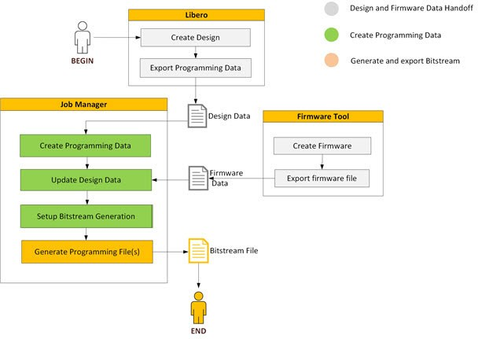
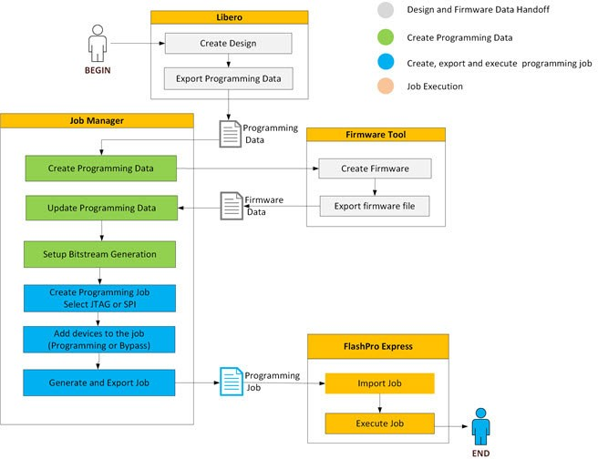

# Non-HSM Flow

The SPPS tool Job Manager supports a non-HSM flow that can be used without the U-HSM and the M-HSM. In this flow, all key material is handled in plain text form and initial key loading is done using KLK-key mode.

The main objective for non-HSM flow is to give the OE a way to prepare non-HSM jobs outside the Libero design tool. This eliminates the need for the user to be familiar with design process and general use of Libero, having to install Libero and eliminates Libero licensing requirements. It allows eNVM update to be handled within the Job Manager. Security can also be overridden at the Operation level similarly to the main HSM-based flow.

This flow is capable of producing a standalone bitstream file \(as shown in [Figure   1](GUID-D3F4A27F-9150-44FB-A266-6E0C81044D55.md#FIG_WNV_4ZQ_SNB)\)  or non-HSM jobs \(as shown in [Figure   2](GUID-D3F4A27F-9150-44FB-A266-6E0C81044D55.md#FIG_RWP_SZQ_SNB)\).

In both the cases, Design and Firmware data handoff is done similarly to the Main SPPS  Flow \(see [Libero Design Handoff](GUID-A6D9C6B4-2973-49BA-8B3E-689B7C715DA3.md#) and [Firmware Handoff](GUID-02087C6F-F646-40DE-9BA0-E0BDA6AA829D.md#)\).

Programming Data entry is created as in the main flow step \(see [Programming Data and Bitstream Initialization](GUID-F13D5010-D949-42F1-868B-CA3A31E10EF9.md#)\), with some differences in security management,  explained as follows.

**Parent topic:**[Programming Production](GUID-9CB51621-8842-4683-A4F7-F1AB8745CAEE.md)

## Security Management in Non-HSM Flow

By default, all security settings and key values are used from the design data loaded from the JDC file.

The user can overwrite security settings from an external SPM file received from Libero. This  feature is similar to the one in the main flow \(see [Security Overwrite](GUID-F13D5010-D949-42F1-868B-CA3A31E10EF9.md#)\).

In addition to Security Overwrite, the non-HSM flow supports Key Overwrite.

### Key Overwrite

Key Overwrite is available in non-HSM flow only. Key Overwrite allows the OE to replace one or more key values \(pass keys, encryption, or debug key\) received from Libero in the original JDC file or from applied security overwrite from the SPM file. Overwritten key values always supersede any key values in Programming Data.

