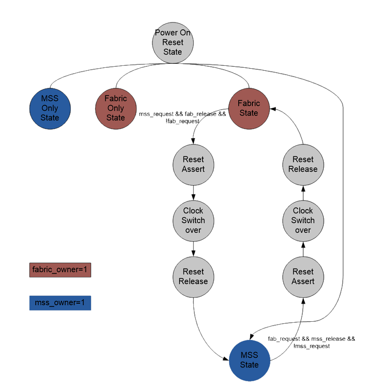

# User Cryptoprocessor

The FIC-4 is a dedicated interface for the User Cryptoprocessor. FIC-4 provides two 32-bit AHB-Lite bus interfaces between the User Cryptoprocessor and the FPGA fabric.

-   In one interface, the FPGA fabric acts as the initiator and the User Cryptoprocessor acts as target.
-   In other interface, the DMA controller acts as the initiator of the User Cryptoprocessor and has a target in the FPGA fabric.

The following table describes the simulation support for each crypto mode.

|Crypto Mode|Description|Simulation Support|
|-----------|-----------|------------------|
|MSS|The Crypto block is available to the MSS only.|Yes, streaming interface is supported.|
|Fabric|The Crypto block is available to the FPGA fabric only.|The AHB interface is exposed to FPGA fabric, simulation can be performed with Crypto.|
|Shared-MSS|Initially, the Crypto block is connected to the MSS and can be requested by the FPGA fabric.|The AHB interface is exposed and simulation can be performed with Crypto in fabric mode and streaming interface in MSS mode.|
|Shared-Fabric|Initially, the Crypto block is connected to the FPGA fabric and can be requested by the MSS.|The AHB interface is exposed and simulation can be performed with Crypto in fabric mode and streaming interface in MSS mode.|

The signals used to change the ownership from MSS to Fabric and vice versa are listed in the following table.

|Signal|Direction|Description|
|------|---------|-----------|
|Crypto\_fab\_request|F2H|Fabric request or is using the Crypto block.|
|Crypto\_mss\_request|H2F|MSS request or is using the Crypto block.|
|Crypto\_fab\_release|F2H|Fabric released the core.|
|Crypto\_mss\_release|Internal|MSS released the core.|
|Crypto\_fab\_owner|H2F|Indicates that the Fabric owns the core, and the fabric interface is enabled.|
|Crypto\_mss\_owner|H2F|Indicates that the MSS owns the core and the fabric interface is disabled.|

The Crypto block can be owned by either the fabric or MSS and the ownership can be transferred during operation. Transfer of ownership requires co-operation between the MSS and Fabric designs.

## Ownership Finite State Machine

The ownership FSM runs on the SCB clock that is independent of the FPGA fabric and MSS clocking systems. During switchover events, the FSM will request that the SCB clock runs at 80 MHz rather than at 1 MHz idle rate.



**Parent topic:**[Simulation Flow](GUID-C6E6D8E0-C726-46F1-ADEA-D21BA9D5101E.md)

## Fabric Mode

In Fabric mode, streaming interface is not enabled. You can perform read and write<br /> operation using the AHB interface.

**Important:** For more information about using Crypto block and performing simulation, see the [PolarFire FPGA Implementing Data Security using UserCrypto Processor Application Note](https://ww1.microchip.com/downloads/aemDocuments/documents/FPGA/ApplicationNotes/ApplicationNotes/Microchip_PolarFire_FPGA_Implementing_Data_Security_Using_User_Cryptoprocessor_Application_Note_AC464_V11.pdf).

## MSS Mode

In MSS mode, only streaming interface simulations are supported. AHB interface is towards MSS and<br /> will not be exposed to Fabric. Libero SoC generates<br /> `PFSOC_MSS_FIC4_user.bfm` file which can used to perform AXI<br /> transaction with crypto engine. Streaming interface is also called direct transfer<br /> interface. The direct transfer interface comprises of unidirectional data input and<br /> output ports, and associated handshakes for data transfer operations. Direct transfers<br /> are performed when explicitly commanded by the direct transfer instructions.

### DXI: Direct Transfer Block In

The DXI instruction copies a block of data from the direct transfer input port, **xwdata**, to the destination register starting at the location determined by the IA/ASEL/AOP field. During the execution of the DXI instruction, the value of the BOP field will be output on the **xwaddr** output port. The length of the transfer is given by the ALEN register. Transfers are controlled by the **xenable**/**xinaccept** handshake and the DXI instruction will run until the specified number of words have been transferred.

<table id="TABLE_NVN_WR5_W4B"><tbody><tr><td>

31

</td><td>

30

</td><td>

29

</td><td>

28

</td><td>

27

</td><td>

26

</td><td>

25

</td><td>

24

</td><td>

23

</td><td>

22

</td><td>

21

</td><td>

20

</td><td>

19

</td><td>

18

</td><td>

17

</td><td>

16

</td><td>

15

</td><td>

14

</td><td>

13

</td><td>

12

</td><td>

11

</td><td>

10

</td><td>

9

</td><td>

8

</td><td>

7

</td><td>

6

</td><td>

5

</td><td>

4

</td><td>

3

</td><td>

2

</td><td>

1

</td><td>

0

</td></tr><tr><td colspan="6">

DXI: 0E

</td><td>

IA

</td><td colspan="2">

ASEL

</td><td colspan="10">

AOP

</td><td colspan="3">

resv.

</td><td colspan="10">

BOP

</td></tr></tbody>
</table>|Operation|Condition Codes|Registers|
|---------|---------------|---------|
|\[ASEL\]\(IA/AOP\)←**xwdata xwaddr**←BOP PC←PC+1|—|BER, MMR, TSR, FPR|

#### Direct Transfer Input Interface Operation and Timing

The direct transfer input transaction occurs as the transmitting party drives **xwdata**and asserts **xenable**. The Crypto block indicates that it will accept the data on the next rising edge of **hclk**by asserting the **xinaccept**signal. If the **xinaccept**signal is negated, then the **xenable**and **xwdata** inputs will be ignored by the Crypto block. If the direct transfer input port is not used, the **xenable**signal should be tied high and the **xwdata**signal should be tied to a known value.


To perform DXI operation in simulation, you need to provide write data on **xwdata** port of crypto engine. The following steps are needed to perform a DXI transaction.

Steps to be followed in `PFSOC_MSS_FIC4_user.bfm` file:

1.  Declare “CSR\_MAIN” with the address

    Example:

    ```
    memmap CSR_MAIN 0x00007f80;
    memmap LIR_BASE_ADDR 0x00004000;
    ```

2.  Give the purge, soft reset and out of soft reset by writing the following commands.

    ```
    write w CSR_MAIN 0x0 0x00000020 // set purge
    wait 300
    write w CSR_MAIN 0x0 0x00000001 // soft reset
    wait 300
    write w CSR_MAIN 0x0 0x00000000 // out of reset
    wait 300
    write w CSR_MAIN 0x0 0x00000002 // clear complete
    ```

3.  Once the above steps are completed, configure some of the registers to perform the DXI transactions. The following steps are the sequence to perform DXI transactions.

    ```
    # **Update Instructions**
    # Update Instructions in LIR registers, LIR register Address Range is from 4000h-5FFCh
    # set the number of instruction user need to perform, set the number of instruction in command with SLN as opcode at bits [31:26] and number of instructions at bit [22:13]
    write w 0x4000 0x0 0x3010e1ce # SLN 0x087,0x1ce
    # write the opcode in bits[31:26] and address at [22:13], [9:0] is the address which user is able to see same address on xwaddr port while performing DXI transaction.
    # opcode of DXI is 0XE. 
    write w 0x4008 0x0 0x3846a13f # DXI BER:0x235, BER:0x13f
    write w 0x400c 0x0 0x74040800 # HLRA
    # write the csrmain register to Start computation command bit
    write w 0x7F80 0x0 0x10 
    #write the csrmain register to Write-only clear CMPLT flag bit
    write w 0x00007f80 0x0 00000002
    #read the csr main register 
    read w 0x00007f80 0x0 #
    wait 300 
    ```

4.  Once the above steps are completed, wait for some time and read the data from the address. Address can be calculated as DXI BER X 4 \(0x235 X 4 =08d4\).

    You can read the data from address 0x8d4 till the length which was given in SLN register using 32\_bit /64 bit transactions.

    You can get the same data that was given on the **xwdata** port when you do a read transaction in the BFM.

    ```
    #Read data at BER:0x235
    set offset 0x08d0
    loop CNT 1 68 1
    read64 w offset 0x0
    set offset offset + 8
    endloop
    ```


Steps to be followed in the testbench:

1.  Once the crypto engine setup is done for DXI transfer by bfm initiator, you will receive `CRYPTO_XINACCEPT_M2F` signal as high and `CRYPTO_XWADDR_M2F` as “13f”\(which you set in the DXI execution command\). Assert `CRYPTO_XENABLE_F2M` and provide the data on `CRYPTO_XWDATA_F2M`.
2.  Dessert the `CRYPTO_XENABLE_F2M` when `CRYPTO_XINACCEPT_M2F` is zero.

    The following code block shows the example commands used in a design.

    ```
    ################################
    ########DXI INTERFACE##########
    ################################
    
    procedure main;
    memmap CSR_MAIN 0x00007f80;
    memmap LIR_BASE_ADDR 0x00004000;
    memmap FPR_BASE_ADDR 0x00003000;
    memmap BER_BASE_ADDR  0x00000000;
    int offset
     int CNT
    write w CSR_MAIN 0x0 0x00000020   // set purge
    
    wait 300
    write w CSR_MAIN 0x0 0x00000001   // soft reset
    
    wait 300
    write w CSR_MAIN 0x0 0x00000000   // out of reset
    
    wait 300
    write w CSR_MAIN 0x0 0x00000002   // clear complete
    ###################################################
    
    # Update Instructions in LIR registers
    #LIR Adress Range  --4000h-5FFCh LIR Linear instruction register
    # set the number of instruction command at bit [22:13]
    write w 0x4000 0x0 0x3010e13h  # SLN 0x087,0x1ce 
    ### write the opcode in bits[31:26] and address at [22:13] and [9:0] is the address
    ## we see on xaddr while perfoming DXI transaction.
    ### opcode of DXI is 0XE. 
    write w 0x4008 0x0 0x3846a000  # DXI BER:0x235, BER:0x13f
    write w 0x400c 0x0 0x74040800  # HLRA 
    
    write w 0x7F80 0x0 0x10  # write the csrmain register to Start computation command bit
    write w 0x00007f80 0x0 00000002 
     #write the csrmain register to Write-only clear CMPLT flag bit
    
    read w 0x00007f80 0x0  
    #read the csr main register
    wait 300
    
    #Read data at BER:0x235
    set offset  0x08d0
    loop CNT 1 68 1
       read64 w offset 0x0
          set offset offset + 8
    endloop
    
    return
    
    ```


### DXO: Direct Transfer Block Out

The DXO instruction copies a block of data to the direct transfer output port, **xrdata**, from the source register starting at the location determined by the IB/BSEL/BOP field. During the execution of the DXO instruction, the value of the AOP field will be output on the **xraddr** output port. The length of the transfer is given by the ALEN register. Transfers are controlled by the **xvalidout**/**xoutack** handshake, and the DXO instruction runs until the specified number of words have been transferred.

<table id="TABLE_QJD_RYJ_X4B"><tbody><tr><td>

31

</td><td>

30

</td><td>

29

</td><td>

28

</td><td>

27

</td><td>

26

</td><td>

25

</td><td>

24

</td><td>

23

</td><td>

22

</td><td>

21

</td><td>

20

</td><td>

19

</td><td>

18

</td><td>

17

</td><td>

16

</td><td>

15

</td><td>

14

</td><td>

13

</td><td>

12

</td><td>

11

</td><td>

10

</td><td>

9

</td><td>

8

</td><td>

7

</td><td>

6

</td><td>

5

</td><td>

4

</td><td>

3

</td><td>

2

</td><td>

1

</td><td>

0

</td></tr><tr><td colspan="6">

DXO: 0F

</td><td colspan="3">

Reserved

</td><td colspan="10">

AOP

</td><td>

IB

</td><td colspan="2">

BSEL

</td><td colspan="10">

BOP

</td></tr></tbody>
</table>|Operation|Condition Codes|Registers|
|---------|---------------|---------|
|**xrdata**←\[BSEL\]\(IB/BOP\) **xraddr**←AOP PC←PC+1|—|BER, MMR, TSR, FPR|

#### Direct Transfer Output Interface Operation and Timing

The direct transfer output transaction occurs as the rising edge of **hclk**, data is presented on **xrdata**, and the **xvalidout**signal is asserted. The receiving party indicates receipt of the data by asserting the **xoutack**signal, which is sampled on the rising edge of **hclk**by the Crypto block. The **xoutack**signal may be asserted on the same clock cycle that **xvalidout**is asserted or any subsequent clock cycle. The following waveform shows an example where the **xoutack**is asserted one cycle after **xvalidout**is asserted. If **xvalid-out**is negated, then the **xoutack**signal is ignored.


Following are the steps that need to be followed to perform DXO transaction.

Steps to be followed in `PFSOC_MSS_FIC4_user.bfm` file:

1.  Declare “`CSR_MIAN`” with the address

    Example:

    ```
    memmap CSR_MAIN 0x00007f80;
    memmap LIR_BASE_ADDR 0x00004000; 
    ```

2.  Give the purge, soft reset and out of soft reset by writing the following commands.

    ```
    write w CSR_MAIN 0x0 0x00000020 // set purge
    wait 300
    write w CSR_MAIN 0x0 0x00000001 // soft reset
    wait 300
    write w CSR_MAIN 0x0 0x00000000 // out of reset
    wait 300
    write w CSR_MAIN 0x0 0x00000002 // clear complete
    ```

3.  Once the above steps are completed write the at address that you are writing along with DXO op code and the number of instructions that you are giving in SLN command.

    ```
    write w 0x0b18 0x0 0x290cadba
    write w 0x0b1c 0x0 0x85b3d5b1
    .
    .
    .
    .
    write w 0x0c18 0x0 0x8f7f3ff6
    ```

4.  After writing the write data, configure some of the registers to perform the DXO transactions. Perform DXO transactions in the following sequence.

    ```
    #Provide the number of instruction user need to perform, set the number of instructions in command with 
    #SLN as opcode at [31:26] and address at bit [22:13]
    write w 0x5000 0x0 0x300820a7 # SLN 0x041,0x0a7
    # write the opcode in bits[31:26] and address where user need to write data at [9:0].
    [22:13] is the address which user can see on xraddr while performing DXO transaction.
    # opcode of DXO is 0XF.
    write w 0x5004 0x0 0x3c6342c6
    # DXO BER:0x31a, BER:0x2c6
    write w 0x5008 0x0 0x74040800
    # HLRA is the compulsory command we need to write
    #write the csrmain register to Start computation command bit
    write w 0x7F80 0x0 0x10
    # to read the status of the transaction
    read w 0x80000000 0x0
    ```

5.  You will get the read data on **xrdata** port which is accessible to fabric.

Steps to be followed in the testbench:

1.  Once the crypto engine setup is done for DXO transfer by `bfm` initiator you will receive the `CRYPTO_XVALIDOUT_M2F` signal as high. Assert `CRYPTO_XOUTACK_F2M` and read data on `CRYPTO_XRDATA_F2M`.
2.  De-assert the `CRYPTO_XOUTACK_F2M` when `CRYPTO_XVALIDOUT_M2F` is zero.
3.  You can get the same data that you wrote from the `PFSOC_MSS_FIC4_user.bfm` file.

The following code block shows the example commands for DXO interface used in a design.

```
################################
#########DXO INTERFACE##########
################################
procedure main;
memmap CSR_MAIN 0x00007f80;
memmap LIR_BASE_ADDR 0x00004000;
memmap FPR_BASE_ADDR 0x00003000;
memmap BER_BASE_ADDR  0x00000000;
int offset
int CNT
write w CSR_MAIN 0x0 0x00000020   // set purge

wait 300
write w CSR_MAIN 0x0 0x00000001   // soft reset

wait 300
write w CSR_MAIN 0x0 0x00000000   // out of reset
wait 300
write w CSR_MAIN 0x0 0x00000002   // clear complete


//writing the data in the adaress
//(adxo_adress divide by 4) 
//which we are giving in the DXO regsiter
write w 0x0b18 0x0 0x290cadba
write w 0x0b1c 0x0 0x85b3d5b1
write w 0x0b20 0x0 0x5cead81e
write w 0x0b24 0x0 0x37295bce
write w 0x0b28 0x0 0xd4368de7
write w 0x0b2c 0x0 0x6e6a9a56
write w 0x0b30 0x0 0xcdc436d5
write w 0x0b34 0x0 0x88d7b83f
write w 0x0b38 0x0 0x19966aec
write w 0x0b3c 0x0 0x997bab2b
write w 0x0b40 0x0 0x8a468a5f
write w 0x0b44 0x0 0xa413c77b
write w 0x0b48 0x0 0x5968d480
write w 0x0b4c 0x0 0xa56447e3
write w 0x0b50 0x0 0xf2158e5b
write w 0x0b54 0x0 0xdc96b803
write w 0x0b58 0x0 0x6d2469c0
write w 0x0b5c 0x0 0x5a23c3ee
write w 0x0b60 0x0 0x5d704806
write w 0x0b64 0x0 0x01840f82
write w 0x0b68 0x0 0xb3843909
write w 0x0b6c 0x0 0x768f73b0
write w 0x0b70 0x0 0x74a771e6
write w 0x0b74 0x0 0x043cf308
write w 0x0b78 0x0 0x51e1eb8a
write w 0x0b7c 0x0 0xd5e33ef3
write w 0x0b80 0x0 0x7b4ac9e8
write w 0x0b84 0x0 0x501f4830
write w 0x0b88 0x0 0xa85a6c97
write w 0x0b8c 0x0 0xe893f45f
write w 0x0b90 0x0 0x81966fdd
write w 0x0b94 0x0 0x59d3d388
write w 0x0b98 0x0 0x01e420f6
write w 0x0b9c 0x0 0xa2ee76c3
write w 0x0ba0 0x0 0x86caf5bf
write w 0x0ba4 0x0 0xaab33ea9
write w 0x0ba8 0x0 0x1014d0f0
write w 0x0bac 0x0 0x6666031c
write w 0x0bb0 0x0 0xdec269f9
write w 0x0bb4 0x0 0x9d972097
write w 0x0bb8 0x0 0x7f251d52
write w 0x0bbc 0x0 0xe6d72245
write w 0x0bc0 0x0 0x0f5c6fac
write w 0x0bc4 0x0 0xebeea91d
write w 0x0bc8 0x0 0xda1da3d1
write w 0x0bcc 0x0 0xb6a81b9b
write w 0x0bd0 0x0 0xdbb136a3
write w 0x0bd4 0x0 0x6678b258
write w 0x0bd8 0x0 0xd1527aad
write w 0x0bdc 0x0 0xafd324e7
write w 0x0be0 0x0 0x207513b0
write w 0x0be4 0x0 0xf5ba6243
write w 0x0be8 0x0 0x1937ac22
write w 0x0bec 0x0 0x46a7fe06
write w 0x0bf0 0x0 0x2b00efc2
write w 0x0bf4 0x0 0x9b02fdc3
write w 0x0bf8 0x0 0x8555b4a5
write w 0x0bfc 0x0 0x8f564f8f
write w 0x0c00 0x0 0x0dc07d70
write w 0x0c04 0x0 0xd5953ef5
write w 0x0c08 0x0 0xb71ebd1f
write w 0x0c0c 0x0 0xf8ee65e3
write w 0x0c10 0x0 0x384a2df0
write w 0x0c14 0x0 0xaf708549
write w 0x0c18 0x0 0x8f7f3ff6

#Provide the number of instructions we need to perform 
#set the number of instructions in command with 
#SLN as opcode at [31:26] and address at bit [22:13]
write w 0x5000 0x0 0x300820a7  # SLN 0x041,0x0a7


### write the opcode in bits[31:26] and address at [9:0] and [22:13] is the address
## we see on xaddr while performing DXO transaction.
### opcode of DXO is 0XF. 

write w 0x5004 0x0 0x3c6342c6  # DXO BER:0x31a, BER:0x2c6
write w 0x5008 0x0 0x74040800  # HLRA is the compulsory command we need to write

#write the csrmain register to Start computation command bit
write w   0x7F80 0x0 0x10

# To start read execution 
read  w   0x80000004 0x0

```

## Shared MSS Mode

By default, Crypto is in MSS mode. In this mode, streaming interface simulations are supported.<br /> You can perform the same operations which are performed in MSS mode.

To change Crypto from MSS mode to Fabric mode the following sequence needs to be followed.

### Steps to be followed in `PFSOC_MSS_FIC4_user.bfm` file

Request crypto controller from MSS mode to Fabric mode by writing `mss_release =1` and<br /> `mss request =’b0;`. You can also perform this operation by writing<br /> `IOWRITE` is set to 2 in<br /> `PFSOC_MSS_FIC4_user.bfm`.

```
IOWRITE  0x00000002   
```

### **Steps to be followed in the testbench**

Once you have requested the Crypto controller from `user.bfm` file, assert<br /> `CRYPTO_REQUEST_F2M` and deassert `CRYPTO_RELEASE_F2M` to change<br /> the mode from MSS mode to Fabric mode.

After changing into Fabric mode, you can perform the same operations which are performed in<br /> Fabric mode and MSS interface will be disconnected from Crypto block.

## Shared Fabric Mode

By default, Crypto is in Fabric mode. You can perform the same operations which are performed in<br /> Fabric mode. The following steps are to change Crypto from Fabric mode to MSS mode.

### Steps to be followed in `PFSOC_MSS_FIC4_user.bfm` file

Request the Crypto controller to change from Fabric mode to MSS mode by writing `mss_release =0` and `mss request =1’b1;`. You can also perform this operation by<br /> writing `IOWRITE` is set to 1 in<br /> `PFSOC_MSS_FIC4_user.bfm`.

```
IOWRITE  0x00000001   
```

### Steps to be followed in the testbench

Once you have requested crypto controller from `user.bfm` file, deassert<br /> `CRYPTO_REQUEST_F2M` and assert `CRYPTO_RELEASE_F2M` to change the<br /> mode from Fabric mode to MSS mode.

