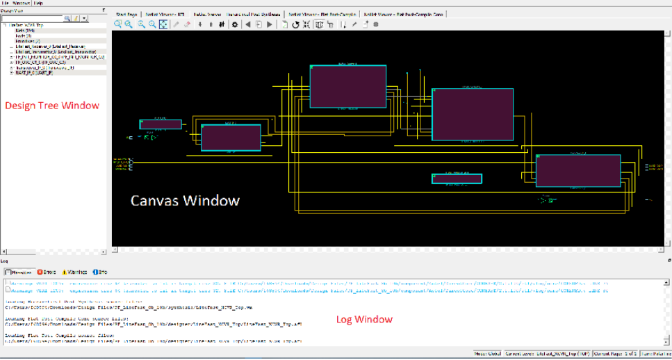

# Netlist Viewer Windows

When the Netlist Viewer opens, it displays three windows by default.

-   Design Tree window displays the design hierarchy from the top level.
-   Canvas window displays the netlist views.
-   Log window displays messages, warnings, info, and so on.

**Parent topic:**[Netlist Viewer Windows](GUID-29F3E93D-3ECA-4F8B-9478-64D63D5F1873.md)

