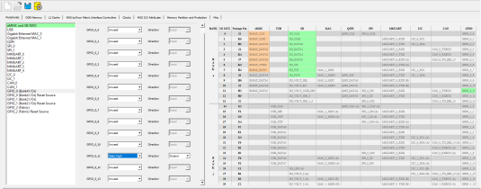
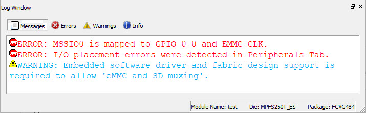
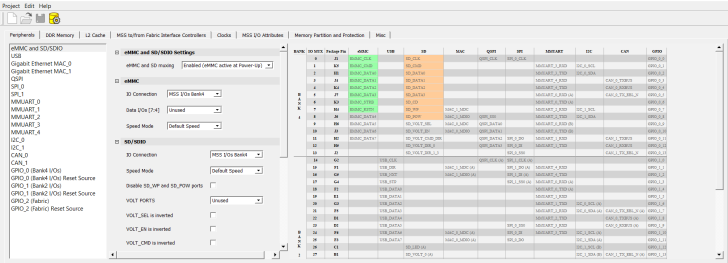

# Peripherals

Select the following I/Os using the **Peripherals** tab:

-   GPIOs from Bank 2 and Bank 4, which are dedicated to the MSS.
-   Fabric I/Os, if the dedicated I/Os from Bank 2 and Bank 4 are not available.
-   GPIOs from Bank 5 are dedicated to SGMII but can be routed to GMII or MII fabric I/Os. GPIO from Bank 5 are displayed only when Gigabit Ethernet MAC\_0 or Gigabit Ethernet MAC\_1 is selected.

**Important:** I/Os from the DDR bank are dedicated to the DDR Controller in the MSS.

For more information, see the [PolarFire SoC FPGA MSS Technical Reference Manual](https://ww1.microchip.com/downloads/aemDocuments/documents/FPGA/ProductDocuments/ReferenceManuals/PolarFire_SoC_FPGA_MSS_Technical_Reference_Manual_VC.pdf).<br /> The following figure shows the **Peripherals** tab on the PolarFire<br /> SoC MSS Configurator.


By default, all peripherals are marked as **Unused**. To include<br /> peripherals that are required in the design, select the peripheral from the left-hand<br /> side of the window and use the corresponding drop-down to assign MSS I/Os or fabric<br /> I/Os.

The I/Os associated with the following peripherals are dedicated and cannot be assigned<br /> to fabric I/Os:

-   USB peripherals are dedicated in Bank 2.
-   eMMC peripherals are dedicated in Bank 4.
-   Ports SD\_POW and SD\_WP can be disabled when not in use and can be used for other interfaces.
-   SD/SDIO peripherals are dedicated in Bank 4.

The GPIOs in Bank 2 and Bank 4 have the following options:

-   Unused
-   MSS I/Os Bank2/4
-   Static High
-   Static Low

**Important:**

-   **Static High** and **Static Low** can only be set when **eMMC and SD muxing** is enabled.
-   **GPIO\_2 \(Fabric\)** does not support **Static High** and **Static Low** options.

According to the options selected, the affected GPIOs are highlighted in green, as shown<br /> in the following figure.



**Note:** If the I/Os for a peripheral are selected in a bank, you cannot select the same I/Os for another peripheral from the same bank. If you try, the tool generates the following error message in the log window:

``` {#CODEBLOCK_PRW_CYV_PVB}
I/O placement errors were detected in Peripherals Tab.
```



You can choose to enable either eMMC or SD at power-up using the eMMC and SD muxing<br /> option. The highlighted green-colored ports denote which I/O setting is active, whereas<br /> the orange-colored ports indicate which I/O setting is inactive.

The following warning message is generated in the log window, when the eMMC or SD setting<br /> is enabled.

``` {#CODEBLOCK_G1X_4J5_P5B}
Embedded software driver and fabric design support is required to allow 'eMMC and SD muxing'.
```

The eMMC and SD cannot be used simultaneously, as shown in the following figure.



1.  [I2C Port Configuration for Fabric I/O](GUID-0AC3B2D1-58D4-421A-8D77-DD8A57F0A773.md)  


**Parent topic:**[Using the PolarFire SoC MSS Configurator GUI](GUID-E11D45E3-7975-4122-BA81-72D6BDD0CD1A.md)

**Previous topic:**[MSS To/From Fabric Interface Controllers](GUID-A1E1F5D7-A681-4C06-9435-D515826BD296.md)

**Next topic:**[I2C Port Configuration for Fabric I/O](GUID-0AC3B2D1-58D4-421A-8D77-DD8A57F0A773.md)

