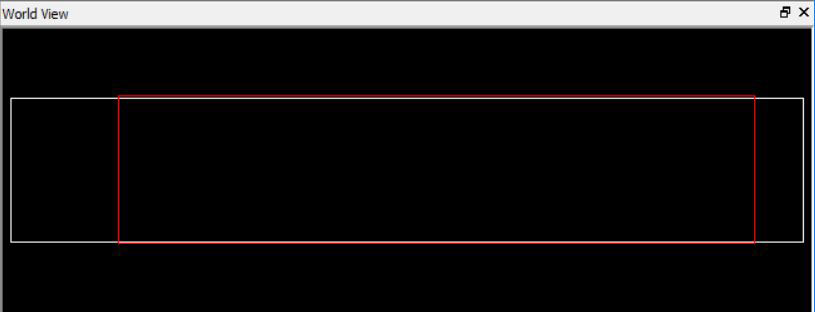

# World View Window

The World View shows a red rectangle which reflects what is visible in the Floorplanner View in the context of the die. Changing what is visible in the canvas also changes the red rectangle. Changing the size or position of the red rectangle changes what is seen in the Floorplanner View.

**Parent topic:**[Other I/O Editor Windows](GUID-A5B625D0-E38D-4817-90D7-344E263F7AA6.md)

