# Example

The following topics describe how to implement a complete PolarFire design using Microchip Design Separation methodology.

The design consists of six subsystems defined in Verilog:

-   block1.v
-   block2.v
-   block3.v
-   block4.v
-   pf\_smip.v

-   PF\_CCC\_C0.v


The following figure shows a top-level view of these subsystems with interconnects between them.

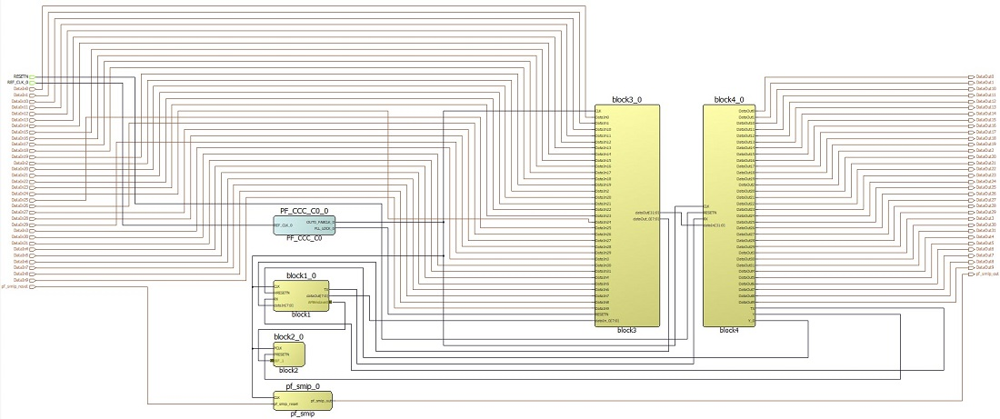

This design is implemented using the design separation methodology steps defined in [Design Separation Methodology Steps](GUID-FDAEB233-DEC2-417A-BE54-07259F52AB82.md#).

**Note:** To understand the design flow and floorplanning terminology in the following topics, see the Libero SoC Design Flow and Chip Planner help topics in Libero.

## Creating HDL Subsystems

The first step when implementing a complete system using Microchip Design Separation methodology is to achieve logical separation of various subsystems. Create logically separate HDL modules corresponding to the system.

1.  This example defines the following subsystems:

    -   block1.v
    -   block2.v
    -   block3.v
    -   block4.v
    -   pf\_smip.v
    -   PF\_CCC\_C0.v
    These subsystems are independent of each other. They communicate with each other using the interconnect signals. To begin with creating the HDL subsystem, follow these steps:

2.  After you identify the subsystems to be implemented using design separation, import these modules into a Libero project.

3.  Create a new Libero project for the FPGA device chosen for the design. In this example, the design using a MPF300TS, 484 FCVG device is implemented. Import the HDL files using **File &gt; Import &gt; HDL Source** file menu into the Libero Project.

4.  Create a Block for each subsystem of this design.


## Creating Blocks

The next step is to create a Block for each subsystem of this design.

1.  Select a module to be the root module. For example, select **block4** as shown in the following figure.

    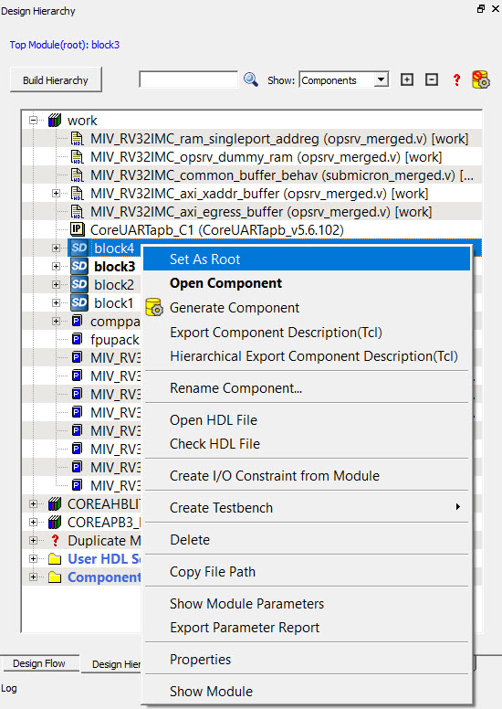

2.  Use **Project &gt; Project Settings &gt; Design Flow &gt; Enable Block Creation** to enable Block flow for this module, as shown in the following figure.

    

    The **Publish Block** option is enabled in the design flow, as shown in the following figure.

    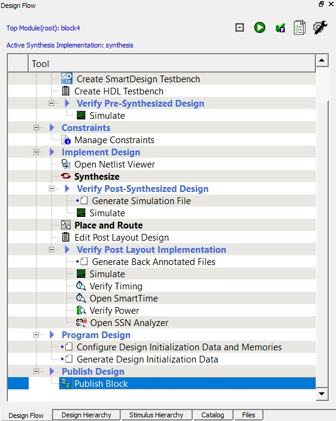

3.  If a Block requires physical I/O resources, specify explicit instantiation of I/O resources. All logic within the Microchip Design Separation methodology must be incorporated within an isolated region. Therefore, you must associate all physical I/O resources with an isolated region. You can insert I/Os through direct instantiation or through insertion of I/O buffers using SmartDesign.

    This example uses the Catalog in SmartDesign to insert I/Os to top-level signals. **block4** subsystem has following port list:

    -   CLK , RESETN , RX, dataIn: Top-level input signals
    -   DataOut: Top-level output signals
    -   TX , Y\_0: IRS signals to **block1**
    -   Y: IRS signals to **block2**
4.  Because each Block should have I/Os inserted for its top-level I/O signals, insert I/O ports to the top-level signals of this subsystem.

5.  Create a SmartDesign with the name **block4**. Instantiate the COREAPB3, COREGPIO, and MIV\_RV32IMC components into **block4**.

6.  For each top-level output signal, assign an OUTBUF macro. This instantiates a single I/O port for each of the signals. The output signal DataOut has a width of 32 bits.

    

7.  After you instantiate all required I/O macros, rename them to a unique name and connect these I/O pads to respective ports of **block4** instance.

8.  Since DataOut, TX, Y, and Y\_0 are interconnected signals, right-click the ports and promote them to the top.

    The following figure shows the schematics of the **block4** SmartDesign component.

    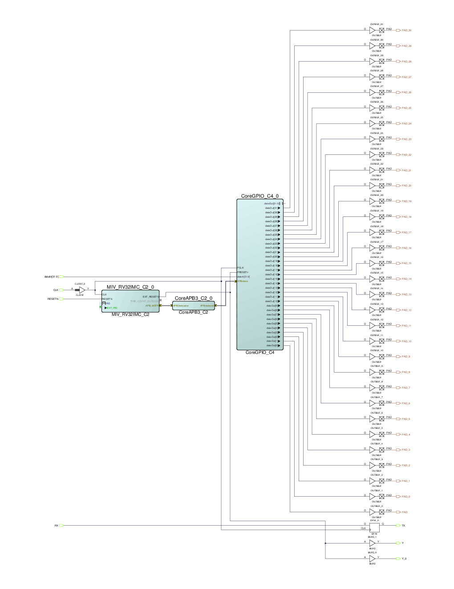

9.  Generate **block4**, set this module as the root module, and enable Block creation for this module as described in the previous section.

10. Publish the Block.


## Publishing the Block

After you create the module with I/Os inserted, publish the Block. Run Synthesis, and compile the subsystem \(or its wrapper SmartDeisgnor HDL component\). You can check for timing closure on the Block. Publish the Block without place-and-route information.

1.  For **block4**, run Synthesis.

2.  Disable **Publish Placement** and **Publish Routing** information in **Publish Block &gt; Configure Options**, as shown in the following figure. Publish the block.**Note:** Placement and routing information is not needed until the Block is integrated with the top-level project. Enabling these options results in a longer Compile cycle.


3.  

    The following figure shows the state of the completed design flow after you publish the Block.

    

    Publishing a Block creates a `<block_name>.cxz` file in the `<project_path>/designer/<block_name>/export` directory.

    For the preceding subsystem, Libero creates the `block4.cxz` file in the export directory under the designer directory of the Project location, as shown in the following figure.

    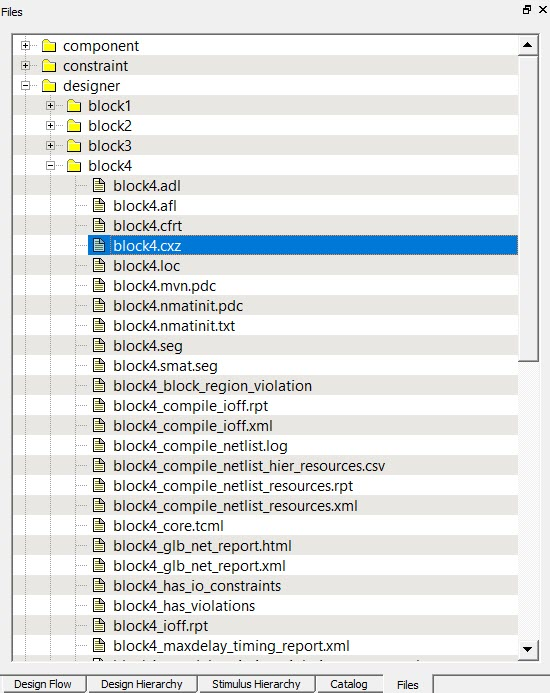

4.  5.  Repeat this procedure for the other four subsystems, and then publish Blocks for each of them. Use the Block names shown in the following table.

    |Subsystem|Block Name|
    |---------|----------|
    |block1|block1|
    |block2|block2|
    |block3|block3|
    |pf\_smip|pf\_smip|

6.  Create a top-level design.


## Creating a Top-level Design

After you published the subsystem Blocks, create a new Libero project for the top-level design. Create a SmartDesign block where you instantiate all the individual blocks and connect their IRS signals. This example writes a top-level module `SD_Top.v` that instantiates these Blocks along with required interconnects. The following shows an example description of the top-level SD\_Top module.

```
//////////////////////////////////////////////////////////////////////
// Created by SmartDesign Sun Mar  7 15:53:21 2021
// Version: v2021.1 2021.1.0.11
//////////////////////////////////////////////////////////////////////

`timescale 1ns / 100ps

// top
module top(
    // Inputs
    input DataIn0,
    input DataIn1,
    input DataIn10,
    input DataIn11,
    input DataIn12,
    input DataIn13,
    input DataIn14,
    input DataIn15,
    input DataIn16,
    input DataIn17,
    input DataIn18,
    input DataIn19,
    input DataIn2,
    input DataIn20,
    input DataIn21,
    input DataIn22,
    input DataIn23,
    input DataIn24,
    input DataIn25,
    input DataIn26,
    input DataIn27,
    input DataIn28,
    input DataIn29,
    input DataIn3,
    input DataIn30,
    input DataIn31,
    input DataIn4,
    input DataIn5,
    input DataIn6,
    input DataIn7,
    input DataIn8,
    input DataIn9,
    input REF_CLK_0,
    input RESETN,
    input pf_smip_reset,
    // Outputs
    output DataOut0,
    output DataOut1,
    output DataOut10,
    output DataOut11,
    output DataOut12,
    output DataOut13,
    output DataOut14,
    output DataOut15,
    output DataOut16,
    output DataOut17,
    output DataOut18,
    output DataOut19,
    output DataOut2,
    output DataOut20,
    output DataOut21,
    output DataOut22,
    output DataOut23,
    output DataOut24,
    output DataOut25,
    output DataOut26,
    output DataOut27,
    output DataOut28,
    output DataOut29,
    output DataOut3,
    output DataOut30,
    output DataOut31,
    output DataOut4,
    output DataOut5,
    output DataOut6,
    output DataOut7,
    output DataOut8,
    output DataOut9,
    output pf_smip_out
);

//--------------------------------------------------------------------
// Nets
//--------------------------------------------------------------------
wire   [31:0] block1_0_APBmslave0_PADDR;
wire          block1_0_APBmslave0_PENABLE;
wire   [31:0] block1_0_APBmslave0_PRDATA;
wire          block1_0_APBmslave0_PREADY;
wire          block1_0_APBmslave0_PSELx;
wire          block1_0_APBmslave0_PSLVERR;
wire   [31:0] block1_0_APBmslave0_PWDATA;
wire          block1_0_APBmslave0_PWRITE;
wire   [7:0]  block1_0_dataOut;
wire          block1_0_TX;
wire   [31:0] block3_0_dataOut;
wire   [7:0]  block3_0_dataOut_0;
wire          block4_0_TX;
wire          block4_0_Y;
wire          block4_0_Y_0;
wire          REF_CLK_ibuf_Y;
wire          RESETN_ibuf_Y;
wire          PF_CCC_C0_0_OUT0_FABCLK_0;

//--------------------------------------------------------------------
// Component instances
//--------------------------------------------------------------------
//--------block1
block1 block1_0(
        // Inputs
        .CLK       ( PF_CCC_C0_0_OUT0_FABCLK_0 ),
        .HRESETN   ( block4_0_Y_0 ),
        .PREADYS0  ( block1_0_APBmslave0_PREADY ),
        .PSLVERRS0 ( block1_0_APBmslave0_PSLVERR ),
        .RX        ( block4_0_TX ),
        .PRDATAS0  ( block1_0_APBmslave0_PRDATA ),
        .dataIn    ( block3_0_dataOut_0 ),
        // Outputs
        .PENABLES  ( block1_0_APBmslave0_PENABLE ),
        .PSELS0    ( block1_0_APBmslave0_PSELx ),
        .PWRITES   ( block1_0_APBmslave0_PWRITE ),
        .TX        ( block1_0_TX ),
        .PADDRS    ( block1_0_APBmslave0_PADDR ),
        .PWDATAS   ( block1_0_APBmslave0_PWDATA ),
        .dataOut   ( block1_0_dataOut ) 
        );

//--------block2
block2 block2_0(
        // Inputs
        .PCLK       ( PF_CCC_C0_0_OUT0_FABCLK_0 ),
        .PENABLE_in ( block1_0_APBmslave0_PENABLE ),
        .PRESETN    ( block4_0_Y ),
        .PSEL_in    ( block1_0_APBmslave0_PSELx ),
        .PWRITE_in  ( block1_0_APBmslave0_PWRITE ),
        .PADDR_in   ( block1_0_APBmslave0_PADDR ),
        .PWDATA_in  ( block1_0_APBmslave0_PWDATA ),
        // Outputs
        .PREADY_in  ( block1_0_APBmslave0_PREADY ),
        .PSVERR_in  ( block1_0_APBmslave0_PSLVERR ),
        .PRDATA_in  ( block1_0_APBmslave0_PRDATA ) 
        );

//--------block3
block3 block3_0(
        // Inputs
        .CLK       ( PF_CCC_C0_0_OUT0_FABCLK_0 ),
        .DataIn0   ( DataIn0 ),
        .DataIn1   ( DataIn1 ),
        .DataIn2   ( DataIn2 ),
        .DataIn3   ( DataIn3 ),
        .DataIn4   ( DataIn4 ),
        .DataIn5   ( DataIn5 ),
        .DataIn6   ( DataIn6 ),
        .DataIn7   ( DataIn7 ),
        .DataIn8   ( DataIn8 ),
        .DataIn9   ( DataIn9 ),
        .DataIn10  ( DataIn10 ),
        .DataIn11  ( DataIn11 ),
        .DataIn12  ( DataIn12 ),
        .DataIn13  ( DataIn13 ),
        .DataIn14  ( DataIn14 ),
        .DataIn15  ( DataIn15 ),
        .DataIn16  ( DataIn16 ),
        .DataIn17  ( DataIn17 ),
        .DataIn18  ( DataIn18 ),
        .DataIn19  ( DataIn19 ),
        .DataIn20  ( DataIn20 ),
        .DataIn21  ( DataIn21 ),
        .DataIn22  ( DataIn22 ),
        .DataIn23  ( DataIn23 ),
        .DataIn24  ( DataIn24 ),
        .DataIn25  ( DataIn25 ),
        .DataIn26  ( DataIn26 ),
        .DataIn27  ( DataIn27 ),
        .DataIn28  ( DataIn28 ),
        .DataIn29  ( DataIn29 ),
        .DataIn30  ( DataIn30 ),
        .DataIn31  ( DataIn31 ),
        .RESETN    ( RESETN_ibuf_Y ),
        .dataIn_0  ( block1_0_dataOut ),
        // Outputs
        .dataOut   ( block3_0_dataOut ),
        .dataOut_0 ( block3_0_dataOut_0 ) 
        );

//--------block4
block4 block4_0(
        // Inputs
        .CLK       ( PF_CCC_C0_0_OUT0_FABCLK_0 ),
        .RESETN    ( RESETN_ibuf_Y ),
        .RX        ( block1_0_TX ),
        .dataIn    ( block3_0_dataOut ),
        // Outputs
        .DataOut0  ( DataOut0 ),
        .DataOut1  ( DataOut1 ),
        .DataOut2  ( DataOut2 ),
        .DataOut3  ( DataOut3 ),
        .DataOut4  ( DataOut4 ),
        .DataOut5  ( DataOut5 ),
        .DataOut6  ( DataOut6 ),
        .DataOut7  ( DataOut7 ),
        .DataOut8  ( DataOut8 ),
        .DataOut9  ( DataOut9 ),
        .DataOut10 ( DataOut10 ),
        .DataOut11 ( DataOut11 ),
        .DataOut12 ( DataOut12 ),
        .DataOut13 ( DataOut13 ),
        .DataOut14 ( DataOut14 ),
        .DataOut15 ( DataOut15 ),
        .DataOut16 ( DataOut16 ),
        .DataOut17 ( DataOut17 ),
        .DataOut18 ( DataOut18 ),
        .DataOut19 ( DataOut19 ),
        .DataOut20 ( DataOut20 ),
        .DataOut21 ( DataOut21 ),
        .DataOut22 ( DataOut22 ),
        .DataOut23 ( DataOut23 ),
        .DataOut24 ( DataOut24 ),
        .DataOut25 ( DataOut25 ),
        .DataOut26 ( DataOut26 ),
        .DataOut27 ( DataOut27 ),
        .DataOut28 ( DataOut28 ),
        .DataOut29 ( DataOut29 ),
        .DataOut30 ( DataOut30 ),
        .DataOut31 ( DataOut31 ),
        .TX        ( block4_0_TX ),
        .Y         ( block4_0_Y ),
        .Y_0       ( block4_0_Y_0 ) 
        );

//--------INBUF
INBUF REF_CLK_ibuf(
        // Inputs
        .PAD ( REF_CLK_0 ),
        // Outputs
        .Y   ( REF_CLK_ibuf_Y ) 
        );

//--------INBUF
INBUF RESETN_ibuf(
        // Inputs
        .PAD ( RESETN ),
        // Outputs
        .Y   ( RESETN_ibuf_Y ) 
        );

//--------PF_CCC_C0
PF_CCC_C0 PF_CCC_C0_0(
        // Inputs
        .REF_CLK_0     ( REF_CLK_ibuf_Y ),
        // Outputs
        .OUT0_FABCLK_0 ( PF_CCC_C0_0_OUT0_FABCLK_0 ),
        .PLL_LOCK_0    (  ) 
        );

//--------pf_smip
pf_smip pf_smip_0(
       // Inputs
        .CLK           ( PF_CCC_C0_0_OUT0_FABCLK_0 ),
        .pf_smip_reset ( pf_smip_reset ),
        // Outputs
        .pf_smip_out   ( pf_smip_out ) 
        );


endmodule

```

1.  Set the top-level module as the root module, and import all Blocks \(`<block_name>.cxz files`\) using **File &gt; Import &gt; Blocks** in Libero. The following figure shows Design Hierarchy of the top-level SD\_Top module with all Blocks instantiated.

    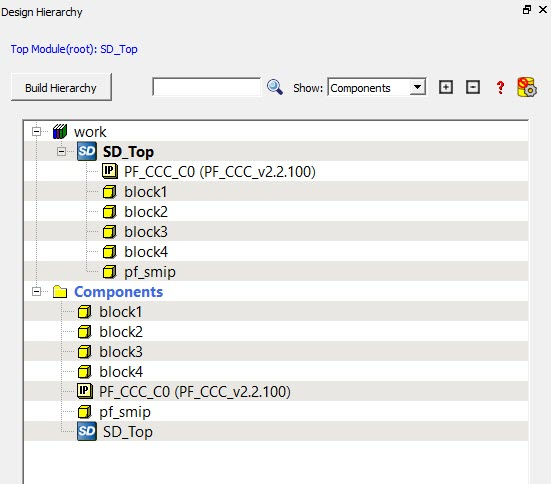

2.  For this module, uncheck the boxes for **Enable block creation** and **Enable synthesis** \(in **Project Settings**\) and check **Enable Design Separation Methodology**, as shown in the following figure.

    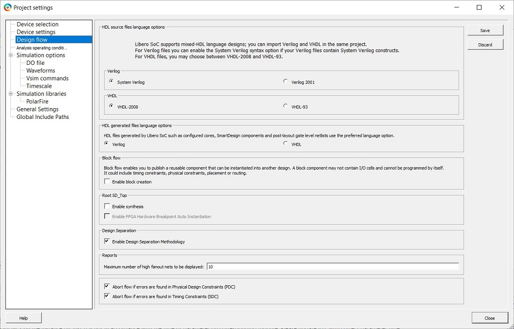

3.  Assign each Block of the design to a separation region.


## Floorplanning Design with Separation Regions

Each Block of the design must be assigned to a separation region. You can define separation regions in Chip Planner or use a PDC file. For more information about floorplanning a design using Chip Planner, see the Libero online help.

This example defines a separation region using Chip Planner for instance block4\_0, which corresponds to the block4 Block.

1.  Open Chip Planner from **Manage Constraints &gt; Floor Planner &gt; Edit** in the **Design Flow** window, as shown in the following figure.

    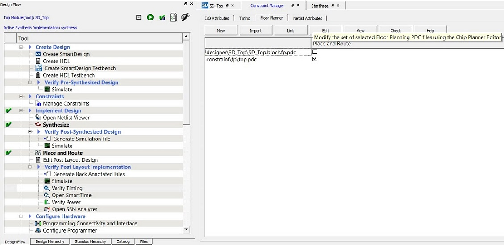

2.  Create a separation region for each Block according to the estimate obtained from the resource usage reports.

    [FloorPlanning with Design Separation Regions](GUID-FDAEB233-DEC2-417A-BE54-07259F52AB82.md#) shows a sample floorplan for the design. This example creates an exclusive routing region constraint for instance block4\_0, as shown in the following figure. You can define the region type to be inclusive if a top-level global instance needs to be placed within the same region.

    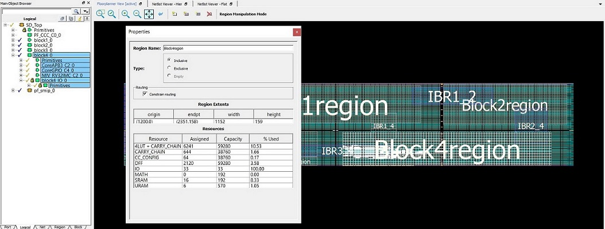

3.  Create separation regions for all blocks of the design. Then assign Block instances to the respective separation region. For this example, the floorplan resembles the following figure.

    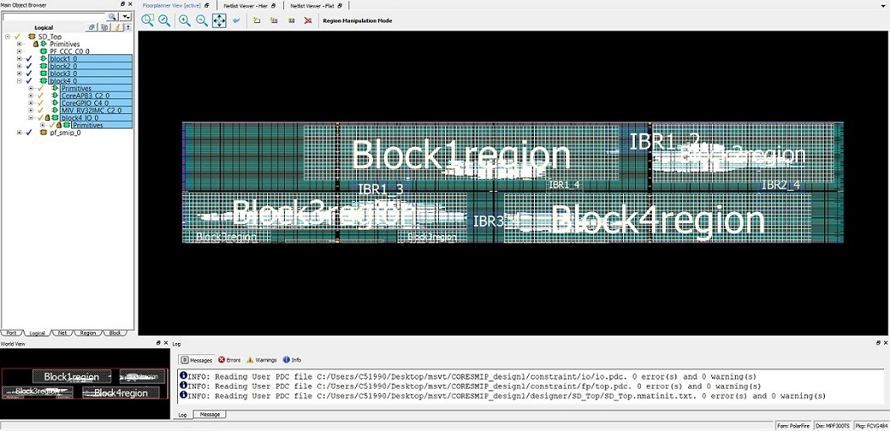

4.  After you create separation regions corresponding to the Blocks, create IRS regions for each set of connections between the Blocks. In the example, block1\_0 connects to IBR1\_2 and IBR1\_2 connects to block2\_0. Consequently, define the remaining three sets of IRS regions.

    IRS region is an inclusive routing region that is created in a similar way as the separation regions. The following figure show an example of an IRS region for instances block1\_0 to IBR1\_2.

    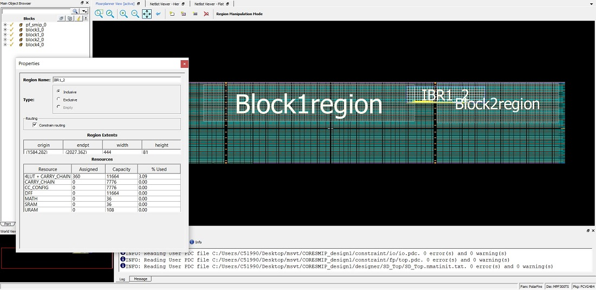

5.  Assign valid IRS net macros to the respective IRS regions.

    A complete floorplan of the example design resembles the following figure.

    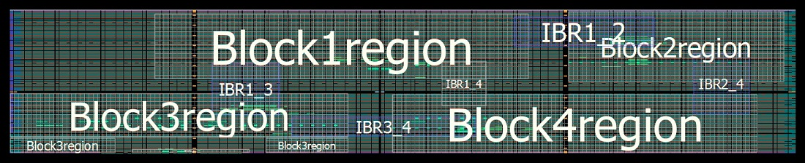

    The separation between each region should be at least equal to the required number of clusters to satisfy the separation criteria.

    The following shows a sample PDC file that can be used to implement the preceding floorplan. The regions are defined with `-route true`to constrain routing. Separation regions are assigned by their highest level hierarchy name using the `assign_region` command. IRS nets are assigned with wildcards using the `assign_net_macros` command.

    ```
    define_region -region_name Block1region -type exclusive -color 2143338688 -route true -push_place true -x1  456 -y1 195 -x2 1631 -y2 371
    define_region -region_name Block2region -type exclusive -color 2143338688 -route true -push_place true -x1 1752 -y1 189 -x2 2435 -y2 377
    define_region -region_name Block3region -type exclusive -color 2143338688 -route true -push_place true -x1    0 -y1   0 -x2  335 -y2  41 \
                                                                                                             -x1    0 -y1  42 -x2 1067 -y2 161 \
                                                                                                             -x1  804 -y1   0 -x2 1067 -y2  41       
    define_region -region_name Block4region -type exclusive -color 2143338688 -route true -push_place true -x1 1200 -y1   0 -x2 2351 -y2 158
    define_region -region_name SMIPregion   -type exclusive -color 2143338688 -route true -push_place true -x1  384 -y1   0 -x2  755 -y2  11
    define_region -region_name IBR1_2 -type inclusive -color 2147442270 -route true -push_place false -x1 1584 -y1 282 -x2 2027 -y2 362
    define_region -region_name IBR1_3 -type inclusive -color 2147442270 -route true -push_place false -x1  636 -y1 102 -x2  851 -y2 239
    define_region -region_name IBR1_4 -type inclusive -color 2143338688 -route true -push_place false -x1 1356 -y1 126 -x2 1499 -y2 245
    define_region -region_name IBR2_4 -type inclusive -color 2147442270 -route true -push_place false -x1 2148 -y1 105 -x2 2327 -y2 266
    define_region -region_name IBR3_4 -type inclusive -color 2147442270 -route true -push_place false -x1  888 -y1  45 -x2 1463 -y2  98
    assign_region -region_name Block1region -inst_name block1_0
    assign_region -region_name Block2region -inst_name block2_0
    assign_region -region_name Block3region -inst_name block3_0
    assign_region -region_name Block4region -inst_name block4_0
    assign_region -region_name Block4region -inst_name RESETN_ibuf
    assign_region -region_name SMIPregion   -inst_name pf_smip_0
    assign_net_macros -region_name IBR1_2 -net_name block1_0_APBmslave0_PENABLE     -include_driver true
    assign_net_macros -region_name IBR1_2 -net_name block1_0_APBmslave0_PSELx       -include_driver true
    assign_net_macros -region_name IBR1_2 -net_name block1_0_APBmslave0_PWRITE      -include_driver true
    assign_net_macros -region_name IBR1_2 -net_name block1_0_APBmslave0_PREADY      -include_driver true
    assign_net_macros -region_name IBR1_2 -net_name {block1_0_APBmslave0_PADDR[*]}  -include_driver true
    assign_net_macros -region_name IBR1_2 -net_name {block1_0_APBmslave0_PRDATA[*]} -include_driver true
    assign_net_macros -region_name IBR1_2 -net_name {block1_0_APBmslave0_PWDATA[*]} -include_driver true
    assign_net_macros -region_name IBR1_3 -net_name {block1_0_dataOut[*]}   -include_driver true
    assign_net_macros -region_name IBR1_3 -net_name {block3_0_dataOut_0[*]} -include_driver true
    assign_net_macros -region_name IBR1_4 -net_name block4_0_TX  -include_driver true
    assign_net_macros -region_name IBR1_4 -net_name block4_0_Y_0 -include_driver true
    assign_net_macros -region_name IBR1_4 -net_name block1_0_TX  -include_driver true
    assign_net_macros -region_name IBR2_4 -net_name block4_0_Y -include_driver true
    assign_net_macros -region_name IBR3_4 -net_name {block3_0_dataOut[*]} -include_driver true
    ```

6.  Complete place-and-route.


## Complete Place-and-Route

After you complete the floorplan, edit the timing constraints and run place-and-route until you achieve timing closure on the design.

## Configure Security Settings and Generate the Programming File

After you complete place-and-route, extract the design information to execute MSVT.

1.  Navigate to **Configure Security &gt; Configure Options &gt; Debug Policy** and configure the security and programming options per system requirements, as shown in the following figure.

    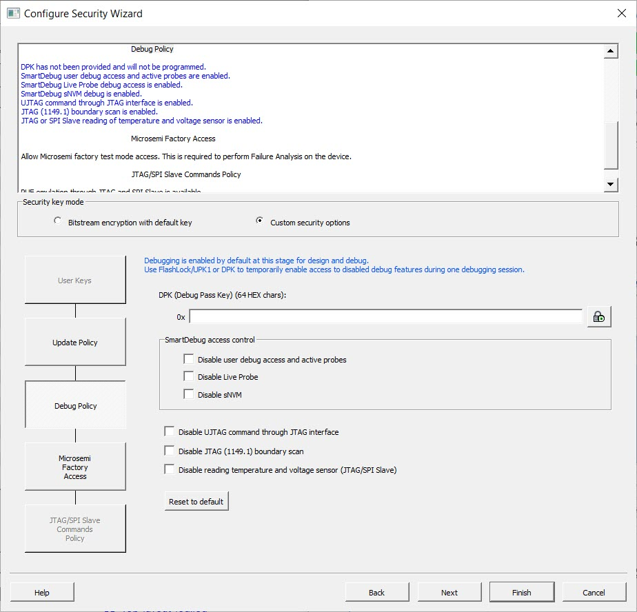

2.  Export the programming file from **Program Design &gt; Export FlashPro Express Job**.

    A programming file and files required for the MSVT are generated. Libero exports these files into the `<project_path>/designer/SD_Top/SD_Top.msvt.dtf` directory and creates a parameter file in the `<project_path>/designer/SD_Top/msvt.param` file, as shown in the following figure. The `msvt.param` file contains a list of parameters that you can adjust before executing MSVT.

    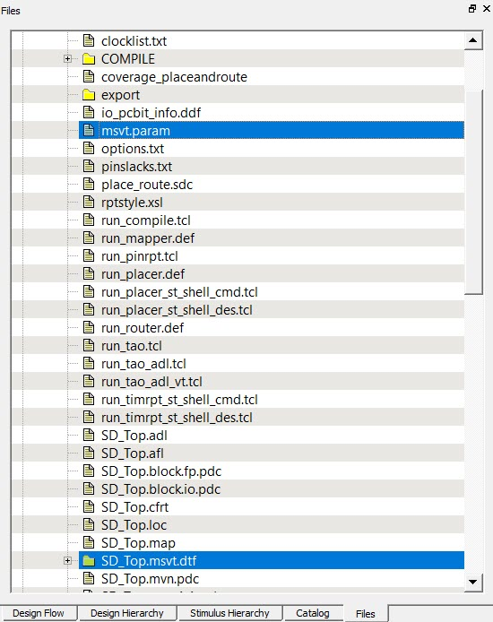

3.  Modify the REQUIRED\_SEPARATION parameter according to your system requirements before executing MSVT.


## Execute MSVT

You can now run the MSVT to verify that the design adheres to the required separation criteria.

MSVT is invoked from `<Libero_Path>/bin64/msvt_check_pf`. It is executed from the command line.

To verify the design using MSVT, run the following command:

```
<Libero_path>/bin64/msvt_check_pf –p <project_path>/designer/SD_Top/msvt.param –o msvt_check_pf.log
```

This command prints an exhaustive report to `msvt_check_pf.log` file given with the `–o` argument or to *stdout* if `–o` is omitted. The argument `–p` is required, along with the path to the `msvt.param` file generated from Libero.

When this command completes successfully, the message `MSVT Check failed` appears<br /> if the design failed to meet one or more separation criteria and the message `MSVT Check succeeded` appears if the design met all separation criteria.

Because Microchip Design Separation methodology guidlines are followed in the example, the following output shows the conclusion of MSVT output indicating that the design was verified for the given separation criteria.

```
MSVT Check
Design: SD_Top.msvt                     Started: Fri Jan  8 16:50:41 2021


Checking IRS connectivity against parameter file
===================================================

The following instances do not belong to any routing region:
====================================================================
   PF_CCC_C0_0/PF_CCC_C0_0/pll_inst_0
   REF_CLK_0_ibuf/U_IOIN


The following IRS nets are not constrained by any routing region:
====================================================================
   block4_0_TX
   block1_0_TX

Analyzing  floorplan ...
========================

   block4_0 and block2_0 : Minimal floorplan separation = 9 clusters.
      block4_0 at cluster (144,62)
      block2_0 at cluster (144,52)
   block4_0 and block2_0 : Minimal placement separation = 21 clusters.
      (2148,156) containing cell block4_0/BUFD_1/U0
      (2148,225) containing cell block2_0/BUFD_0/U0

   block4_0 and block3_0 : Minimal floorplan separation = 11 clusters.
      block4_0 at cluster (99,27)
      block3_0 at cluster (87,27)
   block4_0 and block3_0 : Minimal placement separation = 11 clusters.
      (1211,82) containing cell block4_0/CoreGPIO_C4_0/CoreGPIO_C4_0/inData_s2[6]
      (1057,81) containing cell block3_0/APB_dp_fp_1/U0/i_post_norm_mul/s_shl2_RNIS34841[4]

   block4_0 and block1_0 : Minimal floorplan separation = 11 clusters.
      block4_0 at cluster (99,64)
      block1_0 at cluster (99,52)
   block4_0 and block1_0 : Minimal placement separation = 13 clusters.
      (1368,156) containing cell block4_0/BUFD_0/U0
      (1368,201) containing cell block1_0/BUFD_0/U0

   block4_0 and pf_smip_0 : Minimal floorplan separation = 37 clusters.
      block4_0 at cluster (99,0)
      pf_smip_0 at cluster (61,0)
   block4_0 and pf_smip_0 : Minimal placement separation = 38 clusters.
      (1219,2) containing cell block4_0/block4_IO_0/OUTBUF_31/U_IOTRI
      (746,2) containing cell pf_smip_0/PF_IO_C1_0/PF_IO_C1_0/I_IOD_0

   block4_0 and 'others' : Minimal floorplan separation =  overlapping.
      block4_0 at cluster (99,0)
      'others' at cluster (99,0)
   block4_0 and 'others' : Minimal placement separation = 0 clusters.
      (1219,2) containing cell block4_0/block4_IO_0/OUTBUF_31/U_IOTRI
      (1202,2) containing cell RESETN_ibuf/U_IOIN

   block2_0 and block3_0 : Minimal floorplan separation =  diagonal.
   block2_0 and block3_0 : Minimal placement separation =  diagonal.

   block2_0 and block1_0 : Minimal floorplan separation = 9 clusters.
      block2_0 at cluster (144,93)
      block1_0 at cluster (134,93)
   block2_0 and block1_0 : Minimal placement separation = 9 clusters.
      (1743,282) containing cell block2_0/BUFD_53/U0
      (1620,282) containing cell block1_0/BUFD_87/U0

   block2_0 and pf_smip_0 : Minimal floorplan separation =  diagonal.
   block2_0 and pf_smip_0 : Minimal placement separation =  diagonal.

   block2_0 and 'others' : Minimal floorplan separation = 9 clusters.
      block2_0 at cluster (144,62)
      'others' at cluster (144,52)
   block2_0 and 'others' : Minimal placement separation =  diagonal.

   block3_0 and block1_0 : Minimal floorplan separation = 10 clusters.
      block3_0 at cluster (38,64)
      block1_0 at cluster (38,53)
   block3_0 and block1_0 : Minimal placement separation = 22 clusters.
      (842,124) containing cell block3_0/CoreGPIO_C2_0/CoreGPIO_C2_0/dataOut[7]
      (842,196) containing cell block1_0/CoreGPIO_C0_0/CoreGPIO_C0_0/inData_s1[7]

   block3_0 and pf_smip_0 : Minimal floorplan separation = 4 clusters.
      block3_0 at cluster (66,0)
      pf_smip_0 at cluster (61,0)
   block3_0 and pf_smip_0 : Minimal placement separation = 4 clusters.
      (811,2) containing cell block3_0/Block3_IO_0/INBUF_17/U_IOIN
      (746,2) containing cell pf_smip_0/PF_IO_C1_0/PF_IO_C1_0/I_IOD_0

   block3_0 and 'others' : Minimal floorplan separation = 11 clusters.
      block3_0 at cluster (99,0)
      'others' at cluster (87,0)
   block3_0 and 'others' : Minimal placement separation = 15 clusters.
      (1010,2) containing cell block3_0/Block3_IO_0/INBUF_19/U_IOIN
      (1202,2) containing cell RESETN_ibuf/U_IOIN

   block1_0 and pf_smip_0 : Minimal floorplan separation = 60 clusters.
      block1_0 at cluster (38,64)
      pf_smip_0 at cluster (38,3)
   block1_0 and pf_smip_0 : Minimal placement separation =  diagonal.

   block1_0 and 'others' : Minimal floorplan separation = 11 clusters.
      block1_0 at cluster (99,64)
      'others' at cluster (99,52)
   block1_0 and 'others' : Minimal placement separation = 66 clusters.
      (1204,204) containing cell block1_0/MIV_RV32IMC_C0_0/MIV_RV32IMC_C0_0/u_opsrv_0/u_core_0/u_lsu_0/un1_lsu_expipe_req_op_2
      (1202,2) containing cell RESETN_ibuf/U_IOIN

   pf_smip_0 and 'others' : Minimal floorplan separation = 37 clusters.
      pf_smip_0 at cluster (61,0)
      'others' at cluster (99,0)
   pf_smip_0 and 'others' : Minimal placement separation = 37 clusters.
      (746,2) containing cell pf_smip_0/PF_IO_C1_0/PF_IO_C1_0/I_IOD_0
      (1202,2) containing cell RESETN_ibuf/U_IOIN


Checking internal nets for block block4_0 ...
====================================================================

Checking IRS nets for block block4_0 ...
====================================================================

Propagating IRS nets outgoing from block4_0 to block2_0
====================================================================

Propagating IRS nets outgoing from block4_0 to block1_0
====================================================================

Checking internal nets for block block2_0 ...
====================================================================

Checking IRS nets for block block2_0 ...
====================================================================

Propagating IRS nets outgoing from block2_0 to block1_0
====================================================================

Checking internal nets for block block3_0 ...
====================================================================

Checking IRS nets for block block3_0 ...
====================================================================

Propagating IRS nets outgoing from block3_0 to block4_0
====================================================================

Propagating IRS nets outgoing from block3_0 to block1_0
====================================================================

Checking internal nets for block block1_0 ...
====================================================================

Checking IRS nets for block block1_0 ...
====================================================================

Propagating IRS nets outgoing from block1_0 to block4_0
====================================================================

Propagating IRS nets outgoing from block1_0 to block2_0
====================================================================

Propagating IRS nets outgoing from block1_0 to block3_0
====================================================================

Checking internal nets for block pf_smip_0 ...
====================================================================

Checking IRS nets for block pf_smip_0 ...
====================================================================


Design has met 2 switches separation requirement


MSVT Check succeeded.
Number of errors: 0

```

