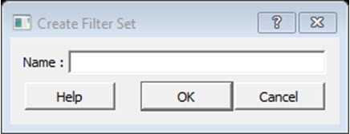

# Create Filter Set Dialog Box

Use the Create Filter Set dialog box to specify a filter.

To open the Create Filter Set dialog box from the SmartTime Timing Analyzer, select a path, and  click the **Store Filter** button in the Analysis View Filter.

-   **[Name](GUID-00CDC4D2-523E-42BE-9F92-BF35C8C5FB3F.md)**  

**Parent topic:**[SmartTime Dialog Boxes](GUID-F96D2B4E-7DDD-4507-8621-C49A84F55C81.md)

