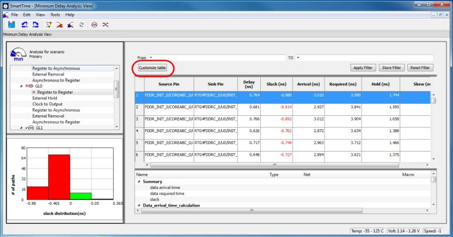
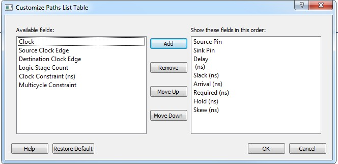

# Customize Analysis View Dialog Box

Use the Customize Analysis View dialog box to customize the timing analysis grid.

To open the Customize Analysis View dialog box from the SmartTime Max/Min Delay Analysis  View, click the **Customize table** button \(circled in red in the  following figure\) in the Max/Min Delay Analysis View. The Customize Paths List Table  dialog box appears.

-   **[Available Fields](GUID-0EFE7C66-12B2-464B-B7E7-7F69C5935CD1.md)**  

-   **[Show These Fields in This Order](GUID-34FE5144-D74A-45D6-816D-BB46DE3A30C7.md)**  

-   **[Restore Defaults](GUID-347632A2-57FE-4A63-BFF8-8AB922CD483F.md)**  

**Parent topic:**[SmartTime Dialog Boxes](GUID-F96D2B4E-7DDD-4507-8621-C49A84F55C81.md)

