# References

## Archive Project Dialog Box

The Archive Project dialog box enables you to create an archive \(`*.zip` file\) of<br /> your existing project and save it at the specified location. This is useful if you want<br /> to create a quick zip file of your project. **Archive Project** and<br /> **Save As Project** are functionally equivalent; however, if you<br /> are saving your Libero application to the SVN repository, it is important to archive<br /> your project. When you do an SVN checkout after checkin, timestamps might be outdated,<br /> and the tool states will remain invalidated. Archive Project helps in retaining the tool<br /> states by preserving the database in compressed format.

To access this dialog box, choose **Archive Project**from the **Project menu.**

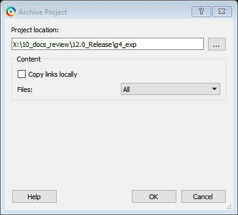

**Project Location**. Accept the default location or browse to a new location<br /> where you want to save the archive \(\*.zip\) file. The `*.zip` file is<br /> named `<project_name>.zip`.

**Copy links locally**. Check this check box to copy the links from your<br /> current project into your archive. Otherwise, the links will not be copied and you must<br /> add them manually.

**Files**. Specifies the kind of files that are archived.

-   **All**. Includes in the archive all your project and source files; the state of the project is retained.
-   Project files only: Includes in the archive only the project-related information required to retain the state of the project.
-   Source files only: Includes in the archive only the source files. This means the configuration of all the tools in the toolchain is retained but the states are not. Source files means constraint information and component information available in the component, hdl and smartgen directories.

Files are archived for different selections as shown in the following table.

|Folder Name|Files|
|All|Project Files Only|Source Files Only|
|-----------|-----|
|---|------------------|-----------------|
|component|All Files|All Files|All Files|
|constraint|All Files|All Files|All Files|
|hdl|All Files|All Files|All Files|
|stimulus|All Files|All Files|All Files|
|viewdraw|All Files|All Files|All Files|
|smartgen|All Files|All Files|All Files|
|<br /> firmware<br />|<br /> All Files<br />|<br /> All Files<br />|<br /> All Files<br />|
|<br /> CoreConsole<br />|<br /> All Files<br />|<br /> All Files<br />|<br /> All Files<br />|
|<br /> SoftConsole/Keil/IAR<br />|<br /> All Files<br />|<br /> All Files<br />|<br /> All Files<br />|
|<br /> simulation<br />|<br /> All Files<br />|<br /> \*.ini, \*.bfm, \*.do., \*.vec<br />|<br /> \*.ini, \*.bfm, \*.do., \*.vec<br />|
|<br /> synthesis<br />|<br /> All Files<br />|<br /> \*.edn, \*.vm, \*.sdc, \*.so,<br /> \*.prj, \*.srr, \*.v, run\_options.txt, synplify.log<br />|<br /> \*.prj files<br />|
|<br /> Designer/impl1<br />|<br /> All Files<br />|<br /> All Files<br />|<br /> \*.ide\_des files<br />|
|<br /> Designer/&lt;root&gt;<br />|<br /> All Files<br />|<br /> All Files<br />|<br /> Not archived<br />|
|<br /> tooldata<br />|<br /> All Files<br />|<br /> All Files<br />|<br /> All Files<br />|

**Note:** \*edn files are not supported in PolarFire.

## Adding or Modifying Bus Interfaces in SmartDesign

SmartDesign supports automatic creation of data driven configurators based on HDL<br /> generics/parameters. You can add a bus interface from your HDL module, or you can add it<br /> from the Catalog.

To add a bus interface using your custom<br /> HDL block:

If your block has all the necessary signals to interface with the AMBA bus protocol \(such<br /> as address, data, and control signals\):

1.  Right-click your custom HDL block and choose **Create Core from HDL**. The Libero SoC creates your core and asks if you want to add bus interfaces.
2.  Click **Yes**to open the Edit Core Definition dialog box and add bus interfaces. Add the bus interfaces, as necessary.
3.  Click **OK**to continue.

Now your instance has a proper AMBA bus interface on it. You can manually connect it to<br /> the bus or let Auto Connect find a compatible connection.

To add \(or modify\) a bus interface to your<br /> Component:

1.  Right-click your Component and choose **Edit Core Definition**. The Edit Core Definition dialog box opens, as shown in the following figure.

    <br />

    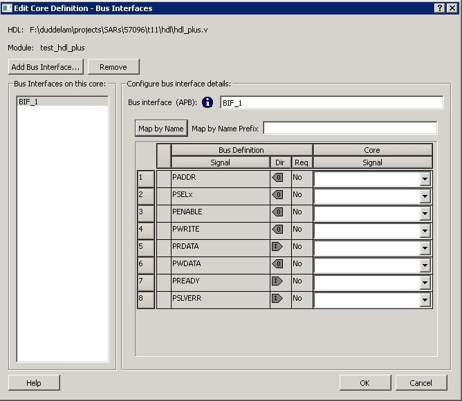

    <br />

2.  Click **Add Bus Interface**. Select the bus interface you want to add and click **OK**.
3.  If necessary, edit the bus interface details.
4.  Click **Map by Name**to map the signals automatically. Map By Name attempts to map any similar signal names between the bus definition and pin names on the instance. During mapping, bus definition signal names are prefixed with text entered in the **Map by Name Prefix**field.
5.  Click **OK**to continue.

**Bus Interface Details**

-   **Bus Interface:**Name of bus interface. It can be edited as required. **Bus Definition:**Specifies the name of the bus interface. **Role:**Identifies the bus role \(master or slave\).
-   **Vendor:**Identifies the vendor for the bus interface.
-   **Version:**Identifies the version for the bus interface.

**Configuration Parameters**

Certain bus definitions contain user configurable parameters.

-   **Parameter:**Specifies the parameter name.
-   **Value:**Specifies the value you define for the parameter.
-   **Consistent:**Specifies whether a compatible bus interface must have the same value for this bus parameter. If the bus interface has a different value for any parameters that are marked with consistent set to **yes**, this bus interface will not be connectable.

**Signal Map Definition**

The signal map of the bus interface specifies the pins on the instance that correspond to<br /> the bus definition signals. The bus definition signals are shown on the left, under the<br /> **Bus Interface Definition**. This information includes the name, direction and<br /> required properties of the signal.

The pins for your instance are shown in the columns under the Component Instance. The<br /> signal element is a drop-down list of the pins that can be mapped for that definition<br /> signal.

If the Req field of the signal definition is Yes, you must map it to a pin on your<br /> instance for this bus interface to be considered legal. If it is No, you can leave it<br /> unmapped.

### Bus Interfaces

When you add a bus interface, the Edit Core Definition dialog box provides the following<br /> Microchip Libero SoC-specific bus interfaces:

-   AHB – Master, Slave, MirroredMaster, MirroredSlave
-   APB – Master, Slave, MirroredMaster, MirroredSlave
-   AXI – Master, Slave, MirroredMaster, MirrorSlave, System
-   AXI 4 – Master, Slave, MirroredMaster, MirrorSlave

## Catalog

In the Libero SoC, from the **View** menu choose **Windows &gt; Catalog**.

The Catalog displays a list of available cores, buses, and macros.


From the Catalog, you can create a component from the list of available cores, add a processor or peripheral, [add a bus interface to your SmartDesign component](GUID-DD5BFD75-BB76-49D8-99EA-EC328F43A5FD.md#), instantiate simulation cores or add a macro \(Arithmetic, Basic Block, and so on.\) to your SmartDesign component.

1.  Double-click a core to configure it and add it to your design. Configured cores are added to your list of Components/Modules in the Design Explorer.
2.  Check the Simulation Mode check box to instantiate simulation cores in your [SmartDesign Testbench.](GUID-DD5BFD75-BB76-49D8-99EA-EC328F43A5FD.md#)Simulation cores are basic cores that are useful for stimulus, such as driving clocks, resets, and pulses.

**Viewing Cores in the Catalog**

The font indicates the status of the core:

-   Plaintext - In vault and available for use
-   Asterisk after name \(\*\) - Newer version of the core \(VLN\) available for download
-   *Italics*- Core is available for download but not in your vault
-   Strikethrough - core is not valid for this version of Libero SoC

The colored icons indicate the license status. Blank means that the core is not license protected in any way. Colored icons mean that the core is license protected, with the following descriptions.

**Green Key -**Fully licensed; supports the entire design flow.

**Yellow Key -**Has a limited or evaluation license only. Precompiled simulation libraries are provided, enabling the core to be instantiated and simulated within Libero SoC. Using the Evaluation version of the core it is possible to create and simulate the complete design in which the core is being included. The design is not synthesizable \(RTL code is not provided\). No license feature in the license.dat file is needed to run the core in evaluation mode. You can purchase a license to generate an obfuscated or RTL netlist.

**Yellow Key with Red Circle -**License is protected. You are not licensed to use this core.

1.  Right-click any item in the Catalog and choose Show Details for a short summary of the core specifications.
2.  Choose Open Documentation for more information on the Core.
3.  Right-click and choose Configure Core to open the core generator.
4.  Click the **Name**column heading to sort the cores alphabetically.
5.  Filter the cores according to the data in the Name and Description fields.
6.  Type the data into the filter field to view the cores that match the filter.
7.  Set the Display setting in the Catalog Options to **List cores alphabetically** while using the filters to search for cores. By default, the filter contains a beginning and ending ‘\*’, so if you type ‘controller’ you get all cores with controller in the core name \(case insensitive search\) or in the core description. For example, to list all the Accumulator cores, in the filter field type:

    `accu`


**Catalog Options**

Click the UI control button  \(or the drop-down arrow next to it\) to import a core, reload the Catalog, or modify the Catalog Options.

Import a core from a file when:

-   You do not have access to the internet and cannot download the core, or
-   A core is not completed and not posted to the web \(you have an evaluation core\)

**Manually Downloading MegaVaults and Individual CPZ files**

When Libero is used in an environment without automatic access to Microchip's online IP repositories via the Internet; see this article explaining [how to download MegaVaults and individual CPZ files](https://www.microchip.com/en-us/products/fpgas-and-plds/fpga-and-soc-design-tools/fpga/libero-software-later-versions).

### Catalog Options Dialog Box

The following Catalog Options dialog box allows you to customize your [Catalog](GUID-DD5BFD75-BB76-49D8-99EA-EC328F43A5FD.md#). You can add a repository, set the location of your<br /> vault, and change the View Settings for the Catalog. To display this dialog box, click<br /> the Catalog Options button .

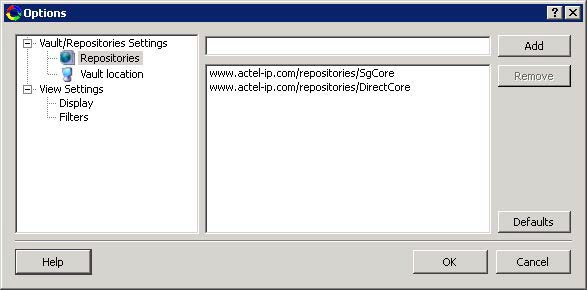

<br />

-   **Vault/Repositories Settings**
    -   **Repositories**:

        A repository is a location on the web that<br /> contains cores that can be included in your design.

        The<br /> Catalog Options dialog box enables you to specify which repositories<br /> you want to display in your Vault. The Vault displays a list of<br /> cores from all your repositories, and the [Catalog](GUID-DD5BFD75-BB76-49D8-99EA-EC328F43A5FD.md#) displays all the cores in your<br /> Vault.

        The default repository cannot be permanently deleted;<br /> it is restored each time you open the Manage Repositories dialog<br /> box.

        Any cores stored in the repository are listed by name in<br /> your Vault and Catalog; repository cores displayed in your Catalog<br /> can be filtered like any other core.

        Type in the address and<br /> click the **Add**button to add new repositories. Click the<br /> **Remove**button to remove a repository \(and its contents\)<br /> from your Vault and Catalog. Removing a repository from the list<br /> removes the repository contents from your Vault.

    -   **Vault location**

        Use this option to choose a new vault location<br /> on your local network. Enter the full domain pathname in the Select<br /> new vault location field. Use the<br /> format:

        `\\server\share`

        and the cores in<br /> your Vault will be listed in the Catalog.

        **Set ENV variable to set vault location**- In addition to setting the vault<br /> location using the Catalog dialog box, you can set the vault<br /> location using the environment variable MSCC\_IDE\_VAULT\_LOCATION.<br /> Setting the vault through the environment variable takes precedence<br /> over all other options to set vault location.

        To set the vault<br /> location on Linux, type the following command:

        `setenv MSCC_IDE_VAULT_LOCATION /home/temp_dir`

        To set the<br /> vault location on Windows:

        Add a new environment variable<br /> MSCC\_IDE\_VAULT\_LOCATION in System Properties and specify your vault<br /> location.

    -   **Read only vault**

        In read only Mega Vault mode, you cannot download, add,<br /> or remove cores. However, you can configure and generate cores by<br /> creating a temporary extract location to extract the core. This<br /> temporary extract location can be set by setting the environment<br /> variable MSCC\_IDE\_VAULT\_EXTRACT\_LOCATION. By setting this<br /> environment variable, your configured cores are retained across<br /> sessions.

        To set the extract location on Linux, type the<br /> following command:

        `setenv MSCC_IDE_VAULT_EXTRACT_LOCATION /home/vault_extract`

        To set the extract vault location<br /> on Windows:

        <br />

        1.  Add a new environment variable MSCC\_IDE\_VAULT\_EXTRACT\_LOCATION in System Properties and specify your extract location.
        2.  If you do not specify the extract location, a temporary location will be created by Libero and it will be accessed only while the current session is active. If the session is no longer active, the temporary extract location will be cleaned up by Libero. If you specify the extract location, it will be available for any instance of Libero on that machine, and it is your responsibility to clean up the extract location.
        <br />

-   **View Settings**
    -   **Display**

        **Group cores by function -**Displays a list of cores, sorted by<br /> function. Click any function to expand the list and view specific<br /> cores.

        **List cores alphabetically -**Displays an expanded<br /> list of all cores, sorted alphabetically. Double-click a core to<br /> configure it. This view is often the best option if you are using<br /> the filters to customize your display.

        **Show core version -**Shows/hides the core version.

    -   **Filters**

        **Filter field -**Type text in the Filter Field to<br /> display only cores that match the text in your filter. For example,<br /> to view cores that include 'sub' in the name, set the Filter Field<br /> to **Name**and type **sub**.

        **Display only latest version of a core -**Shows/hides older versions of cores;<br /> this feature is useful if you are designing with an older family and<br /> wish to use an older core.

        **Show all local and remote cores -**Displays all cores in your Catalog.

        **Show local cores only -**Displays only the cores in your local vault in<br /> your Catalog; omits any remote cores.

        **Show remote cores that are not in my vault -**Displays remote cores that have<br /> not been added to your vault in your Catalog.


<br />

## Changing Output Port Capacitance

Output propagation delay is affected by both the capacitive loading on the board and the I/O<br /> standard. The I/O Attribute Editor in Chip Planner provides a mechanism for setting the<br /> expected capacitance to improve the propagation delay model. SmartTime automatically<br /> uses the modified delay model for delay calculations.

To change the output port capacitance and view the effect of this change in SmartTime<br /> Timing Analyzer, refer to the following example. The following figure shows the delay<br /> from DFN1 to output port Q. It shows a delay of 6.603 ns based on the default loading of<br /> 5 pF.

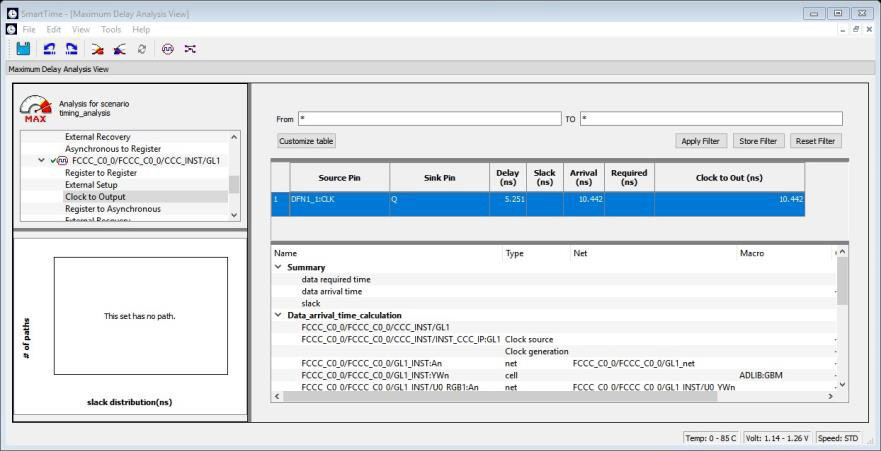

If your board has output capacitance of 15 pf on Q, you must perform the following steps to update the timing number:

1.  Open the I/O Attribute Editor and change the output load to 15 pf.

    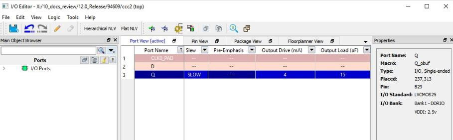

2.  Select **File &gt; Save**.
3.  Select **File &gt; Close**.
4.  Open the SmartTime Timing Analyzer.

You can see that the Clock to Output delay changed to 5.952 ns.

## Core Manager

The Core Manager only lists cores that are in your current project. If any of the cores<br /> in your current project are not in your vault, you can use the Core Manager to download<br /> them all at once.

For example, if you download a sample project and open it, you might not have all the<br /> cores in your local vault. In this instance you can use the Core Manager to view and<br /> download them with one click. Click **Download All**to add any missing cores to your<br /> vault. To add any individual core, click the green download button.

To view the Core Manager, from the **View** menu, choose<br /> **Windows &gt; Cores**. The following table describes the column<br /> headings in the Core Manager.

|Column|Description|
|------|-----------|
|Name|Name of the core.|
|Vendor|Source of the core.|
|Core Type|Core type.|
|Version|Version of the core used in your project. If the version is a<br /> later version than the one in your vault, click Download All to<br /> download the latest version.|

## Configure Security Locks for Production

Configure Security Locks for Production is a GUI-based tool that guides the user on how to<br /> configure the Permanent Locks for Production. The wizard has six steps/pages executed in<br /> sequential order. One Time Programmable \(OTP\) settings in the Permanent Locks page are<br /> applied to configured Security settings from the Configure Security tool. The subsequent<br /> pages have read only fields, which will be affected by Permanent Lock settings. These<br /> settings can only be configured by the [Configure Security](GUID-AE825DD9-DE91-4C39-95B7-F501D59B5932.md#) tool.

If you configure any Permanent Lock settings, you will be forced to go through each page to<br /> review the Security settings to make sure they are as desired.<br /> The settings cannot be changed once they are programmed.

1.  [Permanent Locks and One-way Passcode](GUID-7C0FFD89-F0F2-49A8-9E21-FBB94A5C33F9.md#)
2.  [User keys in Configure Security](GUID-AE825DD9-DE91-4C39-95B7-F501D59B5932.md#)
3.  [Update Policy in Configure Security](GUID-AE825DD9-DE91-4C39-95B7-F501D59B5932.md#)
4.  [Debug Policy in Configure Security](GUID-AE825DD9-DE91-4C39-95B7-F501D59B5932.md#)
5.  [Microsemi Factory Access in Configure Security](GUID-AE825DD9-DE91-4C39-95B7-F501D59B5932.md#)
6.  [JTAG/SPI Slave Commands Policy in Configure Security](GUID-AE825DD9-DE91-4C39-95B7-F501D59B5932.md#)

**Summary Window**

The summary window displays the summary of the current page configuration settings. Based on the selection made in the first page, the summary for the subsequent pages change. The window will scroll to the current page as you move from page to page.

**Back**

Click **Back**to return to the previous step.

**Next**

Click **Next**to proceed to the next step.

**Finish**

Click **Finish**to complete the configuration after executing the all the steps in sequential order.

**Save Summary to File**

Click **Save Summary to File**to save the display in the Summary field to a file.

## Importing Source Files by Copying Files Locally

Designer in Libero SoC cannot import files from outside your project without copying them to your<br /> local project folder. You might import source files from other<br /> locations, but they are always copied to your local folder.<br /> Designer in Libero SoC always audits the local file after you<br /> import; it does not audit the original file.

When the Project Manager asks you if you want to copy files "locally", it means 'copy the files<br /> to your local project folder'. If you do not wish to copy the files to your local<br /> project folder, you cannot import them. Your local project folder contains [files](GUID-DD5BFD75-BB76-49D8-99EA-EC328F43A5FD.md#_BOOKMARK147) related to your Libero SoC project.

Files copied to your local folders are copied directly into their relevant directories: netlists<br /> are copied to the *synthesis* folder; source files are<br /> copied to *hdl* folder, constraint files to<br /> *constraint* folder, and so on. The files are<br /> also added to the Libero SoC project and appear in the<br /> **Files** tab.

## Create Clock Constraint Dialog Box

Use this dialog box to enter a clock constraint setting.

It displays a typical clock waveform with its associated clock information. You can enter or<br /> modify this information and save the final settings as long as the constraint<br /> information is consistent and defines the clock waveform completely. The tool displays<br /> errors and warnings if information is missing or incorrect.

To open the following Create Clock Constraint dialog box from the SmartTime Constraints Editor,<br /> choose **Constraints &gt; Clock**.


**Clock Source**

Enables you to choose a pin from your design to use as the clock source.

The drop-down list is populated with all explicit clocks. You can also select the Browse button to access all potential clocks. The **Browse**button displays the [Select Source Pins for Clock Constraint Dialog Box.](GUID-DD5BFD75-BB76-49D8-99EA-EC328F43A5FD.md#)

**Clock Name**

Specifies the name of the clock constraint. This field is required for virtual clocks when no clock source is provided.

**Period**

When you edit the period, the tool automatically updates the frequency value. The period must be a positive real number. Accuracy is up to 3 decimal places.

**Frequency**

When you edit the frequency, the tool automatically updates the period value.

The frequency must be a positive real number. Accuracy is up to 3 decimal places.

**Starting Clock Edge Selector**

Click the Up or Down arrow to use the rising or falling edge as the starting edge for the created clock.

**Offset**

Indicates the shift \(in nanoseconds\) of the first clock edge with respect to instant zero common to all clocks in the design.

The offset value must be a positive real number. Accuracy is up to 2 decimal places. Default value is 0.

**Duty Cycle**

This number specifies the percentage of the overall period that the clock pulse is HIGH.

The duty cycle must be a positive real number. Accuracy is up to 4 decimal places. Default value is 50%.

**Add this clock to existing one with same source**

Check this box if you want to add a new clock constraint on the same source without overwriting the existing clock constraint. The new clock constraint name must be different than the existing name. Otherwise, the new constraint will overwrite the existing one even if you check this box.

**Comment**

Enables you to save a single line of text that describes the clock constraints purpose.

**See Also**

[Specifying Clock Constraints](GUID-DD5BFD75-BB76-49D8-99EA-EC328F43A5FD.md#)

## Select Source Pins for Clock Constraint Dialog Box

Use this dialog box to find and choose the clock source from the list of available pins.

To open the Select Source Pins for the following Clock Constraint dialog box from the SmartTime<br /> Constraints Editor, click the **Browse**button to the right of the Clock source<br /> field in the [Create Clock Constraint](GUID-DD5BFD75-BB76-49D8-99EA-EC328F43A5FD.md#) dialog box.

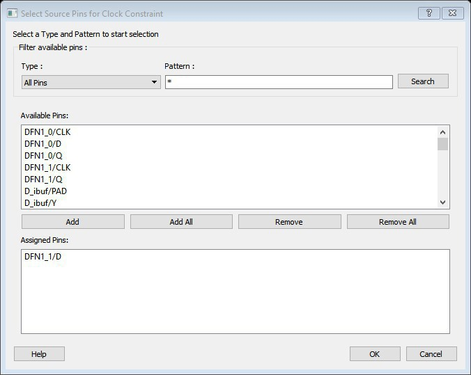

**Filter Available Pins**

-   **Type**– Displays the Type of the Available Pins in the design. The Pin Type options available for the Source are:
    -   All Pins
    -   Input Ports
    -   All Nets
-   **Pattern**– The default is \*, which is a wild-card match for all. You can specify any string value. Click **Search**to filter the available pins based on the specified pin Type and Pattern.

**Available Pins**

The list box displays the available pins. If you change the pattern value, the list box<br /> shows the available pins based on the filter.

Use **Add**, **Add All**to add the pins from the Available Pins list to Assigned<br /> Pins or **Remove**, **Remove All**to delete the pins from the Assigned Pins<br /> list.

**Assigned Pins**

Displays pins selected from the Available Pins list. Select Pins from this list and click **OK**to add the Source Pins for Clock Constraint.

**See Also**

[Specifying clock constraints](GUID-DD5BFD75-BB76-49D8-99EA-EC328F43A5FD.md#)

## Specifying Clock Constraints

Specifying clock constraints is the most effective way to constrain and verify the timing behavior of a sequential design. Use clock constraints to meet your performance goals.

To specify a clock constraint:

1.  Add the constraint in the [editable constraints grid](GUID-DD5BFD75-BB76-49D8-99EA-EC328F43A5FD.md#) or open the [Create Clock Constraint](GUID-DD5BFD75-BB76-49D8-99EA-EC328F43A5FD.md#) dialog box using one of the following methods:

    -   Click the  icon in the Constraints Editor.
    -   Right-click the **Clock**in the Constraint Browser and choose **Add Clock Constraint**.
    -   Double-click **Clock**in the Constraint Browser.
    -   Choose **Clock**from the Constraints drop-down menu \(**Constraints &gt; Clock**\).

        The following<br /> Create Clock Constraint dialog box appears.

    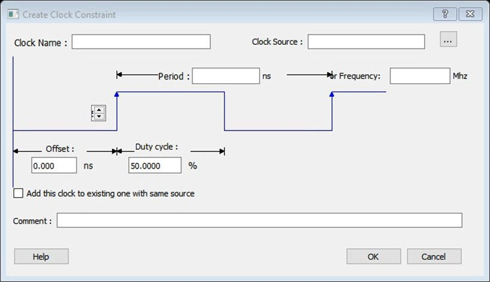

2.  Select the pin to use as the clock source. You can click the **Browse**button to display the following [Select Source Pins for Clock Constraint Dialog Box](GUID-DD5BFD75-BB76-49D8-99EA-EC328F43A5FD.md#).

    <br />

    **Note:** Do not select a source pin when you specify a virtual clock. Virtual clocks can be used to define a clock outside the FPGA that is used to synchronize I/Os.

    <br />

    Use the Choose the Clock Source Pin dialog box to display a list of source<br /> pins from which you can choose. By default, it displays the explicit clock<br /> sources of the design. To choose other pins in the design as clock source pins,<br /> select **Filter available objects - Pin Type**as **Explicit clocks**,<br /> **Potential clocks**, **All Ports**, **All Pins**, **All Nets**,<br /> **Pins on clock network**, or **Nets in clock network**. To display a<br /> subset of the displayed clock source pins, you can create and apply a<br /> filter.

    Multiple source pins can be specified for the same clock when a<br /> single clock is entering the FPGA using multiple inputs with different<br /> delays.

3.  Click **OK**to save these dialog box settings.
4.  Specify the **Period**in nanoseconds \(ns\) or **Frequency**in megahertz \(MHz\).
5.  Modify the **Clock Name**. The name of the first clock source is provided as default.
6.  Modify the **Duty cycle**, if needed.
7.  Modify the **Offset**of the clock, if needed.
8.  Modify the first edge direction of the clock, if needed.
9.  Select the check box for Add this clock to an existing one with the same source, if needed.
10. Click **OK**. The new constraint appears in the Constraints List.

    <br />

    **Note:** When you choose **File &gt; Save**, the Timing Constraints Editor saves the newly created constraint in the database.

    <br />


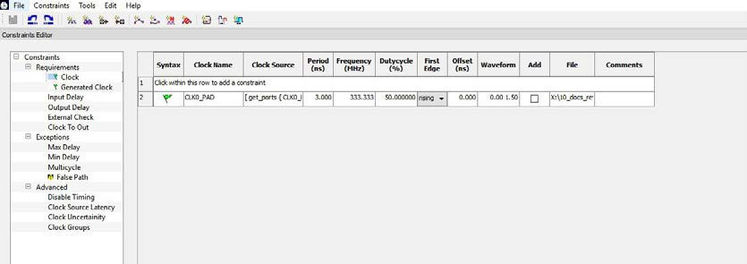

### Create Generated Clock Constraint Dialog Box

Use this dialog box to specify generated clock constraint settings.

It displays a relationship between the clock source and its reference clock. You can<br /> enter or modify this information and save the final settings as long as the constraint<br /> information is consistent. The tool displays errors and warnings if the information is<br /> missing or incorrect.

To open the following Create Generated Clock Constraint dialog box from the SmartTime<br /> Constraints Editor, choose **Constraints &gt; Generated Clock**.


**Clock Pin**

Enables you to choose a pin from your design to use as a generated clock source.

The drop-down list is populated with all unconstrained explicit clocks. You can also<br /> select the Browse button to access all potential clocks and pins from the clock network.<br /> The Browse button displays the [Select Generated Clock Source](GUID-DD5BFD75-BB76-49D8-99EA-EC328F43A5FD.md#) dialog box.

**Reference Pin**

Enables you to choose a pin from your design to use as a generated reference pin. You can<br /> select the Browse button to access all the available reference pins. The Browse button<br /> displays the [Select Generated Clock Reference](GUID-DD5BFD75-BB76-49D8-99EA-EC328F43A5FD.md#) dialog box.

**Generated Clock Name**

Specifies the name of the Generated clock constraint. This field is required for virtual<br /> clocks when no clock source is provided.

**Generated Frequency**

Specify the values to calculate the generated frequency: a multiplication factor and/or<br /> division factor \(must be positive integers\) is applied to the reference clock to compute<br /> the generated clock.

**Generated Clock Edges**

Frequency of the generated clock can also be specified by selecting the Generated Clock<br /> Edges option. Specify the integer values that represent the edges from the source clock<br /> that form the edges of the generated clock.

Three values must be specified to generate the clock. If you specify less than three, a<br /> tooltip indicates an error. The following example shows how to specify the clock<br /> edges.

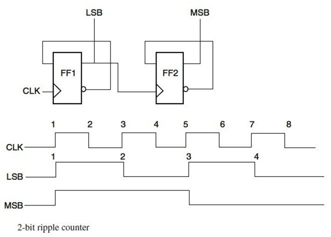

If LSB is the generated clock from CLK clock source, the edge values must be \[1 3 5\].

If MSB is the generated clock from CLK clock source, the edge values must be \[1 5 9\].

**Edge Shift**

Specify a list of three floating point numbers that represents the amount of shift, in<br /> library time units, that the specified edges are to undergo to yield the final generated<br /> clock waveform. These floating-point values can be positive or negative. Positive value<br /> indicates a shift later in time, while negative indicates a shift earlier in time.

For example, an edge shift of \{1 1 1\} on the LSB generated clock, will shift each derived<br /> edge by 1 time unit. To create a 200 MHz clock from a 100 MHz clock, use edge \{ 1 2 3\}<br /> and edge shift \{0 -2.5 -5.0\}

**Generated Waveform**

Specify whether the generated waveform is the same or inverted with respect to the<br /> reference waveform. Click **OK**.

**Phase**

This field is primarily used to report the information captured from the CCC<br /> configuration process, and when constraint is auto-generated. Meaningful phase values<br /> are: 0, 45, 90, 135, 180, 225, 270, and 315. This field is used to report the<br /> information captured from the CCC configuration process, and when the constraint is<br /> auto-generated.

**PLL Output**

This field refers to the CCC GL0/1/2/3 output that is fed back to the PLL \(in the CCC\).<br /> This field is primarily used to report the information captured from the CCC<br /> configuration process, and when constraint is auto-generated.

**PLL Feedback**

This field refers to the way in which the GL/0/1/2/3 output signal of the CCC is<br /> connected to the PLL's FBCLK input. This field is primarily used to report the<br /> information captured from the CCC configuration process, and when constraint is<br /> auto-generated.

**Add Clock to Existing Clock**

Specifies that the generated clock constraint is a new clock constraint in addition to<br /> the existing one at the same source. The name of the clock constraint must be different<br /> from the existing clock constraint. When this option is selected, master clock must be<br /> specified.

**Master Clock**

Specifies the master clock used for the generated clock when multiple clocks fan into the<br /> master pin. It can be selected from the drop-down menu. This option is used in<br /> conjunction with the add option of the generated clock.

**Comment**

Enter a single line of text that describes the generated clock constraints purpose.

### Select Generated Clock Source Dialog Box

Use this dialog box to find and choose the generated clock source from the list of<br /> available pins.

To open the following Select Generated Clock Source dialog box from the **Timing Constraints Editor**, open the [Create Generated Clock Constraint](GUID-DD5BFD75-BB76-49D8-99EA-EC328F43A5FD.md#) dialog box and click the<br /> **Browse**button for the **Clock Pin**.


**Filter Available Pins**

-   **Pin type**– Displays the Available Pin types. The Pin Type options for<br /> Generated Clock Source are:

    -   Output Ports
    -   All Register Output Pins
    -   All Pins
    -   All Nets
    -   Input Ports
-   **Pattern –**The default pattern is \*, which is a wild-card match for<br /> all. You can specify any string value.

    Select **Filter**to filter the available pins based on the specified Pin<br /> Type and Pattern.

    The list box displays the list of available pins based on the filter. Select<br /> the pins from the list and click **OK**to select the Generated Clock<br /> Source Pin.


## Specifying Generated Clock Constraints

Specifying a generated clock constraint enables you to define an internally generated<br /> clock for your design and verify its timing behavior. Use generated clock constraints<br /> and [clock constraints](GUID-DD5BFD75-BB76-49D8-99EA-EC328F43A5FD.md#) to meet your performance goals.

To specify a generated clock<br /> constraint:

1.  Open the [Create Generated Clock Constraint](GUID-DD5BFD75-BB76-49D8-99EA-EC328F43A5FD.md#) dialog box using one of the following methods:
    1.  Click the  icon.
    2.  Right-click the **Generated Clock**in the Constraint Browser and choose **Add Generated Clock**.
    3.  Double-click the Generated Clock Constraints grid. The following Create Generated Clock Constraint dialog box appears.

        

2.  Select a **Clock Pin**to use as the generated clock source. To display a list of available generated clock source pins, click the **Browse**button. The following [Select Generated Clock Source](GUID-DD5BFD75-BB76-49D8-99EA-EC328F43A5FD.md#) dialog box appears.

    

3.  Specify a **Reference Pin**. To display a list of available clock reference pins, click the **Browse**button. The Select Generated Clock Reference dialog box appears.
4.  Specify the **Generated Clock Name** \(optional\).
5.  Specify the values to calculate the generated frequency: a multiplication factor and/or a division factor \(both positive integers\).
6.  Specify the orientation of the generated clock edges based on the reference edges by entering values for the edges and the edge shifts. This is optional.
7.  Specify the first edge of the generated waveform either same as or inverted with respect to the reference waveform.
8.  Specify the PLL output and PLL feedback pins if an External feedback is used to generate the clock.
9.  Specify the Phase shift applied by the PLL in degrees.
10. Specify the Master Clock, if you want to add this to an existing one with the same source.
11. Click **OK**. The new constraint appears in the Constraints List.

    **Tip:**<br /> From the File menu, choose Save to save the newly created constraint in the<br /> database.


### Select Generated Clock Reference Dialog Box

Use this dialog box to find and choose the generated clock reference pin from the list of<br /> available pins.

To open the following Select Generated Clock Reference dialog box from the SmartTime<br /> Constraints Editor, open the [Create Generated Clock Constraint Dialog Box](GUID-DD5BFD75-BB76-49D8-99EA-EC328F43A5FD.md#) dialog box and click the<br /> **Browse**button for the **Clock Reference**.

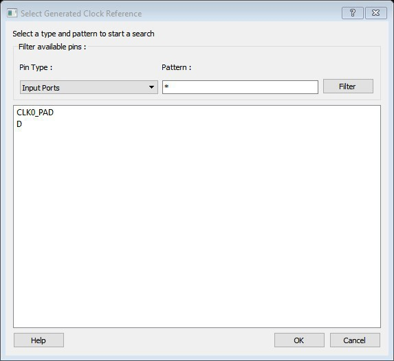

**Filter Available Pins**

-   **Pin type**: Displays the Available Pin types. The Pin Type options for Generated Clock Reference are:
    -   Input Ports
    -   All Pins
-   **Pattern**: The default pattern is \*, which is a wild-card match for all. You can specify any string value.

    Select **Filter**to filter the available pins based on the<br /> specified Pin Type and Pattern.

    The list box displays the list of<br /> available pins based on the filter. Select the pins from the list and click<br /> **OK**to select the Generated Clock Reference Pin.


## Design Hierarchy in the Design Explorer

The Design Hierarchy tab displays a hierarchical representation of the design based on<br /> the source files in the project. It also displays elaborated hierarchy constructed by<br /> propagating correct values for parameters and generics. The software continuously<br /> analyzes the source files and updates the content. The following Design Hierarchy tab<br /> displays the structure of the modules and components as they relate to each other along<br /> with parameter/generic names and its values on the tooltip for which the module is<br /> instantiated. It also displays architecture name for a given entity and Configuration<br /> for VHDL modules.


A module can have multiple elaborations depending on the different parameters/generics<br /> used in the instantiation of the module and all these elaborated modules will be shown<br /> in the Design Hierarchy. The parameterized instantiated module will be shown as<br /> `elab<num>:<modulename>`.

Modules are instantiated with their actual names in the SmartDesign. If a module with<br /> elaborated name in the Design Hierarchy must be instantiated in the SmartDesign, an<br /> instance of the original module is created in the SmartDesign. The following figure<br /> shows the design hierarchy with elaborated modules.

")

")

Modules which are not part of the elaboration will be shown in the complete hierarchy but<br /> they remain grayed out. When you create a core from a module, all the elaborated modules<br /> of that module will be shown as HDL+ core modules. You can get the parameter value of an<br /> elaborated module by selecting **Show Module parameters**on the right-click menu of<br /> the elaborated module.

**Note:** A tooltip on each module shows all the parameters with their values for the instantiated module.

**Note:**Synthesis output will be the same for different elaborations of the same<br /> module, that is **elab0:module1**and **elab1:module1**will have the same<br /> synthesis output. When one of the elaborated modules is set as root, all the<br /> elaborations will be highlighted in the Design Hierarchy, as shown in the following<br /> figure.


You can change the display mode of the Design Hierarchy by selecting **Components**or<br /> **Modules**from the **Show**drop-down list. The components view displays the<br /> entire design hierarchy; the modules view displays only schematic and HDL modules.

You can build the Design Hierarchy and Simulation Hierarchy by clicking the **Build Hierarchy**button.

A yellow icon  indicates that the Design Hierarchy is out of date<br /> \(invalidated\). Any change to the design sources/stimuli invalidates the Design<br /> Hierarchy/Stimulus Hierarchy. Click the **Build Hierarchy**button to rebuild the<br /> Design Hierarchy.

The file name \(the file that defines the block\) appears next to the block name in<br /> parentheses.

**Attention:** If a module from one HDL file instantiates another module defined in a different HDL file located in a separate library, the Stimulus Hierarchy might not appear correctly. Additionally, if the same modules are defined in multiple libraries, the hierarchies might not build correctly.

To view the location of a component, right-click and choose **Properties**. The<br /> Properties dialog box displays the path name, created date, and last modified date.

All integrated source editors are linked with the SoC software. If a source is modified<br /> and the modification changes the hierarchy of the design, the Build Hierarchy<br /> automatically updates to reflect the change.

If you want to update the Design Hierarchy, from the **View**menu, choose **Refresh Design Hierarchy.**

To open a component:

Double-click a component in the Design Hierarchy to open it. Depending on the block type<br /> and design state, several possible options are available from the right-click menu. You<br /> can instantiate a component from the Design Hierarchy to the SmartDesign Canvas. See the<br /> [SmartDesign User Guide](http://coredocs.s3.amazonaws.com/Libero/2025_1/Tool/smartdesign_ug.pdf) for more information.

Icons in the Hierarchy indicate the type of component and the state, as shown in the<br /> following table.

|Icon|Description|
|----|-----------|
|<br /> <br />|<br /> SmartDesign component<br />|
|<br /> <br />|<br /> SmartDesign component with HDL netlist not generated<br />|
|<br /> <br />|<br /> IP core was instantiated into SmartDesign but the HDL netlist is not<br /> generated<br />|
|<br /> <br />|<br /> Core<br />|
|<br /> <br />|<br /> Error during core validation<br />|
|<br /> <br />|<br /> Updated core available for download<br />|
|<br /> <br />|<br /> HDL netlist<br />|
|<br /> <br />|<br /> Shows ungenerated components<br />|
|<br /> <br />|<br /> Shows unknown modules<br />|
|<br /> <br />|<br /> Expands all the files and folders in the Design Hierarchy<br />|
|<br /> <br />|<br /> Collapses all the files and folders in the Design Hierarchy<br />|
|<br /> <br />|<br /> Finds the files in the Design Hierarchy<br />|

**Linked Files with Relative Path in Design Hierarchy with Environment Variable**

The following figure shows linked files that have a relative path in the design hierarchy<br /> with the Environment variable. Linked files that are in a drive different to the drive<br /> specified in Environment variable path are shown as absolute files in Windows.


Properties of file in Design Hierarchy shows Relative Path and Relative Path root<br /> directory

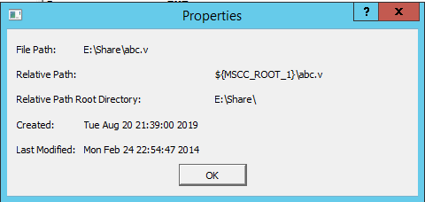

## Digest File

To verify which bitstream file was used on each programmed device, run the VERIFY or<br /> VERIFY\_DIGEST action on the respective device. This is a costly and time-consuming process. To<br /> speed up the verification process, digests are printed during bitstream generation and<br /> bitstream programming.

These digests can be compared to verify that all the devices were programmed with the correct<br /> bitstream file.

The bitstream file is divided into three major component sections: FPGA fabric, eNVM, and<br /> Security. A valid bitstream contains a combination of any of the three primary bitstream<br /> components.

For more information, see [FPGA Programmed Content Integrity Checking and Programming File Tracking using Cryptographic Digests](https://ww1.microchip.com/downloads/aemDocuments/documents/FPGA/ProductDocuments/SupportingCollateral/whitepapers/fpga_programmed_content_integrity_checking.pdf).

**See Also**

[Export Bitstream](GUID-7C0FFD89-F0F2-49A8-9E21-FBB94A5C33F9.md#)

## Design Rules Check

The Design Rules Check runs automatically when you generate your SmartDesign; the results appear<br /> in the **Reports** tab. To initiate a Design Rules Check<br /> manually, in **SmartDesign Canvas** tab, click 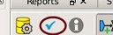<br /> icon.

To view the results, from the **Design**menu, choose<br /> **Reports**.

-   **Status**displays an icon to indicate if the message is an error or a warning \(as shown in the following figure\). Error messages are shown with a small red sign and warning messages with a yellow exclamation point. 
-   **Message**identifies the specific error/warning \(see the following list\); click any message to see where it appears on the Canvas.
-   **Details**provides information related to the Message.

**Note:** If the following message appears, see the [Simultaneous Switching Noise and Signal Integrity Application Note](https://ww1.microchip.com/downloads/aemDocuments/documents/FPGA/ApplicationNotes/ApplicationNotes/RTG4_Simultaneous_Switching_Noise_Signal_Integrity_Application_Note_AC263_V3.pdf) on the Microchip website for information about SSO limits: `When debugging pin placement issues in Simultaneous Switching Output (SSO) systems, Given the current pin placements in Bank X, the SSO limit for the selected drive strength < strength> and IO Standard <standard> has been exceeded.`

<br />

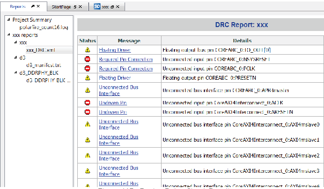

<br />

**Message Types:**

**Unused Instance -**You must remove this instance or connect at least one output pin to the rest of the design.

**Out-of-date Instance -**You must update the instance to reflect a change in the component referenced by this instance.

**Undriven Pin -**To correct the error you must connect the pin to a driver or change the<br /> state, that is, tie LOW \(GND\) or tie HIGH \(VCC\).

**Floating Driver -**You can mark the pin unused if it is not being used in the current<br /> design. Pins marked unused are ignored by the Design Rules Check.

**Unconnected Bus Interface -**You must connect this bus interface to a compatible port because it is required connection.

**Required Bus Interface Connection –**You must connect this bus interface before you can generate the design. These are typically silicon connection rules.

**Exceeded Allowable Instances for Core –**Some IP cores can only be instantiated a certain number of times for legal design because of silicon limitations. You must remove the extra instances.

**Incompatible Family Configuration –**The instance is not configured to work with this<br /> project’s Family setting. Either it is not supported by this family, or you<br /> need to re-instantiate the core.

**Incompatible Die Configuration –**The instance is not configured to work with this project’s Die setting. Either it is not supported or you need to reconfigure the Die configuration.

**No RTL License, No Obfuscated License, No Evaluation License –**You do not have the proper<br /> license to generate this core. Visit the Microchip [Licensing page](https://www.microchip.com/en-us/products/fpgas-and-plds/fpga-and-soc-design-tools/fpga/licensing) to obtain the<br /> necessary license.

**No Top-level Ports -**There are no ports on the top-level. To auto-connect top-level ports,<br /> right-click the Canvas and choose Auto-connect.

**Self-Instantiation -**A component cannot instantiate itself. This is reported only in the<br /> Log/Message Window.

## Editable Constraints Grid

The Constraints Editor enables you to add, edit, and delete.

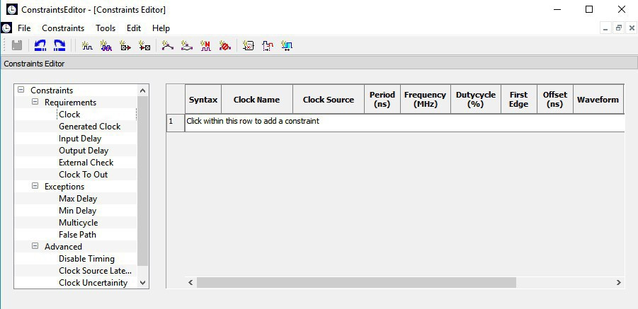

To add a new constraint:

1.  Select a constraint type from the constraint browser.
2.  Enter the constraint values in the first row and click the green check mark to apply your changes. To cancel the changes, press the red cancel mark.
3.  The new constraint is added to the Constraint List. The green syntax flag indicates that the constraint was successfully checked.

To edit a constraint:

1.  Select a constraint type from the constraint browser.
2.  Select the constraint, edit the values, and click the green check mark to apply your changes. To cancel the changes, press the red cancel mark. The green syntax flag indicates that the constraint was successfully checked.

To delete a constraint:

1.  Select a constraint type from the constraint browser.
2.  Right-click the constraint you want to delete and choose **Delete Constraint**.

## Files Tab and File Types

The Files tab displays all the files associated with your project, listed in the directories in which they appear.

Right-clicking a file in the Files tab provides a menu of available options specific to the file<br /> type. You can delete files from the project and the disk by selecting<br /> **Delete** from the right-click menu.

You can instantiate a component by dragging the component to a SmartDesign Canvas or by selecting<br /> **Instantiate in SmartDesign** from the right-click menu. See the<br /> [SmartDesign User Guide](http://coredocs.s3.amazonaws.com/Libero/2025_1/Tool/smartdesign_ug.pdf) for more details.

You can configure a component by double-clicking the component or by selecting **Open Component**from the right-click menu.

**File Types**

When you create a new project in the Libero SoC it automatically creates new directories and<br /> project files. Your project directory contains all your 'local' project files.<br /> **If you**[import](GUID-DD5BFD75-BB76-49D8-99EA-EC328F43A5FD.md#)**files from outside your current project, the files must be**[copied into your local project folder](GUID-DD5BFD75-BB76-49D8-99EA-EC328F43A5FD.md#)<br /> **\(The Project Manager enables you to manage your files as you import them\)**.

Depending on your project preferences and the Libero SoC version you installed, the software<br /> creates directories for your project.

The top-level directory \(&lt;project\_name&gt;\) contains your PRJ file; only one PRJ file is<br /> enabled for each Libero SoC project.

-   **component**directory - Stores your SmartDesign components \(SDB and CXF files\) for your Libero SoC project.
-   **constraint**directory - All your constraint files \(SDC, PDC\).
-   **designer**directory **-**\*\_ba.sdf, \*\_ba.v\(hd\), **STP,**TCL \(used to run designer\), designer.log \(log file\) **hdl**directory - all hdl sources. \*.vhd if VHDL, \*.v and \*.h if Verilog, \*.sv if SystemVerilog **simulation**directory - meminit.dat, modelsim.ini files.
-   **smartgen**directory - GEN files and LOG files from generated cores.
-   **stimulus**directory - BTIM and VHD stimulus files.
-   **synthesis**directory - \*.edn, \*\_syn.prj \(Synplify log file\), \*.srr \(Synplify log file\), \*.tcl \(used to run synthesis\) and many other files generated by the tools \(not managed by Libero SoC\).
-   **tooldata**directory - includes the log file for your project with device details.

## Importing Files

Anything that describes your design, or is needed to program the device, is a project source.<br /> These might include schematics, HDL files, simulation files, testbenches, and so on.<br /> Import these source files.

To import a file:

1.  From the **File**menu, choose **Import Files**.
2.  In **Files of type**, choose the file type.
3.  In **Look in**, navigate to the drive/folder where the file is located.
4.  Select the file to import and click **Open**.

    **Note:** You cannot import a Verilog File into a VHDL project and vice versa.


|File Type|File Extension|
|---------|--------------|
|Behavioral and Structural VHDL; VHDL Package|\*.vhd, \*.vhdl|
|Design Block Core|\*.gen|
|Verilog Include|\*.h|
|Behavioral and Structural Verilog|\*.v, \*.sv|
|Netlist Verilog|\*.vm|
|Stimulus|\*.vhd, \* .vhdl,\*.v, \*.sv|
|Memory file|\*.mem|
|Components \(Designer Blocks, Synplify DSP\)|\*.cxf|
|MSS Components|\*.cxz|

## Layout Error Message: layoutg4NoValidPlacement

This is a generic error produced by the placer when it is unable to place a design. The most<br /> common cause for this failure is that the placer was unable to find a solution, which<br /> could fit the design into the chip, either because the design is close to maximum<br /> utilization, or logic cannot be fit into user-defined region constraints.

If Libero is unable to find a legal placement, a list of unplaced cells will be provided in the<br /> log. The cells in this list might not be the cause of the placement problem; it is quite<br /> possible that some other constrained block of logic was placed first and now prohibits<br /> further placement. However, starting with the unplaced cell list is the easiest and most<br /> likely course:

-   The simplest potential solution is to remove all placement constraints of the unplaced cells, and re-run Place and Route.

However, the cells in this list might not be the cause of the placement problem; it is quite<br /> possible that some other constrained block of logic which was placed first and now<br /> prohibits further placement. If removing the placement constraints on the unplaced cells<br /> fails.

-   Remove all region constraints and re-run Place and Route. Some designers make it a practice to put all their region constraints in a single, separate PDC file; in which case they need to disable that file.
    -   If this Place and Route re-run still fails, there might be wider issues with the design's size and complexity that cannot be addressed by changes to Place and Route options.
    -   If the unconstrained Place and Route re-run succeeds, then the you must add back constraints a few regions at a time in order of "simplicity". Usually, big regions with lots of free space are "simpler" for the placer, whereas tall/narrow regions with high utilization are "harder". Re-run Place and Route with each constraint restoration and repeat the process until the failing region\(s\) is identified.

        Depending on requirements, the failing region might be<br /> handled by removing or changing its constraints, or revising its design<br /> to use less resources.


You can also re-run the Placer in high-effort mode. Applying high-effort mode to a design which<br /> is very full can incur additional runtime and can produce a placement solution that<br /> might not meet tight timing constraints because the placer will aggressively attempt to<br /> fit the design. In practice, customers are encouraged to apply the previous suggestions<br /> first; and utilize high-effort mode only when other approaches are exhausted.

## Layout Error Message: layoutg4DesignHard

This design is very difficult to place, and high-effort techniques were required to fit it. This<br /> might lead to increased layout runtime and<br /> diminished timing performance.

This message typically appears in designs with high utilization — a very full design, or a design<br /> with region constraints which are, themselves, very full. It can also occur in designs<br /> with moderate utilization but with numerous, long carry chains.

No immediate action is required. However, if this notice is observed during Layout, the resultant<br /> performance of the design and the runtime of the<br /> Layout tools might not be optimal, and there is a<br /> strong possibility that reducing the size of the<br /> design, or relaxing region and floorplanning<br /> constraints, will help to improve timing closure<br /> and runtime.

## Save Project As Dialog Box

The Save Project As dialog box enables you to save your entire project with a new name and location. To access this dialog box, choose **Save Project As**from the **Project menu.**

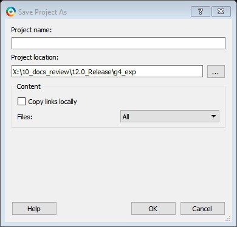

**Project Name**

Type the project name for your modified project.

**Project Location**

Accept the default location or **Browse**to the new location where you can save and store your project. All files for your project are saved in this directory.

**Content**

**Copy links locally -**Check this check box to copy the links from your current project into<br /> your new project. If you do not check this check box, the links will not be copied and<br /> you must add them manually.

**Files**

-   **All**- Includes all your project and source files; the state of the project is retained.

-   **Project files only**- Copies only the project-related information required to retain the state of the project.

-   **Source files only**- Copies all the source files into the specified location. This means the configuration of all the tools in the tool chain is retained but the states are not. Source files means constraint information and component information available in the component, hdl and smartgen directories.

Files are saved as shown in the following table.

|Folder Name|Files|
|All|Project|Source|
|-----------|-----|
|---|-------|------|
|component|All Files|All Files|All Files|
|constraint|All Files|All Files|All Files|
|hdl|All Files|All Files|All Files|
|<br /> stimulus<br />|<br /> All Files<br />|<br /> All Files<br />|<br /> All Files<br />|
|<br /> smartgen<br />|<br /> All Files<br />|<br /> All Files<br />|<br /> All Files<br />|
|<br /> firmware<br />|<br /> All Files<br />|<br /> All Files<br />|<br /> All Files<br />|
|<br /> CoreConsole<br />|<br /> All Files<br />|<br /> All Files<br />|<br /> All Files<br />|
|<br /> SoftConsole/Keil/IAR<br />|<br /> All Files<br />|<br /> All Files<br />|<br /> All Files<br />|
|<br /> Phy\_Synthesis<br />|<br /> All Files<br />|<br /> All Files<br />|<br /> Not Copied<br />|
|<br /> simulation<br />|<br /> All Files<br />|<br /> \*.ini, \*.bfm, \*.do., \*.vec<br />|<br /> \*.ini, \*.bfm,<br /> \*.do., \*.vec<br />|
|<br /> synthesis<br />|<br /> All Files<br />|<br /> \*.edn, \*.vm, \*.sdc, \*.so, \*.prj,<br /> \*.srr, \*.v, run\_options.txt, synplify.log<br />|<br /> \*.prj files<br />|
|<br /> Designer/impl1<br />|<br /> All Files<br />|<br /> All Files<br />|<br /> \*.ide\_des files<br />|
|<br /> Designer/&lt;root&gt;<br />|<br /> All Files<br />|<br /> All Files<br />|<br /> Not Copied<br />|
|<br /> tooldata<br />|<br /> All Files<br />|<br /> All Files<br />|<br /> All Files<br />|

<br />

**Note:** \*.edn files are not supported in PolarFire.

<br />

## Project Settings Dialog Box

The Project Settings dialog box enables you to modify your Device, HDL, and Design Flow settings<br /> and your **Simulation options**. In Libero SoC, from the<br /> **Project** menu, click **Project Settings**.

The following figure shows an example of the **Project Settings** dialog<br /> box:

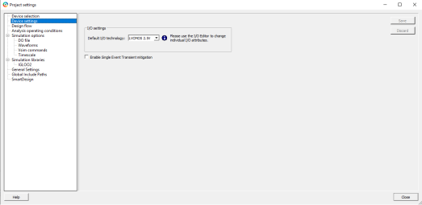

<br />

Device Selection
:   Sets the device Die and Package for your project. For a detailed description of the options, see the [New Project Creation Wizard: Device Selection](GUID-F9EBA308-305F-4288-8D09-CB856AA26995.md#) section.

<br />

Device Settings
:   **Default I/O Technology**: Sets all your I/Os to a default value. You can change the values for individual I/Os in the I/O Attributes Editor.

<br />

System controller suspended mode
:   If the System Controller Suspended mode is enabled in any PolarFire design, the following operations and features are not available during normal operation. For more information, see system services in the [PolarFire Family System Services](https://ww1.microchip.com/downloads/aemDocuments/documents/FPGA/ProductDocuments/UserGuides/PolarFire_FPGA_and_PolarFire_SoC_FPGA_System_Services_User_Guide_VD.pdf) user guide.

    -   All System Controller services requested after power-up is complete and the System Controller is suspended
    -   System controller generated Tamper flags
    -   Device reset and zeroization Tamper responses
    -   SPI-Master In-Application Programming \(IAP\)
    -   SPI-Slave Programming mode

    For RT PolarFire devices, the System Controller Suspended mode is<br /> enabled by default for all new RT PolarFire projects. If the System<br /> Controller Suspended mode is disabled, it increases vulnerability to<br /> radiation single event effects in the System controller.

<br />

Design Flow
:   For more information, see the [Project Settings: Design Flow](GUID-DD5BFD75-BB76-49D8-99EA-EC328F43A5FD.md#).

<br />

Analysis Operating Conditions
:   Allows you to change the operation conditions based on your device by setting ranges for operating temperature, core voltage, and default I/O voltage available in the pick-list.

    Based on the selected device family,<br /> the operating conditions differ. The following list describes the device<br /> families with family-specific operating conditions:

    PolarFire
    :   Currently, for all the PolarFire devices the **Operating Temperature Range** can be set to **EXT** or **IND**.

    :   For some of the devices within this family the **Operating Temperature Range** can be set to **TGrade2** or **MIL** as well.

    :   The RT PolarFire devices, allow you to set the **Operating Temperature Range** to either **MIL** or **IND**.

    PolarFire SoC
    :   Currently, for all the PolarFire SoC devices, the **Operating Temperature Range** can be set to **EXT**, **IND** or **TGrade2**.

    :   The RT PolarFire devices allow you to set the **Operating Temperature Range** to either **MIL** or **IND**.

    **Important:** For both **PolarFire** and **PolarFire SoC**, the **Core Voltage Range** and **Default I/O Voltage Range** options are disabled.

    SmartFusion 2
    :   Currently, for all the SmartFusion 2 devices, the **Operating Temperature Range**, **Core Voltage Range**, and **Default I/O Voltage Range** can be set to **COM**, **IND**. If desired, the ranges can be defined manually by selecting **Custom**.

    IGLOO 2
    :   Currently, for all the IGLOO 2 devices, the **Operating Temperature Range**, **Core Voltage Range**, and **Default I/O Voltage Range** can be set to **COM**, **IND**, **TGrage1**. If desired, the ranges can be defined manually by selecting **Custom**.

    RTG4 FPGA
    :   Currently, for all the RTG4 devices, the **Operating Temperature Range**, **Core Voltage Range**, and **Default I/O Voltage Range** can be set to **MIL**. Alternatively, select **Custom** to define the ranges manually.

    These settings are propagated to **Verify Timing**, **Verify Power**, and<br /> **Backannotated Netlist** for you to perform<br /> **Timing/Power Analysis**.

    After you<br /> select the range for operating temperature, the<br /> **Minimum**, **Typical**, and<br /> **Maximum** temperature values are automatically<br /> displayed for the selected device.

<br />

Simulation Options and Simulation Libraries
:   Sets your simulation options. For more information, see the [Project Settings: Simulation - Options and Libraries](GUID-DD5BFD75-BB76-49D8-99EA-EC328F43A5FD.md#).

### Project Settings: Simulation - Options and Libraries

Using this dialog box, you can set change how Libero SoC handles Do files in simulation, import your own Do files, set simulation run time, and change the DUT name used in your simulation. You can also change your library mapping.

To access this dialog box, from the **Project**menu choose **Project Settings**and click to expand **Simulation options**or **Simulation libraries**.

For **Simulation options**click the option you wish to edit: **DO file**, **Waveforms**, **Vsim commands**, **Timescale**. For **Simulation libraries**click on the library you wish to change the path for.


DO file:

-   **Use automatic DO file -**Select if you want the Project Manager to automatically create a DO file that will enable you to simulate your design.
-   **Simulation Run Time -**Specify how long the simulation must run. If the value is 0, or if the field is empty, there will not be a run command included in the run.do file.

-   **Testbench module name -**Specify the name of your testbench entity name. Default is “testbench,” the value used by WaveFormer Pro.
-   **Top Level instance name -**Default is &lt;top\_0&gt;, the value used by WaveFormer Pro. The Project Manager replaces &lt;top&gt; with the actual top-level macro when you runsimulation\(presynth/postsynth/postlayout\).
-   **Generate VCD file**- Check the check box to generate a VCD file.
-   **VCD file name**- Specifies the name of your generated VCD file. The default is power.vcd; click power.vcd and type to change the name.
-   **User defined DO file -**Enter the DO file name or click the browse button to navigate to it.

-   **DO command parameters -**Text in this field is added to the DO command.

    Waveforms

-   **Include DO file -**Including a DO file enables you to customize the set of signal waveforms that will be displayed in ModelSim ME Pro.
-   **Display waveforms for -**You can display signal waveforms for either the top-level testbench or for the design under test. If you select **top-level testbench**then Project Manager outputs the line 'addwave /testbench/\*' in the DO file run.do. If you select **DUT**then Project Manager outputs the line 'add wave /testbench/DUT/\*' in the run.do file.
    -   **Log all signals in the design -**Saves and logs all signals during simulation.

**Vsim Commands**


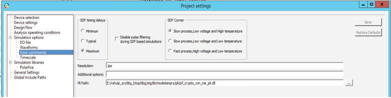

-   **Resolution - The default is 1ps.** Some custom simulation resolutions might not work with your simulation library. Consult your simulation help for more information on how to work with your simulation library and detect infinite zero-delay loops caused by high resolution values.
-   **Additional options -**Text entered in this field is added to the vsim command.
    -   SRAM ECC Simulation -

        Two options can be added to specify the simulated error and correction probabilities of all ECC SRAMs in the design.

        -   `-gERROR_PROBABILITY=<value>`, where 0 &lt;= value &lt;= 1
        -   `-gCORRECTION_PROBABILITY=<value>`, where 0 &lt;= value &lt;= 1
    -   During Simulation, the `SB_CORRECT` and `DB_DETECT` flags on each SRAM block will be raised based on generated random numbers being below the specified&lt;value&gt;s.
    -   When you run the Post-Layout Simulation Tool, a run.do file is created, which consists of information which needs to be sent to a simulator. To run a simulation on a corner, you must select one of the SDF corners along with the type of delay needed from one of the options in SDF timing delays section.
        -   SDF Corners:
            -   Slow Process, Low Voltage, and High Temperature
            -   Slow Process, Low Voltage, and Low Temperature
            -   Fast Process, High Voltage, and Low Temperature
        -   SDF Timing Delays:
            -   Minimum
            -   Typical
            -   Maximum
        -   Disable pulse filtering during SDF based simulations: This option disables the pulse filtering during SDF simulations.
        -   After the user selects the corner, appropriate files needed for simulation are written in the run.do file as shown in the following example.

            ```
            vlog -sv -work postlayout “$(PROJECT_DIR)/designer/sd1/sd1_fast_hv_lt_ba.v” vsim -L PolarFire -L postlayout -t 1ps -sdfmax
            /sd1=$(PROJECT_DIR)/designer/sd1/sd1_fast_hv_lt_ba.sdf +pulse_int_e/1
            +pulse_int_r/1 +transport _int_delays postlayout.sd1
            ```

    -   To run a simulation on a design having Crypto core, you need to enter the PLI path in the PLI Path field. You can use the browse button to select the appropriate file. After the file is selected the PLI Path field is populated with the path and file. You can also manually enter the path in the PLI path field.
        -   Errors will be generated in case of wrong path or wrong file extension as follows:
            1.  If you enter a wrong PLI path and click on Save.

                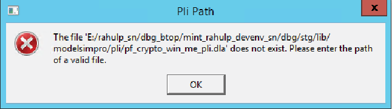

            2.  If the user enters a wrong file extension, the following error message is displayed.

                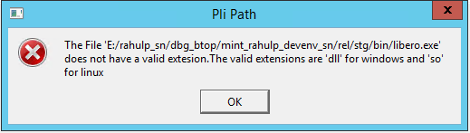

    -   To compile all the files under System Verilog Multi-File Compilation Unit \(MFCU\) mode, group them based on the library. This applies to all the .hdl files, simulation files, and core files. The following code example provides a general syntax to compile the files in System Verilog MFCU mode.

        ```
        vlog  "+incdir+<incdir1>"  "+incdir+<incdir2>" -sv -mfcu -work library1  "file1" "file2" "file3" 
        vlog  "+incdir+<incdir1>"  "+incdir+<incdir2>" -sv -mfcu -work library2  "file4"  "file5"  "file6" 
        ```


Timescale

-   **TimeUnit**- Enter a value and select s, ms, us, ns, ps, or fs from the pull-down list, which is the time base for each unit. The default setting is ns.
-   **Precision**- Enter a value and select s, ms, us, ns, ps, or fs from the pull-down list. The default setting is ps.

Simulation Libraries

-   **Restore Defaults**- Sets the library path to default from your Libero SoC installation.
-   **Library path**- Enables you to change the mapping for your simulation library \(both Verilog and VHDL\). Type the pathname or click the Browse button to navigate to your library directory.

### Project Settings: Design Flow

To access the Design flow page, from the Project menu choose **Project settings**. From the **Project settings** window, select the **Design flow**from the left pane.

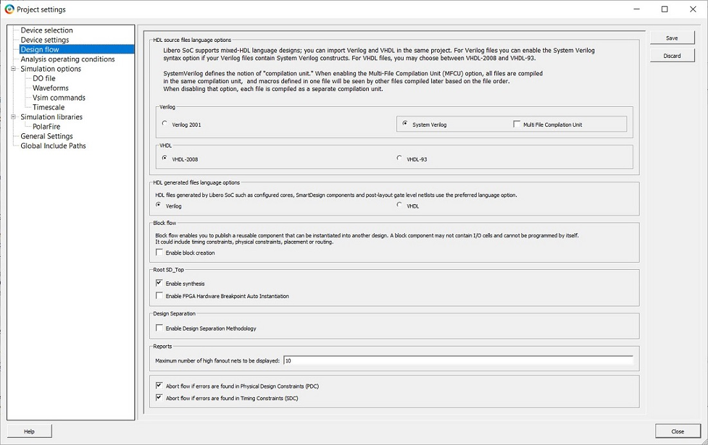

**HDL Source Files Language Options**

Libero SoC supports mixed-HDL language designs. You can import Verilog and VHDL in the same project.

You can set HDL to VHDL or Verilog. For VHDL, choose VHDL-2008 or VHDL-93. For Verilog, choose System Verilog \(if your Verilog files contain System Verilog constructs\) or Verilog 2001.

SystemVerilog defines the notion of "compilation unit." Enabling the Multi-File Compilation Unit \(MFCU\) option, compiles all the files in the same compilation unit, and macros defined in one file will be seen by other files compiled later based on the file order. Disable the option to compile each file as a separate compilation unit.

When a New Project is created, **Multi-File Compilation Unit** option is enabled by default. This option will be disabled/greyed out if **Verilog-2001** option is selected.

**Note:** Libero SoC supports the following Verilog and VHDL IEEE standards for ModelSim ME Pro and SynplifyPro:

-   Verilog 2005 \(IEEE Standard 1364-2005\)
-   Verilog 2001 \(IEEE Standard 1364-2001\)
-   Verilog 1995 \(IEEE Standard 1364-1995\)
-   SystemVerilog 2012 \(IEEE Standard 1800-2012\)
-   VHDL-2008 \(IEEE Standard 1076-2008\)
-   VHDL-93 \(IEEE Standard 1076-1993\)

**HDL generated files language options**

HDL files generated by Libero SoC can be set to use VHDL or Verilog. If there are no other considerations, it is generally recommended to use the same HDL language as you are using for HDL source files because it can reduce the cost of simulation licenses.

**Block flow**

Enable block creation - Enables you to create and publish design blocks \(\*.cxz files\) in Libero SoC. Design blocks are low-level components that might have completed the Place and Route step and met the timing and power requirements. These low-level design blocks can be imported into a Libero SoC project and re-used as components in a higher level design. See **Designing with Designer Block Components** in the Online Help for more information.

**Root &lt;module\_name&gt;**

Enable synthesis - Option to enable or disable synthesis for your root file; useful if you wish to skip synthesis on your root file by default.

Enable FPGA Hardware Breakpoint Auto Instantiation - The FPGA Hardware Breakpoint \(FHB\) Auto Instantiation feature automatically instantiates an FHB instance per clock domain that is using gated clocks \(GL0/GL1/GL2/GL3\) from an FCCC instance. The FHB instances gate the clock domain they are instantiated on. These instances can be used to force halt the design or halt the design through a live probe signal. Once a selected clock domain or all clock domains are halted, you can play or step on the clock domains, either selectively or all at once. FPGA Hardware Breakpoint controls in the SmartDebug UI provide control of the debugging cycle.

**Note:** The default format for Synthesis gate level netlist is Verilog for PolarFire devices.

**Reports**

Maximum number of high fanout nets to be displayed - Enter the number of high fanout nets to be displayed. The default value is 10. This means the top 10 nets with the highest fanout will appear in the `<root>_compile_netlist_resource.xml>` report.

**Abort Flow Conditions**

Abort Flow if Errors are found in Physical Design Constraints \(PDC\) – Check this check box to abort Place and Route if the I/O or Floorplanning PDC constraint file contains errors.

Abort Flow if Errors are found in Timing Constraints \(SDC\) – Check this check box to abort Place and Route if the Timing Constraint SDC file contains errors.

Abort flow if 3.3 V I/Os are found in the design – Check this check box to abort Place and Route if 3.3 V I/Os are found in the design. This allows the tool to generate an error similar to the following. However, if the check box is unchecked, the Place and Route tool will generate the same error message as a warning without interrupting the design flow process.

Error: I/Os at 3.3 V are vulnerable to Single Event Latch-up at low LET levels. Review RT PolarFire radiation data at [Microchip.com](https://www.microchip.com/).

### Project Settings: General Settings

To access the General Settings page, from the Project menu choose **Project Settings**and click the General Settings tab.

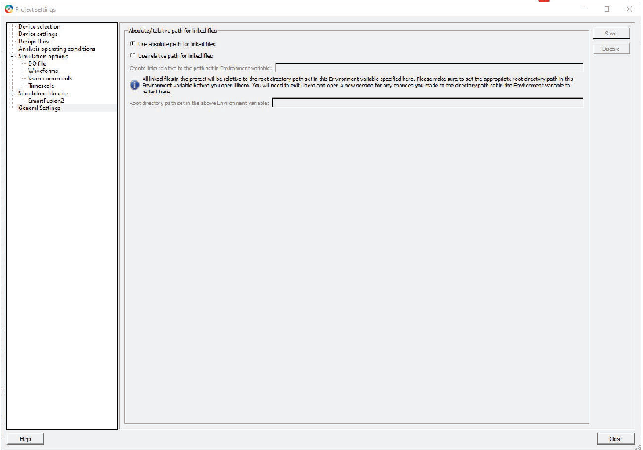

**Absolute/Relative path for linked files**

Use either "absolute path for linked files" or "relative path for the linked files" for<br /> the files linked in the project. The path set in the environment variable is read<br /> only.

If "Use absolute path for linked files" option is selected, all the linked files are<br /> stored with the absolute path.

If "Use relative path for linked files "option is selected, the user is given an option<br /> to provide an environment variable that contains the root directory path that will be<br /> used as base location for the relative paths. All the files linked will be relative to<br /> the base location specified in environment variable by the user.

After you set the relative path and provides an environment variable that has a valid<br /> path, the following message appears in the log window.

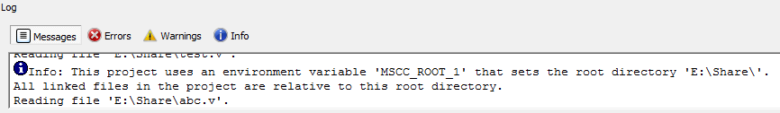

This message can appear in the log window when the user:

-   Opens a project that was created using relative path for linked files.
-   Creates a project with relative path for linked files.
-   Changes the environment variable from the project settings.

The environment variable set by the user is validated before proceeding. If the<br /> environment variable set by the user is not present or if it is set after starting<br /> Libero, the tool issues the following error.

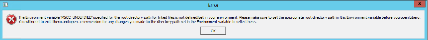

Error message: The Environment variable &lt;env\_variable\_name&gt; specified for the root<br /> directory path for linked files is not defined/set in your environment. Ensure to set<br /> the appropriate root directory path in the Environment variable before you open Libero.<br /> Exit Libero and open a new session for any changes you made to the directory path set in<br /> the Environment variable to reflect here.

Other error messages that can occur are:

-   Empty path in Environment variable

<br /> 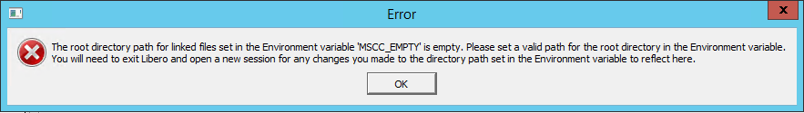

Error message: The root directory path for linked files set in the Environment variable<br /> &lt;env\_variable\_name&gt; is empty. Set a valid path for the root directory in the<br /> Environment variable. Exit Libero and open a new session for any changes you made to the<br /> directory path set in the Environment variable to reflect here.

-   Inaccessible path in environment variable

    


Error message: The root directory path &lt;env\_variable\_directory&gt; for linked files<br /> set in the Environment variable &lt;env\_variable\_name&gt; does not exist. Set a valid<br /> accessible directory path in the Environment variable. You will need to exit Libero and<br /> open a new session for any changes you made to the directory path set in the Environment<br /> variable to reflect here.

-   Project location is set as root directory in environment variable

    


Error message: The root directory path &lt;env\_variable\_path&gt; for the linked files set<br /> in the Environment variable

&lt;env\_variable\_name&gt; must not match with the current project directory path. Set a<br /> different directory path in the Environment variable. You need to exit Libero and open a<br /> new session for any changes you made to the directory path set in the Environment<br /> variable to reflect here.

-   Project settings are saved by selecting relative path and the environment variable is not specified

    


Error message: Specify an Environment variable for the root directory path for linked<br /> files in the project.

<br />

**Note:** Set the Environment Variable before starting Libero. Otherwise, Libero will not be able to get the path set in Environment Variable.

<br />

### Project Settings: Global Include Paths

This setting facilitates the user with an option to provide Global Include paths in Libero and<br /> manage how the files are sent to downstream tools. It is the user’s responsibility to<br /> provide the paths in order \(Include Paths Order\).

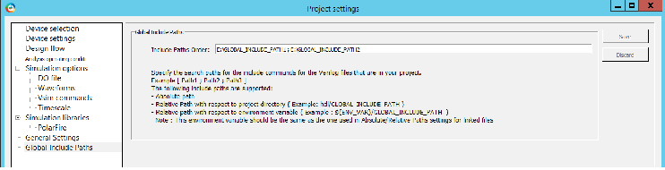

**Example:**

If a user has a defines file which exists in all the three paths – source file path\(default\), global\_inlcude\_path\_1 and global\_include\_path\_2; the order of priority of files will be as follows:

-   Source file path\(default\)
-   Global\_include\_path\_1
-   Global\_inlcude\_path\_2

**Absolute and Relative paths in Global Include Paths**

You can specify both relative and absolute files in global include paths. Example -

Absolute Path : \{ E:/User/GLOBAL\_INCLUDE\_PATH\_1 \} Relative Path: \{ ../hdl/GLOBAL\_INCLUDE\_PATH\_1 \}

Relative Path with respect to Environment Variable: \{ **$\{ENV\_VAR\}**/GLOBAL\_INCLUDE\_PATH\_1<br /> \}

Here, the environment variable must be the one used in absolute ad relative paths options only.

1.  Changing the Global Include Paths will invalidate the Design Hierarchy but not the Design flow.
2.  Change in content of Include Files present in Global Include Paths has impact as in the following cases:

    -   Case 1: If the Global Include Path is part of the project – Design flow will be invalidated.
    -   Case 2: If the Global Include Path is outside the project – Design flow will not be invalidated.
    The files are audited only if they are part of the project.


## Global Include Files

This option facilitates the users to provide global include file/s in Libero and manage how these files are sent to downstream tools occurring in Design Flow process.

Libero GUI facilitates user to provide Global Include Files. On right clicking a file in Design<br /> Hierarchy view, user can either set a file as global include by selecting **Set Global Include** option or unset a file as global include by selecting **Unset Global Include** option.

Linked files can also be set as Global Include files. The files that are set are highlighted in<br /> Design hierarchy view as shown in the following figure.

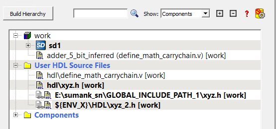

The selected order of global include files is shown in Info tab in log window:

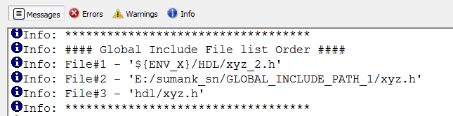

**Note:**

Setting Global Include File will use System Verilog MFCU mode internally. An info message will be generated in the log window as below:

```screen
Info: Global Include file requires System Verilog setting to be in MFCU mode. Enabling Multi File Compilation Unit internally.
```

## Create and Configure Core Component

<br />

1.  The user can create, configure, and generate a component for any core in the Libero SoC Catalog window.
2.  Select a core in the Catalog window by double clicking or right clicking on it and choose the option 'Configure core'.
3.  Specify a name to the core component to be created in the pop-up dialog box.
4.  The core's configurator window appears where the user can specify any desired configuration and click on the OK button to generate the core component.

<br />


Once the core component is created and generated, the component related files like the generated<br /> HDL netlist file are also generated to the directory `<project directory>/component/work/<component_name>`. The generated HDL netlist<br /> file of the core component now contains the component description/configuration<br /> information in Tcl as comments. These comments also include Family Name and Part Number<br /> of the device used. The following figure shows a sample Tcl component description of the<br /> core COREAXI4INTERCONNECT.


## Search in Libero SoC

Search options vary depending on your search type.

To find a file:

1.  Use CTRL + F to open the Search window.
2.  Enter the name or part of name of the object you wish to find in the Find field. '\*' indicates a wildcard, and \[\*-\*\] indicates a range, such as if you search for a1, a2, ... a5 with the string a\[1-5\].
3.  Set the Options for your search; options vary depending on your search type.
4.  Click **Find All**\(or **Next**if searching Text\).

    Searching an open text file,<br /> Log window, or Reports highlights search results in the file itself. All other<br /> results appear in the Search Results window \(as shown in the following<br /> figure\).


**Match case**: Select to search for case-sensitive occurrences of a word or<br /> phrase. This limits the search so it only locates text that matches the upper- and<br /> lowercase characters you enter.

**Match whole word**: Select to match the whole word only.

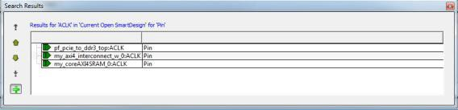

**Currently Open SmartDesign**

Searches your open SmartDesign, returns results in the Search window.

**Type**: Choose Instance, Net or Pin to narrow your search.

**Query**: Query options vary according to Type.

|Type|Query Option|Function|
|----|------------|--------|
|Instance|Get Pins|Search restricted to all pins|
|Get Nets|Search restricted to all nets|
|Get Unconnected Pins|Search restricted to all unconnected pins|
|Net|Get Instances|Searches all instances|
|Get Pins|Search restricted to all pins|
|Pin|Get Connected Pins|Search restricted to all connected pins|
|Get Associated Net|Search restricted to associated nets|
|Get All Unconnected Pins|Search restricted to all unconnected pins|

**Currently Open Text Editor**

Searches the open text file. If you have more than one text file open, place the cursor in it and<br /> click CTRL + F to search it.

-   **Find All**: Highlights all finds in the text file.
-   **Next**: Proceed to next instance of found text.

-   **Previous**: Proceed to previous instance of found text.

-   **Replace with**: Replaces the text you searched with the contents of the<br /> field.

-   **Replace**: Replaces a single instance.

-   **Replace All**: Replaces all instances of the found text with the<br /> contents of the field.


**Design Hierarchy**

Searches your Design Hierarchy; results appear in the Search window.

**Find All**: Displays all finds in the Search window.

**Stimulus Hierarchy**

Searches your Stimulus Hierarchy; results appear in the Search window.

**Find All**: Displays all finds in the Search window.

**Log Window**

Searches your Log window; results are highlighted in the Log window - they do not appear in the Search Results window.

**Find All**: Highlights all finds in the Log window.

**Next**: Proceed to next instance of found text.

**Previous**: Proceed to previous instance of found text.

**Reports**

Searches your Reports; returns results in the Reports window.

**Find All**: Highlights all finds in the Reports window.

**Next**: Proceed to next instance of found text.

**Previous**: Proceed to previous instance of found text.

**Files**

Searches your local project file names for the text in the Search field; returns results in the Search window.

**Find All**: Lists all search results in the Search window.

**Files on disk**

Searches the files' content in the specified directory and subdirectories for the text in the Search field; returns results in the Search window.

**Find All**: Lists all finds in the Search window.

**File Type**: Select a file type to limit your search to specific file extensions or choose<br /> \*.\* to search all file types.

## Organize Source Files Dialog Box – Synthesis

The Organize Source Files dialog box enables you to set the source file order in the Libero SoC.

Click the **Use list of files organized by User**radio button to add/remove source files for<br /> the selected tool.

To specify the file order:

1.  In the Design Flow window under Implement Design, right-click **Synthesize**and choose **Organize Input Files &gt; Organize Source Files**. The Organize Source Files dialog box appears.
2.  Click the **Use list of files organized by User**radio button to Add/Remove source files for the selected tool.
3.  Select a file and click the add or remove buttons, as necessary. Use the Up and Down arrows to change the order of the Associated Source files.
4.  Click **OK**.

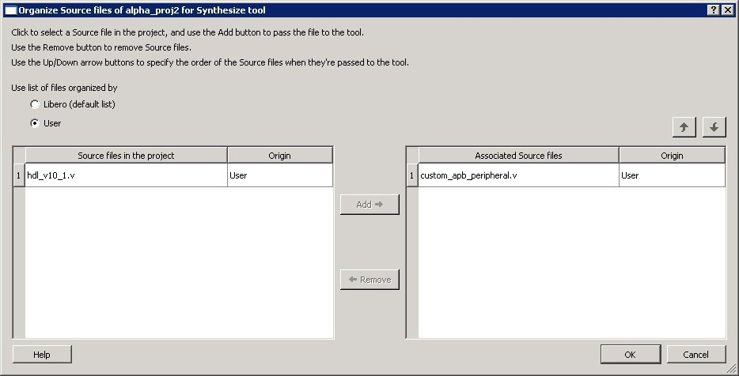

<br />

## SmartDesign Testbench

SmartDesign testbench is a GUI-based tool that enables you to design your testbench hierarchy.<br /> Use SmartDesign testbench to instantiate and connect stimulus cores or modules to drive your<br /> design.

You can create a SmartDesign testbench by right-clicking a SmartDesign component in the Design<br /> Hierarchy and choosing **Create Testbench &gt; SmartDesign**. SmartDesign testbench<br /> automatically instantiates the selected SmartDesign component into the Canvas. You can also<br /> double-click **Create SmartDesign Testbench**in the Design Flow window to add a new<br /> SmartDesign testbench to your project. New testbench files appear in the [Stimulus Hierarchy.](GUID-DD5BFD75-BB76-49D8-99EA-EC328F43A5FD.md#) SmartDesign Testbench automatically instantiates your<br /> SmartDesign component into the Canvas.

You can instantiate your own stimulus HDL or simulation models into the SmartDesign Testbench<br /> Canvas and connect them to your DUT \(design under test\). You can also instantiate Simulation<br /> Cores from the [Catalog](GUID-DD5BFD75-BB76-49D8-99EA-EC328F43A5FD.md#). Simulation cores are simulation models \(such as DDR memory<br /> simulation models\) or basic cores that are useful for stimulus generation \(such as Clock<br /> Generator, Pulse Generator, or Reset Generator\). Click the Simulation Mode check box in the<br /> Catalog to view available simulation cores. Refer to the [SmartDesign User Guide](http://coredocs.s3.amazonaws.com/Libero/2025_1/Tool/smartdesign_ug.pdf) for more information.

## Stimulus Hierarchy

To view the Stimulus Hierarchy, from the **View**menu choose **Windows &gt; Stimulus Hierarchy**.

The Stimulus Hierarchy tab displays a hierarchical representation of the stimulus and<br /> simulation files in the project. The software continuously analyzes and updates files<br /> and content. The tab in the following figure displays the structure of the modules and<br /> component stimulus files as they relate to each other.

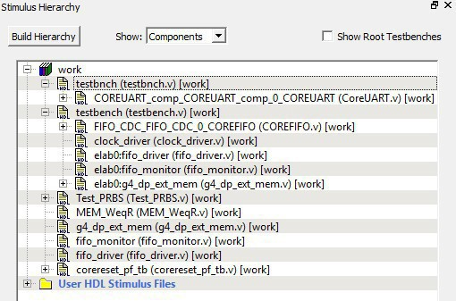

Expand the hierarchy to view stimulus and simulation files. Right-click an individual component and choose **Show Module**to view the module for only that component.

Select **Components**, instance or **Modules**from the **Show**drop-down list to change the display mode. The Components view displays the stimulus hierarchy; the modules view displays HDL modules and stimulus files.

The file name \(the file that defines the module or component\) appears in parentheses. Click **Show Root Testbenches**to view only the root-level testbenches in your design.

Right-click and choose **Properties**; the Properties dialog box displays the pathname, created date, and last modified date.

All integrated source editors are linked with the SoC software; if you modify a stimulus file the Stimulus Hierarchy automatically updates to reflect the change.

To open a stimulus file:

1.  Double-click a stimulus file to open it in the HDL text editor.
2.  Right-click and choose **Delete from Project**to delete the file from the project. Right-click and choose **Delete from Disk and Project**to remove the file from your disk.

The following table shows the icons in the hierarchy indicate the type of component and the<br /> state.

|Icon|Description|
|----|-----------|
||SmartDesign component|
||SmartDesign component with HDL netlist not generated|
||SmartDesign testbench|
||SmartDesign testbench with HDL netlist not generated|
||IP core was instantiated into SmartDesign but the HDL netlist has not been generated|
||HDL netlist|

## Timing Exceptions Overview

Use timing exceptions to overwrite the default behavior of the design path. Timing exceptions include:

-   Setting multicycle constraint to specify paths that \(by design\) will take more than one cycle.
-   Setting a false path constraint to identify paths that must not be included in the timing analysis or the optimization flow.

-   Setting a maximum/minimum delay constraint on specific paths to relax or to tighten the original clock constraint requirement.

## Admin Profile Tool Dialog Box

This allows a way to use same set of tools and same vault location if Libero SoC is started from the same installed location. An admin \(the person who generally takes care of Libero SoC installation\) creates an admin profile. This profile is common to all Libero SoC users from the same installed location. Individual users do not need to have to create the tool profile and vault location.

To create an admin profile, start `adminprofile.exe` from `<Libero installation directory>/Designer/bin` location in case of windows and from `<Libero installation directory>/bin64` location in case of Linux.

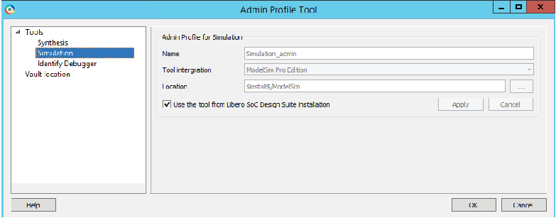

This admin profile will be common to all users who are using Libero SoC from the installed path, by providing the following values:

-   Synplify location
-   ModelSim ME Pro location
-   Vault location
-   Any other tool mentioned in admin profile utility

**Note:** It is not mandatory for the user to create admin profile. If the user skips the creation of admin profile, the tool will continue to work normally.

To create an admin profile, all the fields in the dialog box must be entered correctly. The vault location provided during admin profile creation will have precedence and will be used by all the other users.

**Vaults and tools location**

Vault location: Location of megavault consisting of all the cores for the current Libero SoC version must be mentioned.

Tools location: Correct tool executable location must be entered which is accessible by all of Libero SoC users.

Using admin profile, you can use Libero SoC-provided tools, which are a part of Libero SoC Design Suite, by selecting the **Use the tool from Libero SoC Design Suite installation**option. In this case, location of specific tools will be used from Libero SoC installation.

## Tool Profiles Dialog Box

The Tool Profiles dialog box enables you to add, edit, or delete your project tool profiles.

Each Libero SoC project can have a different profile, enabling you to integrate different tools with different projects.

The following table shows the supported tool versions in this release.

|Tool|Supported Version|
|----|-----------------|
|ModelSim® ME Pro|2024.2|
|SynplifyPro® ME|V202309M-2|
|Identify ME|V202309M-2|

**To set or change your tool profile:**

1.  From the **Project**menu, choose **Tool Profiles**. Select the type of tool you wish to add.

    -   **To add a tool**: Select the tool type and click the **Add**button. Fill out the tool profile and click **OK**.
    -   **To change a tool profile**: After selecting the tool, click the **Edit**button to select another tool, change the tool name, or change the tool location.
    -   **To remove a tool from the project**: After selecting a tool, click the **Remove**button.
    

2.  When you are done, click **OK**.

The tool profile with the padlock icon indicates that it is a pre-defined tool profile \(the default tool that comes with the Libero SoC Installation\).

To export the tool profile and save it for future use, click the **Export Tool Profiles** dialog box and save the tool profile file as a tool profile \*.ini file. The tool profile \*.ini file can be imported into a Libero SoC project \(**File &gt; Import &gt; Others**\) and select Tool Profiles \(\*.ini\) in the File Type pull-down list.

## User Preferences Dialog Box – Design Flow Preferences

This dialog box allows you to set your personal preferences for how Libero SoC manages<br /> the design flow across the projects you create.

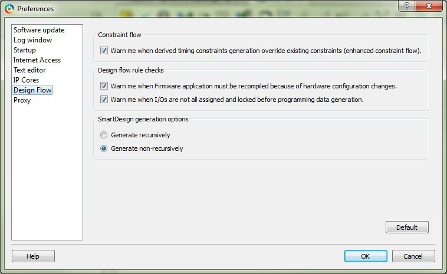

**Constraint Flow**

-   Warn me when derived timing constraints generation override existing constraints \(enhanced constraint flow\):

    Libero SoC can generate/derive timing constraints for known hardware<br /> blocks and IPs such as SerDes, CCC. Check this box to have Libero SoC pop up a<br /> warning message when the generated timing constraints for these blocks override<br /> the timing constraints you set for these blocks. This box is checked by<br /> default.


**Design Flow Rule Checks**

-   Warn me when Firmware applications must be recompiled because of hardware configuration changes.

    Check this box if<br /> you want Libero SoC to display a warning message. This box is checked by<br /> default.

-   Warn me when I/Os are not all assigned and locked before programming data generation.

    I/Os must always be<br /> assigned and locked before programming data generation. Check this box if you<br /> want Libero SoC to display a warning message. This box is checked by<br /> default.


**SmartDesign Generation Options**

-   Generate recursively

    In this mode,<br /> all sub-designs must be successfully generated before a parent can be generated.<br /> An attempt to generate a SmartDesign results in an automatic attempt to generate<br /> all sub-designs.

-   Generate non-recursively

    In this<br /> mode, the generation of only explicitly selected SmartDesigns is attempted. The<br /> generation of a design can be marked as successful even if a subdesign is<br /> ungenerated \(either never attempted or unsuccessful\).


<br />

**Note:** These preferences are stored on a per-user basis across multiple projects; they are not project-specific.

<br />

## IP Report

Libero tool generates a report listing all the IPs used in the design project.

The report consists of the following:

-   Project Information
-   List of components in the project with the following information:
    -   Component name
    -   Component State
    -   IP Core \(Vendor, Library, Name, Version\) used to create the component
    -   TCL Parameters of the core used to create the component
-   Information of core instances used in the SmartDesign.
    -   Component Name – In the form of "smartdesign\_name&gt;\_&lt;instance\_name&gt;"
    -   Component State – State of the instance in the SmartDesign
    -   Vendor, Library, Name, and Version of the core used to create the instance
    -   TCL Parameters of the core used to create the instance
-   Single Page SystemBuilder components
-   Multi Page SystemBuilder components without parameter list of latest core versions available for the cores used in the project. This list is present at the end of an open project.

To export the **IP CORE Usage Report**, go to **File** &gt; **Export** &gt; **IP Core Usage Report**. When clicked, a file dialog box appears to navigate to the location and<br /> file format to save the report. The file can be generated in either “JSON” or “txt”<br /> format.

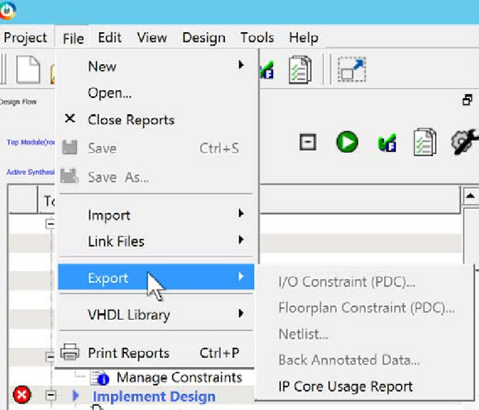

Once the report is generated successfully, the location to where the report is exported is shown in log window.


## Force Update Design Flow

A global option to force update the design flow to Pass state is added to Libero SoC v12.5. The<br /> tool’s state is force updated to PASS state only for Synthesize/Compile and Place and<br /> Route tools. The remaining tools remain in the same state they were in before the force<br /> update action was performed.

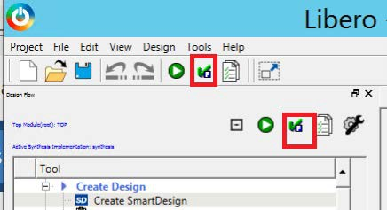

To differentiate between PASS state and FORCE UPDATE PASS state, the following icon and tooltip<br /> for the FORCE UPDATE PASS state \(force update action\) is added.

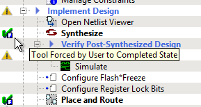

If you click the **Force update action** button, the following warning message appears. If you click **OK** in the message, the action proceeds. Otherwise, the action is canceled.

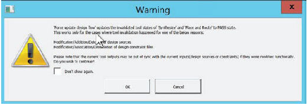

The message log window shows when the Force Update Action is performed.


After the tool states are force updated to PASS state from Out of Date Design state, the following message appears in the log window.

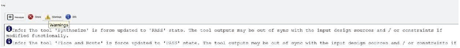

On running programming tool – Generate FPGA Array Data, a warning message pops up if Synthesize, Place and Route, or both are in the Force Update Pass state.

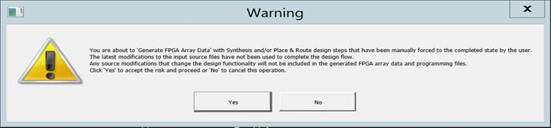

The log window shows the following message.


## Generic/Parameter Report

Libero tool generates hierarchical reports that show parameter/generic values used in<br /> instantiation of the modules. Report is generated for the active top module. Report will<br /> be generated for only that active top module which is not instantiated in any other<br /> modules. The report is generated in xml format.

In the following example, report will not be generated for the active root \(top\) module<br /> **COREABC\_C0**because it is instantiated in sd1. The file sd1<br /> needs to be set as a root to generate the report.

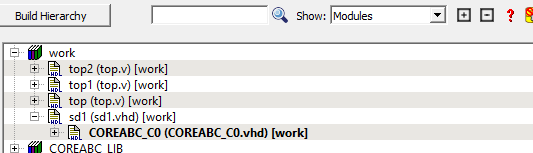

The report can be generated by right clicking on the active top module and selecting<br /> **Export Parameter Report**option in Design Hierarchy window.<br /> Once the report is generated successfully, the location to where the report is exported<br /> is shown in log window.


Error message is flagged in cases where the user tries to generate report for a module<br /> that is instantiated in another module.

Error: Parameter/Generic report cannot be exported for a module that is instantiated in<br /> any other module. It can only be exported for top level modules. Set a top level module<br /> as the root or specify a top level module in the Tcl command ‘export\_parameter\_report’<br /> to be able to export the report.

## Export Back Annotated Files


This feature can be accessed by going to **File &gt; Export &gt; Back Annotated Data**.

The following table describes the elements in the Export Back Annotated Files dialog box.

|Element|Description|
|-------|-----------|
|Name|Name of the folder where the back annotated files will be exported.|
|Location|Location of the folder where the back annotated files will be exported.|
|Mode|Set the mode to Simulation or Timing Analysis.|

### Simulation Mode

This is the default mode. The tool generates three .sdf files and a netlist. The three .sdf files generated are \{file\_name\}\_fast\_hv\_lt\_ba.sdf \{file\_name\}\_slow\_lv\_ht\_ba.sdf and \{file\_name\}\_slow\_lv\_lt\_ba.sdf. The netlist file generated is \{filename\)\_ba.v.

### Timing Analysis Mode

The tool generates three .sdf files, a netlist and a .tcl file. The .tcl file is a template on how to run a generated netlist and .sdf files in a PrimeTime shell. The three .sdf files generated are \{file\_name\}\_fast\_hv\_lt\_sta\_ba.sdf \{file\_name\}\_slow\_lv\_ht\_sta\_ba.sdf and \{file\_name\}\_slow\_lv\_lt\_sta\_ba.sdf. The netlist file generated is \{filename\)\_sta\_ba.v.

### Limitations

The limitations of Export Back Annotated Files feature are:

1.  Encrypted Verilog

    This is a<br /> limitation in PrimeTime and because of that, Back Annotated tool in<br /> Timing Analysis mode will not support encrypted netlist. User should not<br /> use or include encrypted blocks in Timing Analysis mode as PrimeTime<br /> does not support encrypted netlists.

2.  SDC File Option

    User needs<br /> to populate user.sdc \(needed by PrimeTime\) using sdc file found under<br /> **constraint** directory.

3.  Differences in clock reconvergence pessimism removal \(CRPR\)

    When arrival and required common<br /> clock paths use different edges, SmartTime and PrimeTime have different<br /> values.


## Absolute and Relative Path Support for MSS

This feature supports absolute and relative path in batch mode for PolarFireSOC MSS Configurator.

The format of the batch command is as follows:

```
pfsoc_mss.exe \
-CONFIGURATION_FILE:<path_to_file>/<file_name>.cfg \
-OUTPUT_DIR:<path_to_file>/MSS \
-EXPORT_HDL:false \
-LOGFILE:<path_to_file>/logfile.txt

```

|Parameter|Type|Description|
|---------|----|-----------|
|CONFIGURATION\_FILE|string|Specifies the configuration file. The path to configuration \(`.cfg`\) file can<br /> be an absolute path or a relative path.|
|OUTPUT\_DIR|string|Specifies the output directory location. The output directory can be an absolute path or a<br /> relative path.|
|EXPORT\_HDL|string|Set to True or 1 to export the HDL files. Default is false or 0.|
|LOGFILE|string|Specifies the logfile.The path to log file can be an absolute path or relative path.|

### Absolute Path

```
D:/dir_1/dir_2/dir_3/pfsoc_mss.exe \
-CONFIGURATION_FILE:./soft/sqadir/user/mss_configuration.cfg \
-OUTPUT_DIR:d:./soft/sqadir/user/MSS \
-EXPORT_HDL:false \
-LOGFILE:/soft/sqadir/user//logfile.txt

```

### Relative Path

```
D:/dir_1/dir_2/dir_3/pfsoc_mss.exe \
-CONFIGURATION_FILE:./../mss_configuration.cfg \
-OUTPUT_DIR:d:/MSS \
-EXPORT_HDL:false \
-LOGFILE:d:/logfile.txt

```

In this example, the `.cfg` file is expected to be present in the<br /> following absolute location:

```
<current_working_directory>/../../mss_configuration.cfg
```

And the design files are generated in the following output directory location:

```
<current_working_directory>/MSS
```

