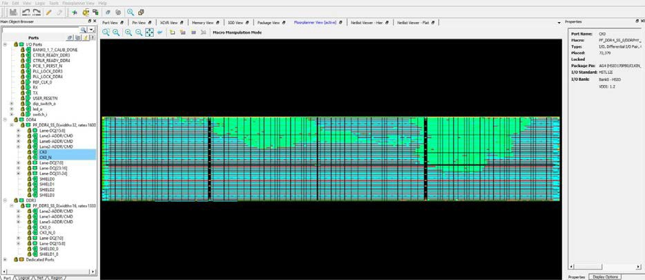

# Floorplanner View

The Floorplanner View displays all design elements in one window. The selections you make in the views are reflected in the window. The color scheme used in the canvas is dependent on the layers and colors you have selected in the Display Options window.

The following figure shows the Floorplanner View.

-   **[Operating Modes](GUID-BA522578-5894-4CAA-9E78-66546C3F5B81.md)**  

-   **[Netlist Views](GUID-C610932F-80DB-4292-AFCF-47C4D7E7D1AD.md)**  

