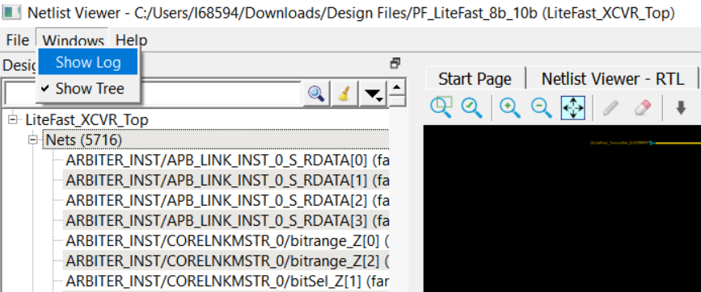
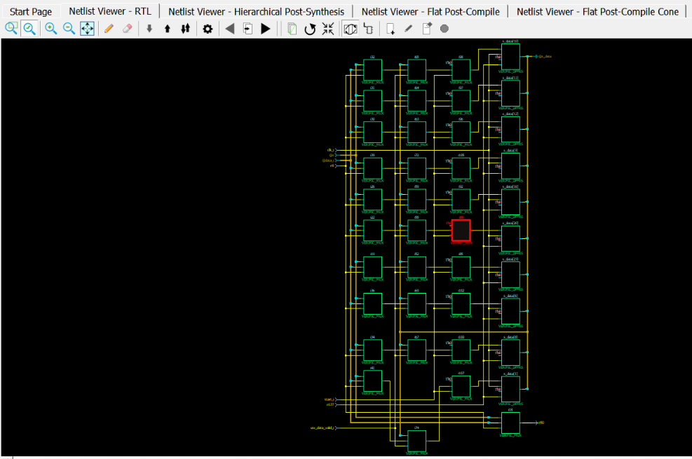

# Canvas Window

The Canvas Window displays the:

-   RTL view
-   Hierarchical Post-Synthesis view
-   Flat Post-Compile view
-   Flat Post-Compile Cone view
-   Cones view
-   Opened HDL files \(not available in the Flat Post-Compile view\)
-   Start Page—when no netlist views are opened

When a view is opened, a view tab is added across the top of the Canvas  window for ease of switching between views.

**Important:** To get a larger display area for the Canvas view, hide the Design Tree Window \(**Netlist Viewer** &gt; **Windows** &gt; **Uncheck Show Tree**\) and hide the **Log** window \(**Netlist Viewer** &gt; **Windows** &gt; **Uncheck** &gt; **Show Log**\) Hiding the **Log** window and the **Design Tree** window leaves more display area for the **Canvas** window. Alternatively, press **CTRL+W** to maximize the work area.

Icons in the Canvas window allow you to:

-   Traverse vertically up \(Pop\) or down \(Push\) the design hierarchy
-   Navigate horizontally across different pages of the design view
-   Zoom in/out of the design view
-   Trace critical nets to the driver/load
-   Create logical cones for debugging
-   Control the color display the design objects

**Parent topic:**[Netlist Viewer Windows](GUID-29F3E93D-3ECA-4F8B-9478-64D63D5F1873.md)

