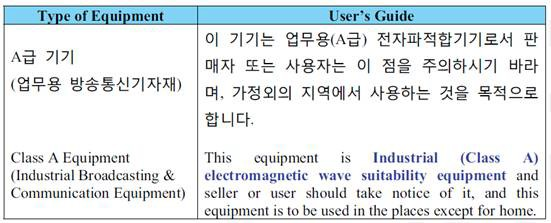

# Appendix B: Regulatory and Compliance Information

EU Declaration of Conformity:

This product complies with Directive 2011/65/EU of the European Parliament and of the Council of 8 June 2011 on the restriction of the use of certain hazardous substances in electrical and electronic equipment.

To view the Declaration of Conformity in English, see [EU Declaration of Conformity](https://ww1.microchip.com/downloads/aemdocuments/documents/fpga/ProductDocuments/SupportingCollateral/eu-declaration-of-conformity---flashpro5.pdf).

For Non-English, see [EU Declaration of Conformity \(EU Languages\)](https://ww1.microchip.com/downloads/aemdocuments/documents/fpga/ProductDocuments/SupportingCollateral/flashpro4_doclanguages-1.pdf)

Markings:

 This product complies with 2004/108/EC, Electromagnetic Compatibility \(EMC\) Directive

For Korea:

