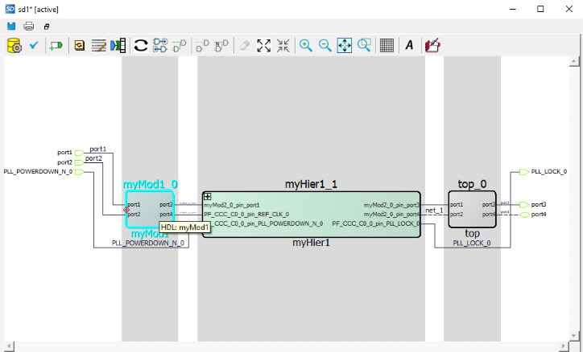

# Understanding the SmartDesign Canvas

The SmartDesign canvas places all components in columns, with the nets vertically routed in the space between columns. Input ports are placed in the left-most column. Output ports and inout ports are placed in the right-most column. However, you can choose to move the ports or components to any location of your choice in the SmartDesign canvas.

When components are instantiated in the SmartDesign tool, they are either placed in an existing column or a new column is created for them. When you move the components vertically, you can see the column boundaries. You can also move the components horizontally to a new or an existing column.

The following figure shows the SmartDesign tool's canvas.

**Tip:** Click on specific area within the SmartDesign canvas image to know more about it.

   

## Click and Drag Operations in the Canvas

The following table lists the mouse click and drag operations supported in the SmartDesign  canvas.

|Operation|Action|Description|
|---------|------|-----------|
|**Zoom in**|Click and drag the mouse pointer towards the top-left in the  canvas.|The distance your cursor is dragged determines the magnitude of  the zoom-in and is indicated by a positive integer in red.|
|**Zoom out**|Click and drag the mouse point towards the top-right in the  canvas|The distance your cursor is dragged determines the magnitude of  the zoom-out and is indicated by a negative integer in red.|
|**Zoom to fit**|Click and drag the mouse pointer towards bottom-left in the  canvas.|Changes the display to tightly fit the design in the  canvas.|
|**Select**|Click and drag toward bottom-right in the canvas to select  multiple instances.|Ensure that instances, pins, and ports you want select are fully  contained inside the selection rectangle.|

To move the viewpoint/perspective of specific component\(s\) of your design to a specific  area in the canvas, hold the **Ctrl** key down, drag and drop the  components of the design to the required area in the canvas, and release the  **Ctrl** key. Alternatively, you can perform this action by  holding the mouse scroll wheel down and drag and drop the design to the required area in  the canvas.

## Additional Canvas Operations

The following table lists additional SmartDesign toolbar canvas operations. Hover your  cursor over the icon to view the operation name in a tool tip. You can perform any of  these operations by right-clicking in the empty space inside the canvas.

|Operation|Action|Description|
|---------|------|-----------|
|**Reset Layout**|Resets the layout view using the built-in optimization  algorithms|You can retain the presentation model \(instance, port coordinates,  and highlight colors\) while saving your SmartDesign.However, if you  choose to clear the current presentation model, click on  Reset Layout. This action removes all the  presentation information \(position, size, highlights, and modified  pin orders\) and recreates canvas layout using the built-in  optimization algorithms.|
|**Auto-arrange Layout**|Auto arranges the components in the layout using the built-in  optimization algorithms|  Only the location \(X-Y coordinates\) of the instances and ports are  changed. All presentation information remains intact. |
|**Compress Layout**|Compresses display of the complete design using the built-in  optimization algorithms|  Click to push the instances and ports towards each other to remove  the extra white space between them on the screen.  The relative positions of the instances on the screen are preserved.  The result is a more compact display of the design. |
|**Unhighlight All**|Removes all highlights in the design|  Highlighting of all the design objects \(nets, pins, ports, and  instances\) on the canvas are removed.  This action is active only if design objects are already  highlighted. |
|**Zoom In**|Zooms in to the canvas|  Zoom in on the canvas. |
|**Zoom Out**|Zooms out of the canvas|  Zoom out on the canvas. |
|**Zoom to Fit**|Optimizes the design to the fit into the canvas|  Adjust the zoom and viewpoint, so that everything on the canvas fits  within the visible view port with no extra empty space around the  design. |
|**Zoom to Selection**|Zooms in to the selected area in the canvas|  Click this action and drag the mouse to draw a rectangle which is  when released, causes a zoom in, so that the visible view port area  is approximately the size of the drawn rectangle. |
|**Show Grid**|Makes the gridlines visible|  Click to show a background grid behind the items on the canvas. If  the grid does not appear when the button is clicked, zoom in until  the grid shows. The grid pattern might not show if the canvas is  zoomed too far out. |
|**Add Note**|Allows you to add notes in your design|  Click to enter the Add Note mode.  During the next mouse click, the canvas opens a dialog box for  entering the text and font size of the text \(anchored at the mouse  click location\). |
|**Save to PDF**|Saves the design to a `.PDF` file.|This action opens a dialog box that allows you to save a picture of  all or part of the design to a `.PDF` document.|

