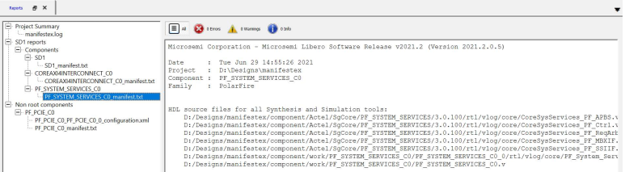
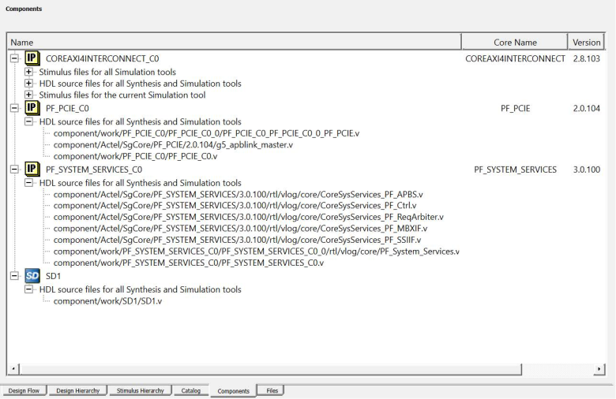

# Component Manifests

When you generate your components, a set of files is generated for each component. The  Component Manifest report details the set of files generated and used in each subsequent  step \(Synthesis, Simulation, Firmware Generation, and so on\). This report gives you the  locations of all the generated files needed to proceed with the Custom Flow. You can  access the component manifest in the **Reports** area: Click  `Design > Reports` to open the **Reports**  tab. In the **Reports** tab, you see a set of  `manifest.txt` files \([Overview](GUID-1BA4CB4D-FE1F-4BF9-9865-B061E5938FCA.md)\), one for each component you  generated.

**Tip:** You must set a component or module as '"root"' to see the component manifest file contents in the **Reports** tab.

Alternatively, you can access the individual manifest report files for each core  component generated or SmartDesign component from  `<project>/component/work/<component name>/<instance name>/<component name>_manifest.txt` or  `<project>/component/work/<SmartDesign name>/<SmartDesign name>_manifest.txt`. You can also access the manifest file contents of  each component generated from the new **Components** tab in Libero,  where the file locations are mentioned with respect to the project directory.

Focus on the following Component Manifest reports:

-   If you instantiated cores into a SmartDesign, read the file `<smartdesign_name>_manifest.txt`.
-   If you created components for cores, read the `<core_component_name>_manifest.txt`.

You must use all [Component Manifests](GUID-E82E32F4-E622-477E-A4C9-37BB5DE032DC.md#)  reports that apply to your design. For example, if your project has a SmartDesign with  one or more core components instantiated in it and you intend to use them all in your  final design, then you must select files listed in the [Component Manifests](GUID-E82E32F4-E622-477E-A4C9-37BB5DE032DC.md#) reports of all those components  for use in your design flow.

**Parent topic:**[Component Configuration](GUID-FE19AAE3-578B-4B77-857E-C2796C8240F2.md)

