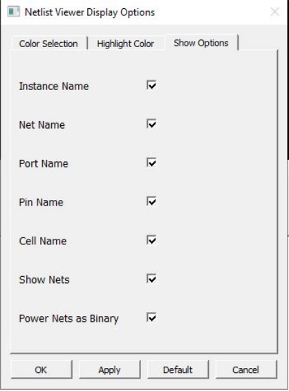

# Show Options Tab

The **Show Options** tab allows you to display or hide design object  names:

-   Instance Name
-   Net Name
-   Port Name
-   Pin Name
-   Cell Name
-   Show Nets—allows you to display or hide nets
-   Power Nets as Binary—displays power net labels in binary instead of hex \(the default\)

Select one or more items you want to display and clear the items you want to hide. Hiding  object names and/or nets makes the display less cluttered.

**Parent topic:**[Customizing Display Preferences](GUID-A95E02AB-4644-40D0-8D87-246FA078580B.md)

