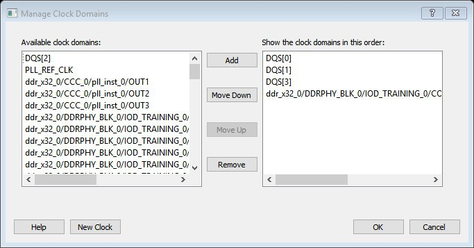

# Manage Clock Domains Dialog Box

Use the Manage Clock Domains dialog box to specify the clock pins you want to see in the Expanded  Path view.

To open the Manage Clock Domain dialog box from the SmartTime Max/Min Delay Analysis view, click  the icon.

-   **[Available Clock Domains](GUID-E064A100-3385-46CB-9A55-80028B480E1C.md)**  

-   **[Show the Clock Domains in This Order](GUID-7561BD0F-C5B3-4EFB-9541-1DB2E3535841.md)**  

-   **[New Clock](GUID-87F27A03-1E3D-4C03-BA31-593A8AA11C8B.md)**  

**Parent topic:**[SmartTime Dialog Boxes](GUID-F96D2B4E-7DDD-4507-8621-C49A84F55C81.md)

