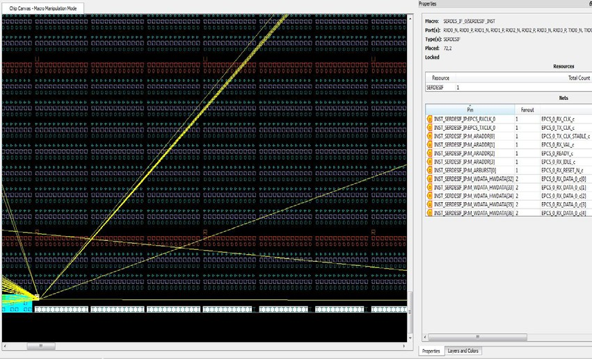

# A - Limitations

This appendix lists Chip Planner limitations.

## I/O Register Support

Every I/O has several embedded registers that you can use for faster clock-to-out timing, and to meet external hold and setup timing requirements. This feature uses input, output, or enable registers available in the I/O block.

However, a register \(if combined with an I/O register\) is not shown in the Logical view as a separate element and is shown as part of a port.

## Internal Elements of External IP Macros Displayed in a Single Connection

Some external IP, such as SerDes and FDDR, spans across multiple clusters  and has its own dedicated ports. However, the net connected to these macro I/Os are shown  to be connected from a single location. The following figure is an example of a SerDes  macro that shows all the associated nets connected to a single macro.

### Cross-Probing into SmartTime Not Supported

Cross-probing from the Chip View /Netlist View into SmartTime is not supported.  Cross-probing is supported for SmartTime to Chip View and  Netlist View, but not from Chip View or Netlist View to  SmartTime.

