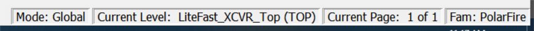

# Status Bar

The status bar at the bottom-right corner of the Netlist Viewer displays  the following:

-   Mode—displays Global or Local mode. Global mode means the Netlist Viewer can cross hierarchical boundaries when following nets to drivers or loads. Local means the Netlist Viewer stays in the current level of design hierarchy.
-   Current Level—displays the current level of design hierarchy, either TOP\_LEVEL instance name or instance name of the component
-   Current Page—displays the current page of the Netlist Viewer \(Page x of &lt;total&gt;\) when traversing across different pages of the Netlist Viewer
-   Fam—displays the technology family

**Parent topic:**[Log Window](GUID-9ACCAE24-EEF9-4F16-813A-1666DAAD20F2.md)

