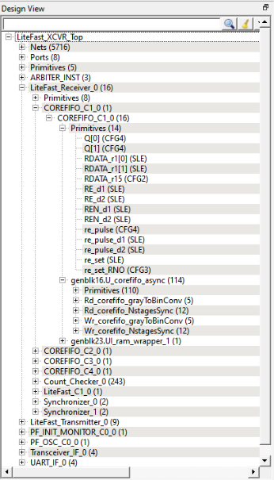

# Design Tree Window

The Design Tree window displays the design hierarchy from the top level.  By default, when the Netlist Viewer opens, it displays the Design Tree window.

**Important:** The Design Tree window is displayed by default when the Netlist Viewer opens. Hiding the Design Tree view will leave more display area for the Canvas view. To get a bigger display area for the canvas view, hide the Design Tree window \(**Netlist Viewer** &gt; **Windows** and uncheck **Show Tree**\)

The Design Tree window displays:

-   Nets \(&lt;integer&gt;\)—number in brackets is the total number of nets at the top level
-   Ports \(&lt;integer&gt;\)—number in brackets is the total number of ports at the top level
-   Design components under the top level—each component can be collapsed or expanded to expose
    -   Nets—total number of nets at the component level
    -   Ports—total number of ports at the component level
    -   Subcomponents inside the component
-   Fanout Values \(Nets\)—when two numbers are displayed in the bracket, the first number is the fanout of the net at the local level \(of hierarchy\) and the second number is the fanout of the net at the global level. As an example, net\_xyz \(fanout: 1,3\) means the net goes down the levels of hierarchy to three different pins \(global fanout 3\) and is not connected to any other pins at the current level \(local fanout 1\).
-   Primitives—primitives refer to macros and low-level design objects and can appear in the top level or component level.

The design tree is different with different netlist views. For the Flat Post-Compile view, the design tree displays a much larger number of nets than the RTL view or  Hierarchical Post-Synthesis view, because the netlist is flattened in the Post-Compile view and all nets are counted. The nets in the Flat Post-Compile view, unlike the RTL view or the  Hierarchical Post-Synthesis view, shows only one value for fanout \(global fanout\) because it is a flattened view \(no hierarchy\).

For nets that are part of a NetBundle, the NetBundle name is followed by a number in parentheses that indicates the total number of nets in the NetBundle.

-   **[Filter](GUID-5A23C0ED-41A2-493E-8F1F-55DBCF59BAC6.md)**  

-   **[Interoperability Between Windows and Views](GUID-666E6536-C485-4F20-B0BD-0FA899354C5B.md)**  

**Parent topic:**[Netlist Viewer Windows](GUID-29F3E93D-3ECA-4F8B-9478-64D63D5F1873.md)

