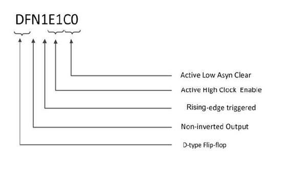

# Introduction

This macro library guide supports the  SmartFusion® 2 FPGA and IGLOO® 2 FPGA families. See the Microchip  website for macro guides for other families.

This guide follows a naming convention for sequential  macros that is unambiguous and extensible, making it possible to  understand the function of the macros by their name alone.

The first two mandatory characters of the macro name  indicates the basic macro function:

-   DF—D-type flip-flop
-   DL—D-type latch

The next mandatory character indicates the output  polarity:

-   I—Output inverted \(QN with bubble\)
-   N—Output non-inverted \(Q without bubble\)

The next mandatory number indicates the polarity of the  clock or gate:

-   1—Rising edge-triggered flip-flop or transparent high latch \(non-bubbled\)
-   0—Falling edge-triggered flip-flop or transparent low latch \(bubbled\)

The next two optional characters indicate the polarity  of the Enable pin, if present:

-   E0—Active-Low enable \(bubbled\)
-   E1—Active-high enable \(non-bubbled\)

The next two optional characters indicate the polarity  of the asynchronous Preset pin, if present:

-   P0—Active-Low asynchronous preset \(bubbled\)
-   P1—Active-High asynchronous preset \(non-bubbled\)

The next two optional characters indicate the polarity  of the asynchronous Clear pin, if present:

-   C0—Active-Low asynchronous clear \(bubbled\)
-   C1—Active-High asynchronous clear \(non-bubbled\)

All sequential and combinatorial macros \(except MX4 and  XOR8\) use one logic element in the PolarFire® FPGA family.

For example, the macro DFN1E1C0 indicates a D-type  flip-flop \(DF\) with a non-inverted \(N\) Q output,  positive-edge-triggered \(1\), with Active-High Clock Enable \(E1\)  and Active-Low Asychronous Clear \(C0\). See the following  table.

The truth table states in this User Guide are defined as  follows:

|State|Meaning|
|-----|-------|
|0|Logic  0|
|1|Logic  1|
|X|Do not Care  \(for Inputs\), Unknown \(for Outputs\)|
|Z|High  Impedance|

User Parameter/Generics

**WARNING\_MSGS\_ON**

This feature enables you to disable the warning messages  display. Default is ON \('True' in VHDL and '1' in Verilog\).

