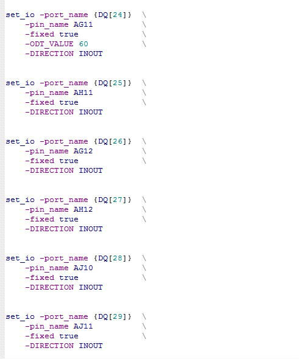

# IO\_PDC File

When the I/O assignment is committed and saved in the I/O Editor, the  assignment is saved in a PDC file in the &lt;project\_folder/constraints/io/user.pdc&gt; file.  The PDC file contains set\_io commands on each of the DDR Memory Interface I/O.

The following figure shows PDC file generation after Memory interface I/O assignment in the I/O Editor.

**Parent topic:**[Memory Interface View](GUID-04C2F3E6-C9E6-4210-AF6D-16C492A0BAAA.md)

