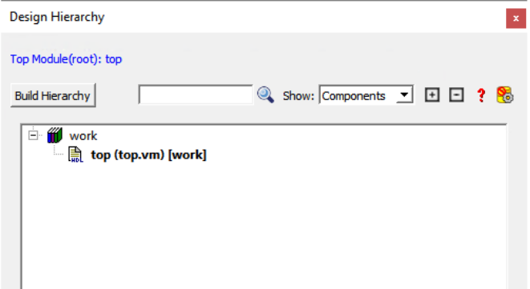
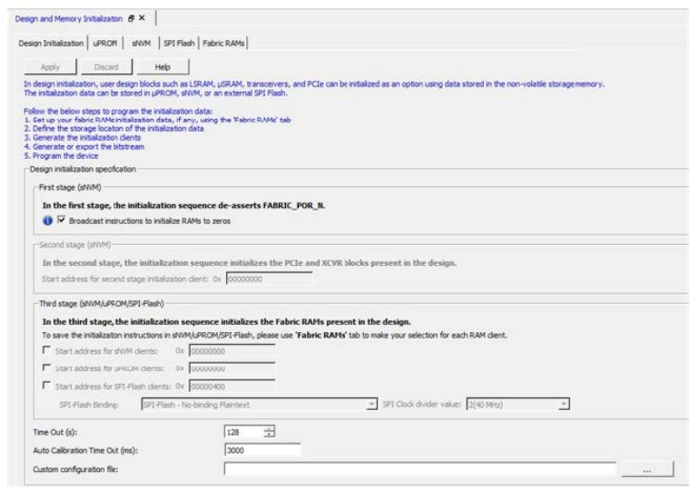

# Implementing Your Design

After completing the Synthesis and Post-Synthesis simulation in your environment, you  must use Libero again to physically implement your design, run timing and power  analysis, and generate your programming file.

1.  Create a new Libero project for the physical implementation and layout of the design. Ensure to target the same device as in the reference project you created in [Component Configuration](GUID-FE19AAE3-578B-4B77-857E-C2796C8240F2.md).
2.  After project creation, remove Synthesis from the tool chain in the **Design Flow** window \(`Project > Project Settings > Design Flow > Uncheck Enable Synthesis`\).
3.  Import your post-synthesis `*.vm` file into this project, \(`File > Import > Synthesized Verilog Netlist (VM)`\).

    **Tip:** It is recommended that you create a link to this file, so that if you re-synthesize your design, Libero always uses the latest post-synthesis netlist.

    1.  In the **Design Hierarchy** window, note the name of the root module.

        

4.  Import the constraints into the Libero project. Use the **Constraint Manager** to import `*.pdc/*.sdc/*.ndc` constraints.
    1.  Import I/O `*.pdc` constraint files \(`Constraints Manager > I/O Attributes > Import`\).
    2.  Import Floorplanning `*.pdc` constraint files \(`Constraints Manager > Floor Planner > Import).`
    3.  Import `*.sdc` timing constraint files \(`Constraints Manager > Timing > Import`\). If your design has any of the cores listed in [Overview](GUID-1BA4CB4D-FE1F-4BF9-9865-B061E5938FCA.md), ensure to import the SDC file generated through derive constraint tool.
    4.  Import `*.ndc` constraint files \(`Constraints Manager > Netlist Attributes > Import`\).
5.  Associate Constraints Files to design tools.

    1.  Open **Constraint Manager** \(`Manage Constraints > Open Manage Constraints View`\). Check the **Place-and-Route and Timing Verification** check box next to the constraint file to establish constraint file and tool association. Associate the `*.pdc` constraint to Place-and-Route and the `*.sdc` to both Place-and-Route and Timing Verification. Associate the `*.ndc` file to Compile Netlist.
    **Tip:** If Place and Route fails with this `*.sdc` constraint file, then import this same `*.sdc` file to synthesis and re-run synthesis.

6.  Click **Compile Netlist** and then Place and Route to complete the layout step.
7.  The Configure Design Initialization Data and Memories tool allows you to initialize design blocks, such as LSRAM, µSRAM, XCVR \(transceivers\), and PCIe using data stored in nonvolatile µPROM, sNVM, or external SPI Flash storage memory. The tool has the following tabs for defining the specification of the design initialization sequence, the specification of the initialization clients, user data clients.

    -   Design Initialization tab
    -   µPROM tab
    -   sNVM tab
    -   SPI Flash tab
    -   Fabric RAMs tab
    Use the tabs in the tool to configure the design initialization data and  memories.

    

    After completing the configuration, perform the following steps to  program the initialization data:

    -   Generate initialization clients
    -   Generate or export the bitstream
    -   Program the device
    For detailed information on how to use this tool, see [Libero SoC Design Flow User Guide](http://coredocs.s3.amazonaws.com/Libero/2025_1/Tool/libero_ecf_ug.pdf). For more information on the Tcl commands used to configure various  tabs in the tool and specify memory configuration files  \(`*.cfg`\), see [Tcl Commands Reference Guide](http://coredocs.s3.amazonaws.com/Libero/2025_1/Tool/libero_soc_tcl_cmd_ref_ug.pdf).

8.  Generate a Programming File from this project and use it to program your FPGA.

