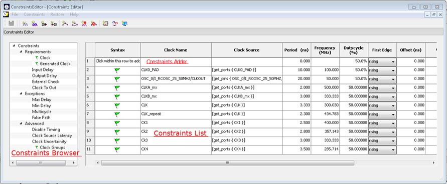
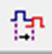
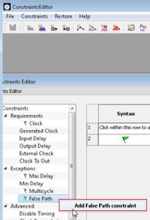
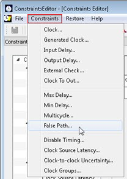
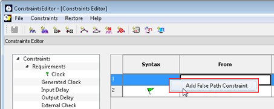

# About the Timing Constraints Editor

This chapter provides an overview of the Timing Constraints Editor.

## Constraints Editor Window

The **Constraints Editor** window is organized into the following  areas:

-   Constraint Browser
-   Constraint List
-   Constraint Adder

### Constraints Browser

The **Constraint Browser** categorizes constraints based on the following  types of  constraints:

-   Requirements are constraints to meet the design’s timing requirements and specifications. Examples are clock constraints and generated clock constraints.
-   Exceptions are constraints on certain timing paths for special considerations. Examples are false path constraints and multicycle path constraints.
-   Advanced are special timing constraints such as clock latency and clock groups.

### Constraints List

The **Constraints List** is a spreadsheet of constraints with detailed values  and parameters of the constraint displayed in individual cells. You can click the  individual spreadsheet cells to change the values of the constraint parameters.

### Constraints Adder

Constraints Adder is the first row of the constraint list spreadsheet. There are two ways to add  a constraint from this row.

-   To add a constraint of the same type to the **Constraint List**, right-click a row and select **Add Constraint**. This method displays the specific add constraint dialog.
-   Click in a cell, and then double-click and start typing. This method is for the experienced users who know the design well and do not need to rely on the dialog box for guidance.

You can perform the following tasks in the Constraints View:

-   From the **Constraint Browser**, select a constraint type, and then create or edit the constraint.
-   Add a new constraint and check the syntax.
-   Right-click a constraint in the **Constraints List** to edit or delete.
-   Use the first row to create a constraint, and then add it to the **Constraints List**.

### Constraint Editor Icons

You can click the icons across the top of the Constraint Editor to add constraints. Tool tips are  available to identify the constraints. The following table lists the the icons.

|Icon|Name \(Tool tip\)|
|----|-----------------|
||Add Clock Constraint|
||Add Generated Clock Constraint|
||Add Input Delay Constraint|
||Add Output Delay Constraint|
||Add Maximum Delay Constraint|
||Add Minimum Delay Constraint|
||Add Multicycle Path Constraint|
||Add False Path Constraint|
||Add Disable Timing Constraint|
||Add Clock Source Latency|
||Add Clock to Clock Uncertainty|

## Adding Constraints

The Constraints Editor provides four ways to add constraints using the **Add Constraints** dialog box.

1.  Option 1: Click the **Add Constraint**  icon.
2.  Option 2:

    In the **Constraints Browser**, click the type  of constraints you want to add.

    

3.  Option 3:

    From the  **Constraints** menu, click a constraint.

     

    

     

4.  Option 4:

    In the **Constraints Browser**, click the type  of constraints you want to add. Right-click the first row and in the context  menu that appears, click the constraint.

     

    

     

