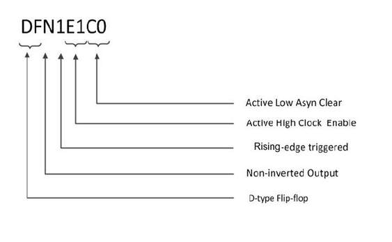

# Introduction

This macro library guide supports the PolarFire® FPGA family.  See the Microchip website for macro guides for other families.

This guide follows a naming convention for sequential macros that is  unambiguous and extensible, making it possible to understand the function of the macros  by their name alone.

The first two mandatory characters of the macro name will indicate the  basic macro function:

-   DF—D-type flip-flop
-   DL—D-type latch

The next mandatory character indicates the output polarity:

-   I—output inverted \(QN with bubble\)
-   N—output non-inverted \(Q without bubble\)

The next mandatory number indicates the polarity of the clock or  gate:

-   1—rising edge-triggered flip-flop or transparent high latch \(non-bubbled\)
-   0—falling edge-triggered flip-flop or transparent low latch \(bubbled\)

The next two optional characters indicate the polarity of the Enable  pin, if present:

-   E0—active-low enable \(bubbled\)
-   E1—active-high enable \(non-bubbled\)

The next two optional characters indicate the polarity of the  asynchronous Preset pin, if present:

-   P0—active-low asynchronous preset \(bubbled\)
-   P1—active-high asynchronous preset \(non-bubbled\)

The next two optional characters indicate the polarity of the  asynchronous Clear pin, if present:

-   C0—active-low asynchronous clear \(bubbled\)
-   C1—active-high asynchronous clear \(non-bubbled\)

All sequential and combinatorial macros \(except MX4 and XOR8\) use one  logic element in the PolarFire FPGA family.

As an example, the macro DFN1E1C0 indicates a D-type flip-flop \(DF\) with  a non-inverted \(N\) Q output, positive-edge-triggered \(1\), with Active-High Clock Enable  \(E1\) and Active-Low Asychronous Clear \(C0\). See the following table.

The truth table states in this User Guide are defined as follows:

|State|Meaning|
|-----|-------|
|0|Logic “0”|
|1|Logic “1”|
|X|Do not Care \(for Inputs\), Unknown \(for  Outputs\)|
|Z|High Impedance|

User Parameter/Generics

**WARNING\_MSGS\_ON**

This feature enables you to disable the warning messages display.  Default is ON \('True' in VHDL and '1' in Verilog\).

