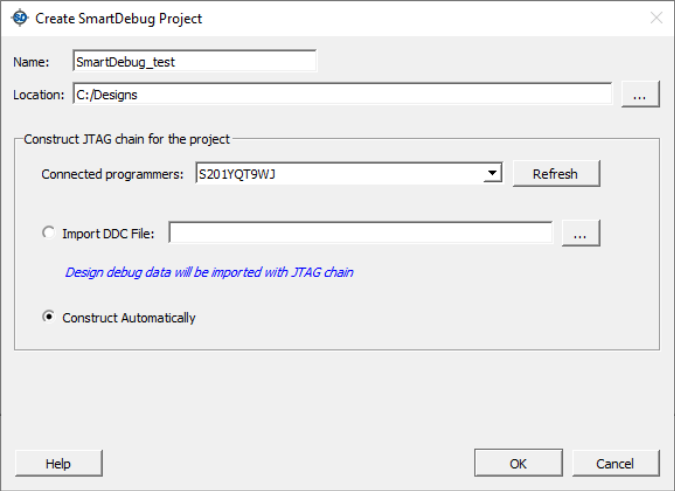

# Getting Started with SmartDebug

SmartDebug allows you to interrogate and view embedded silicon features and device status. The following procedure describes the most common steps for using SmartDebug.

**Note:** To use SmartDebug, connect a FlashPro programmer from a PC to the target device.

1.  Create your design.
2.  Expand **Debug Design** and double click **SmartDebug Design**in the Design Flow window. SmartDebug opens for your target device.
3.  Click **View Device Status**to view the device status report and check for issues.

## Use Models

SmartDebug can be run in the following modes:

-   [Integrated mode](GUID-FE25F1F5-48D3-42D5-AAB9-226AFA442DA7.md#)
-   [Standalone mode](GUID-FE25F1F5-48D3-42D5-AAB9-226AFA442DA7.md#)
-   [Demo mode](GUID-FE25F1F5-48D3-42D5-AAB9-226AFA442DA7.md#)

### Integrated Mode

Running SmartDebug in Integrated mode allows you to access all design and programming hardware information. No additional setup is required. In addition, the Probe Insertion feature is available in Debug FPGA Array.

To run SmartDebug in Integrated mode, expand **Debug Design** in the Libero Design Flow window, and then double click **SmartDebug Design**. Unlike Standalone mode, you do not have to create a project to use SmartDebug in Integrated mode.

### Standalone Mode

SmartDebug can be installed separately in the setup containing FlashPro Express and Job Manager.  This provides a lean installation that includes all the programming and debug tools to  be installed in a lab environment for debug. In this mode, SmartDebug is launched  outside of the Libero Design Flow. When launched in Standalone mode, you must create a  project and import a Design Debug Data Container \(DDC\) file exported from Libero to  access all debug features in the supported devices.

In the main use model for standalone SmartDebug, the DDC file must be generated from  Libero and imported into a SmartDebug project to obtain full access to the device debug  features. Alternatively, SmartDebug can be used without a DDC file with a limited  feature set.

**Note:** In Standalone mode, the **Probe Insertion** feature is not available in **FPGA Array Debug** because it requires incremental routing to connect the user net to the specified I/O.

#### Creating a Standalone SmartDebug Project

Creating standalone SmartDebug projects starts with the Create SmartDebug Project dialog  box. This dialog box provides two options for creating standalone SmartDebug  projects:

-   [Import DDC File](GUID-FE25F1F5-48D3-42D5-AAB9-226AFA442DA7.md#) creates a standalone object from DDC files created in Libero.
-   [Construct Automatically](GUID-FE25F1F5-48D3-42D5-AAB9-226AFA442DA7.md#) creates a debug project with all the devices connected in the chain for the selected programmer.

To display the Create SmartDebug Project dialog box, from the SmartDebug main window,  click **Project** and choose **New Project**.

 

 

##### Import DDC File Created from Libero

If you select the **Import DDC File**option in the Create SmartDebug Project  dialog box, the SmartDebug project inherits:

-   The Design Debug Data of the target device and all hardware and JTAG chain information in the DDC file exported in Libero.
-   The programming file information loaded onto other Microchip devices in the chain.

Debug data is imported from the DDC file \(created through Export SmartDebug Data in Libero\) into the debug project, and the devices are configured using data from the DDC file.

If the DDC version and software version are not compatible, you cannot create the project. In  this case, PolarFire users must run **Generate SmartDebug FPGA Array Data** under **Debug Design** in Design Flow. All users  must then click **Export SmartDebug Data** under **Handle Design for Debugging** in Design Flow to export a new DDC file for use  with project creation.

##### Construct Automatically

Selecting the **Construct Automatically**option in the Create SmartDebug  Project dialog box creates a debug project with all the devices  connected in the chain for the selected programmer. This is  equivalent to **Construct Chain Automatically** in FlashPro.

##### Connected Programmers Drop-Down List

The **Connected Programmers** drop-down list in the Create SmartDebug  Project dialog box shows all FlashPro programmers connected to the device. Select the  programmer connected to the chain with the debug device. At least one programmer must be  connected to create a standalone SmartDebug project.

Before a debugging session or after a design change, program the device using  **Programming Connectivity and Interface** in Design Flow.

### Demo Mode

Demo mode provides access to the following SmartDebug features without requiring you to connect a  board to the system:

-   Active Probe
-   Live Probe
-   Memory Blocks
-   Transceiver
-   Debug sNVM
-   Debug UPROM
-   Fabric DDR
-   Debug IOD

To run SmartDebug in Demo mode, start SmartDebug in either Integrated or  Standalone mode when the hardware is not connected.

**Note:** SmartDebug Demo mode is for demonstration purposes only, and does not provide the functionality of integrated mode or standalone mode. You cannot switch between Demo mode and any other mode while SmartDebug is running in Demo mode.

## Configuring a Generic Device

For Microchip devices that have the same JTAG IDCODE \(that is, multiple derivatives of the same  Die\), configure the device type for SmartDebug to enable relevant features for debug. To  configure the device, load the programming file by selecting the device using  **Configure Device** in Design Flow, or import DDC files using  **Programming Connectivity and Interface** in Design Flow. When  the device is configured, all debug options are shown.

For debug projects created using **Construct Automatically**, use the  following options to debug the devices:

-   **Load the programming file**: Right click the device in the **Programming Connectivity and Interface** view.
-   **Import Debug Data from DDC file**: Right click the device in **Programming Connectivity and Interface** view.

The appropriate debug features of the targeted devices are enabled after the programming file or DDC file is imported.

## Debugging Devices Connected in a JTAG Chain

To debug the devices that are connected in JTAG chain, use the following procedure.

1.  In Libero, under **Handoff Design for Debugging**, click **Export SmartDebug Data**.
2.  When the Export SmartDebug Data dialog box appears, select the parameters shown in the following figure.

    

3.  Start SmartDebug in stand-alone mode, and then click **Construct Automatically** in the Create SmartDebug Project dialog box to create a debug project with all the devices connected in the chain for the selected programmer.

    

4.  In Design Flow, open **Programming Connectivity and Interface**, enable the devices for programming, and load the DDC file exported in step 2. After the DDC file loads successfully for all the devices, program the devices.

    

5.  When you finish programming, close the **Programming Connectivity and Interface**. The **Device** drop-down list in SmartDebug shows the devices connected in a JTAG chain.
6.  Use the **Device** drop-down list to select the device you want to debug.

    **Important:** You can debug only one device at a time.

