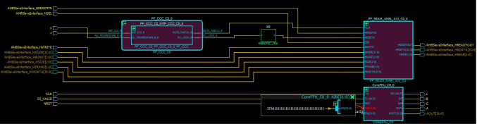
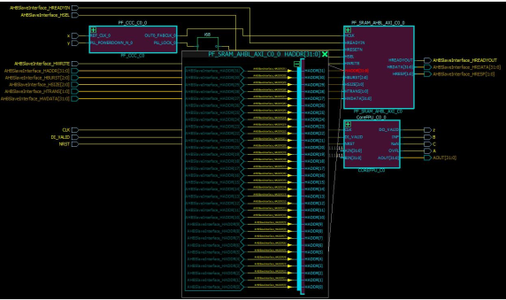

# Magnifying Pins

Netlist Viewer allows you to magnify a pin and display it in a window. If the pin is connected to  a bus, the bus can be expanded to display all its elements.

Double click a pin to magnify a pin.

Click the **+** sign to expand the bus. When expanded, all the elements of the  pin bus is displayed.

Click the **-** sign to fold or collapse the expanded pins.

**Parent topic:**[Navigating in the Netlist Viewer](GUID-360738F7-F20E-4FB6-9210-AA44A76F40D3.md)

